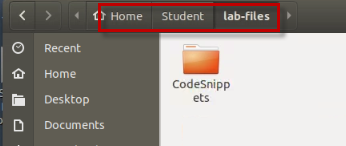
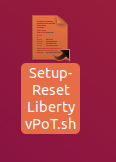
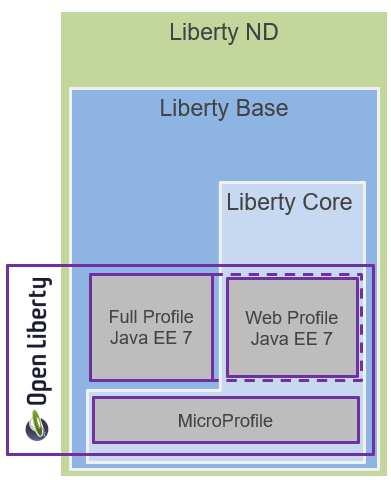
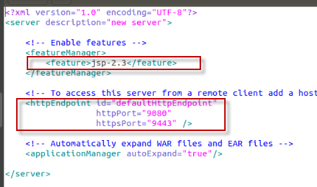
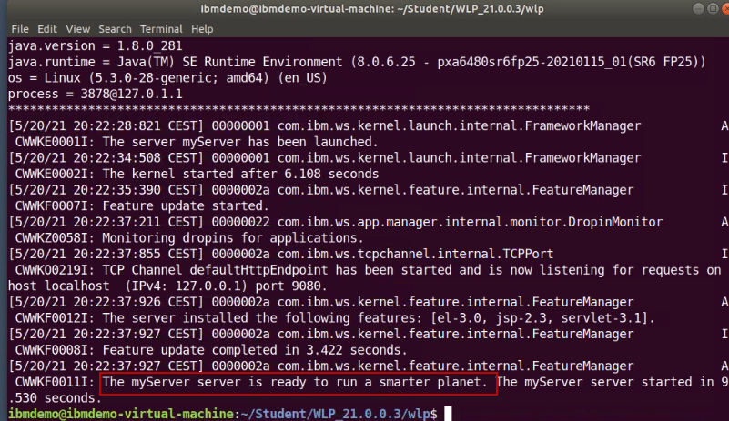
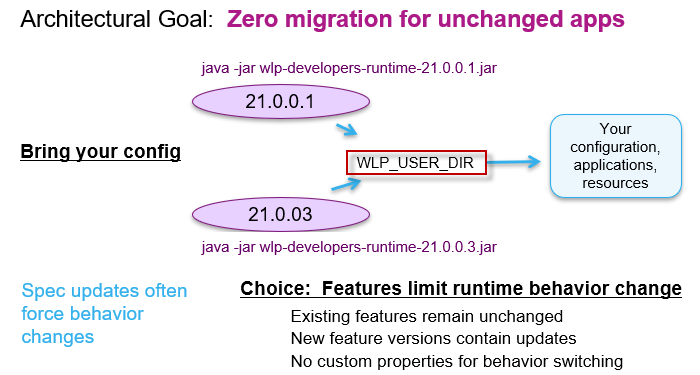
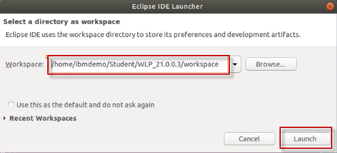
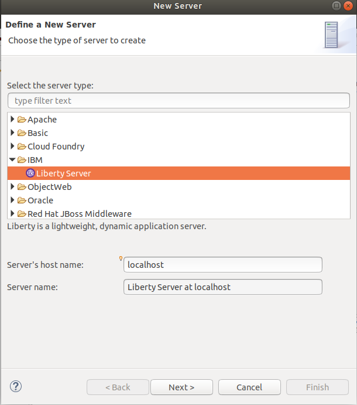
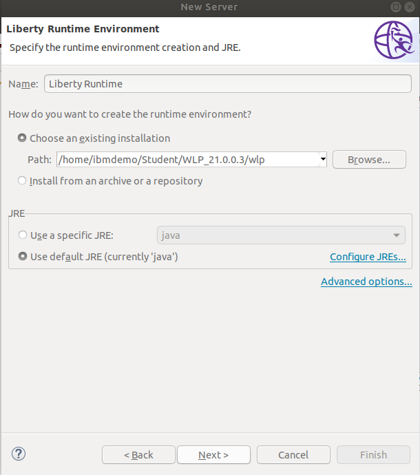
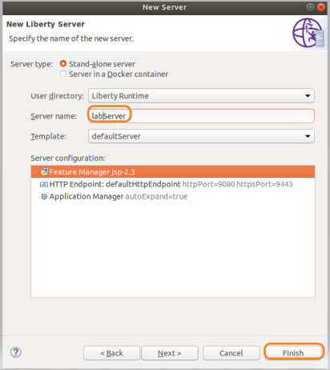

# Liberty: Primeros pasos

[Regresar a la página principal de laboratorios](../README.md)

## Configurar el entorno de Liberty

En la configuración inicial de Liberty, instalará Liberty mediante el método **Archive** . Luego, creará su primer servidor Liberty, lo iniciará e implementará una aplicación Java EE simple en el servidor para probar el entorno de ejecución del servidor Liberty.

Utilizarás una máquina virtual Ubuntu Linux que ha sido preparada para los laboratorios Liberty e incluye lo siguiente:

- El paquete **Liberty** se ha descargado al directorio **/home/ibmdemo/Downloads**

- El **IBM JDK** se ha descargado en el directorio **/home/ibmdemo/Downloads**

- Se han instalado las bibliotecas del sistema operativo necesarias.

<table>
<tbody>
<tr class="odd">
<td></td>
<td>
<p><strong>Información:</strong></p>
<p>La imagen de Liberty contiene WebSphere Developer Tools para Eclipse.</p>
<p>La imagen de VMWare contiene la carpeta “wdt” que contiene las herramientas de desarrollo de WebSphere que se utilizan para el laboratorio.</p>
</td>
</tr>
</tbody>
</table>


**SUGERENCIA:** Para reducir la escritura o la copia y pegado de comandos, puede buscar los fragmentos de código o comandos relacionados en la imagen de VMWare en el directorio:

```
/home/ibmdemo/Student/lab-files/CodeSnippets/Bootcamp_Lab1_setup_CodeSnippets.txt
```



  <br>


## Accediendo al entorno del laboratorio

Si está realizando este laboratorio como parte de un taller dirigido por un instructor (virtual o presencial), ya se le ha proporcionado un entorno. El instructor le proporcionará los detalles para acceder al entorno del laboratorio.

De lo contrario, deberá reservar un entorno para el laboratorio. Puede obtener uno aquí. Siga las instrucciones en pantalla para la opción “ **Reservar ahora** ”.

[https://techzone.ibm.com/my/reservations/create/63877af037f8a600183c737b](https://techzone.ibm.com/my/reservations/create/63877af037f8a600183c737b)

El entorno de laboratorio contiene una (1) máquina virtual Linux, denominada **Workstation** .


La máquina virtual **de la estación de trabajo** Ubuntu Linux tiene el siguiente software instalado para el laboratorio:

- Proyecto de aplicación con Liberty
- Maven 3.6.0

  <br>


1. Acceda al entorno de laboratorio desde su navegador web.

    Se configura un `Published Service` para proporcionar acceso a la máquina virtual **de la estación de trabajo** a través de la interfaz noVNC para el entorno de laboratorio.

    a. Cuando se haya aprovisionado el entorno de demostración, haga clic en el **mosaico del entorno** para abrir su vista de detalles.

    b. Haga clic en el enlace **Servicio publicado** que mostrará una **lista del directorio.**

    c. Haga clic en el enlace **"vnc.html"** para abrir el entorno de laboratorio a través de la interfaz **noVNC** .

    

    d. Haga clic en el botón **Conectar**

    

    e. Ingrese la contraseña como: **passw0rd** . Luego haga clic en el botón **Enviar credenciales** para acceder al entorno de laboratorio.

    > Nota: Ese es un cero numérico en passw0rd

    

2. Inicie sesión con el ID **de ibmdemo** .

    a. Haga clic en el ícono “ **ibmdemo** ” en la pantalla de Ubuntu.

    

    b. Cuando se le solicite la contraseña para el usuario “ **ibmdemo** ”, ingrese “ **passw0rd** ” como contraseña:

    Contraseña: **passw0rd** (minúscula con un cero en lugar de la o)

    

     <br>
    

3. Una vez que accedas a la **VM del Estudiante** a través del servicio publicado, verás el Escritorio, que contiene todos los programas que utilizarás (navegadores, terminal, etc.)

  <br>


## Consejos para trabajar en el entorno de laboratorio

1. Puede cambiar el tamaño del área visible utilizando las opciones **de Configuración de noVNC** para cambiar el tamaño del escritorio virtual para que se ajuste a su pantalla.

    a. Desde la máquina virtual del entorno, haga clic en el icono **giratorio** en el panel de control noNC para abrir el menú.

    

    b. Para aumentar el área visible, haga clic en `Settings > Scaling Mode` y configure el valor en `Remote Resizing`

    

2. Puede copiar/pegar texto de la guía de laboratorio en el entorno de laboratorio utilizando el portapapeles en el visor noVNC.

    a. Copie el texto de la guía de laboratorio que desea pegar en el entorno de laboratorio.

    b. Haga clic en el icono **del Portapapeles** y **pegue** el texto en el portapapeles de noVNC

    

    c. Pegue el texto en la máquina virtual, por ejemplo en una ventana de terminal, una ventana del navegador, etc.

    d. Haga clic en el icono **del portapapeles** nuevamente para cerrarlo.

    > **NOTA:** A veces, pegar en una ventana de Terminal en la VM no funciona de manera consistente.

    > En este caso, puedes intentarlo nuevamente, o abrir otra ventana de terminal e intentarlo nuevamente, o pegar el texto en un **editor de texto** en la VM y luego pegarlo en la ventana de terminal en la VM.

3. Como alternativa a la opción Copiar/Pegar de noVNC, puede considerar abrir la guía de laboratorio en un navegador web dentro de la máquina virtual. Con este método, puede copiar y pegar fácilmente texto de la guía de laboratorio sin tener que usar el portapapeles de noVNC.

     <br>
    

<table>
<tbody>
<tr class="odd">
<td></td>
<td>
<p><strong>Importante:</strong></p>
<p><strong>Haga clic en CANCELAR</strong> … Si, en cualquier momento durante el laboratorio, aparece una ventana emergente que le solicita instalar un software actualizado en la máquina virtual Ubuntu.</p>
<p>Lo que estamos experimentando es una actualización disponible para VS Code.</p>
<p><strong>¡HAGA CLIC EN CANCELAR!</strong></p>
<p></p>
</td>
</tr>
</tbody>
</table>

## Extraer la imagen vPoT de Liberty extendida

Localice el script en el escritorio y haga doble clic en él para **ejecutarlo en la terminal.**




Espere hasta que se haya extraído la imagen. Una vez finalizado, presione **Enter** para continuar:


El contenido de Liberty vPOT se extrae a **/home/ibmdemo/Student/WLP_21.0.0.3** y se hace referencia a él como { **LAB_HOME** } en todos los laboratorios.

<table>
<tbody>
<tr class="odd">
<td></td>
<td>
<p><strong>Información:</strong></p>
<p>Si necesita restablecer la imagen en algún momento, asegúrese de que todos los programas estén detenidos y ejecute el script nuevamente.</p>
<p>Esto limpiará el directorio <strong>/home/ibmdemo/Student/WLP_*</strong> y extraerá la imagen nuevamente.</p>
</td>
</tr>
</tbody>
</table>

## Instalar WebSphere Liberty

Para su comodidad, Liberty ya se ha instalado en el directorio **/home/ibmdemo/Student/WLP_21.0.0.3/wlp** .

Sin embargo, en esta sección, instalará una nueva instancia de Liberty para aprender lo fácil y rápido que es instalar Liberty, utilizando el método **de instalación de archivo** .

Liberty se puede instalar a través de IBM Installation Manager, pero la forma más conveniente es utilizar una instalación de archivo.

Los paquetes relacionados se pueden descargar desde Passport Advantage, pero las versiones más recientes solo están disponibles en las páginas de soporte de IBM. Hay paquetes separados disponibles para la edición Liberty y para IBM Java SDK. Las descargas y la documentación de Liberty for Developers se encuentran aquí:

[https://www.ibm.com/support/pages/node/6250961#asset/](https://www.ibm.com/support/pages/node/6250961#asset/)

En esta sección utilizaremos estos dos paquetes, que son **Java JDK v8** y **Liberty ND** edition.

- Kit de desarrollo de software Java de IBM para WebSphere: ibm-java-sdk-8.0-6.26-linux-x86_64.tgz

- Instalación del archivo IBM WebSphere Liberty ND: wlp-nd-all-21.0.0.3.jar

Para instalar Liberty utilizando el método Archive, realice los siguientes pasos:

1. Abra una ventana de Terminal haciendo clic en el ícono apropiado:

    

2. Vaya al directorio “Estudiantes”:

    ```
    cd /home/ibmdemo/Student
    ```

3. Crea un directorio temporal y navega hasta ese directorio

    ```
    mkdir temp

    cd temp
    ```

4. Extraiga el IBM Java SDK al directorio ~/Student/temp/. Esto extraerá el JDK al directorio **ibm-java-x86_64-80**

    ```
    tar -zxvf '/home/ibmdemo/Downloads/ibm-java-sdk-8.0-6.26-linux-x86_64.tgz'
    ```

5. Extraiga el paquete WebSphere Liberty ND al directorio **~/Student/temp** .

    El archivo Liberty es un archivo “jar” de Java. Para extraer el archivo, utilice el comando java -jar.

    ```
    ibm-java-x86_64-80/bin/java -jar '/home/ibmdemo/Downloads/wlp-nd-all-21.0.0.3.jar' --acceptLicense .
    ```

    - Se incluye la opción **--acceptLicense** para aceptar automáticamente la licencia, sin avisos adicionales.

    - El **punto** al final del comando significa extraer el archivo al directorio actual.

    - Se extrae el archivo Liberty y ahora está instalado en el subdirectorio **wlp** .

<br>

1. Enumere los dos directorios que se crearon mediante la extracción de Java JDK y Liberty ND

    ```
    ls
    ```

    

    - Liberty ahora está instalado en el directorio **wlp** .

    - IBK JDK ahora está instalado en el directorio **ibm-java-x86_64-80**

2. Establezca la ruta **JAVA_HOME** para indicarle a Liberty que use el SDK de Java que acaba de extraer

    ```
    export JAVA_HOME=~/Student/temp/ibm-java-x86_64-80/jre/
    ```

3. Mostrar la información del producto Liberty

    a. Mostrar la edición y la versión del producto Liberty

    ```
    wlp/bin/productInfo version
    ```

    La salida debe indicar que la edición Liberty es **ND** y la versión del producto debe coincidir con el archivo Liberty que se utiliza en el laboratorio.

    Los fixpacks de Liberty se entregan en un intervalo de entrega continua de cuatro semanas.

    - La versión indica el AÑO y el MES del fixpack Liberty instalado.

    - 21.0.0.3 es el <sup>tercer</sup> paquete de correcciones de 2021

    

    b. Mostrar la lista de funciones instaladas

    ```
    wlp/bin/productInfo featureInfo
    ```

    El resultado debería ser similar a la ilustración que aparece a continuación, que incluye todas las funciones de Liberty ND. La captura de pantalla es solo una lista parcial de las funciones instaladas de Liberty ND.

    

    c. **Acaba de instalar Liberty en el directorio temporal utilizando el método de instalación de archivo** .

    Instalar Liberty es así de sencillo. Crear un nuevo servidor Liberty y trabajar con él es igualmente sencillo. Lo hará en las siguientes secciones del laboratorio.

    Hay más de 200 funciones instaladas a través del paquete Liberty ND. De forma predeterminada, comenzaría con un paquete mucho más liviano. Si está interesado en ver qué funciones pertenecen a cada edición de Liberty, consulte aquí:

    [https://www.ibm.com/docs/en/was-liberty/nd?topic=management-liberty-features](https://www.ibm.com/docs/en/was-liberty/nd?topic=management-liberty-features)

<table>
<tbody>
<tr class="odd">
<td></td>
<td>
<p><strong>Información:</strong></p>
<p>Como se mencionó anteriormente, Liberty ya se ha instalado en el directorio <strong>/home/ibmdemo/Student/WLP_21.0.0.3*/wlp.</strong></p>
<p><strong>NO</strong> utilizaremos el Liberty instalado en el <strong>directorio</strong> <strong>temporal</strong> en las siguientes secciones del laboratorio. Puede ignorar el directorio temporal.</p>
</td>
</tr>
</tbody>
</table>

1. **Cerrar** la ventana de Terminal.

## SOLO INFORMACIÓN – Open Liberty

¿Cómo encaja Open Liberty en la familia de ediciones Liberty?

Open Liberty es un entorno de ejecución de servidor de código abierto liviano que puede ser ideal para crear microservicios Java y aplicaciones nativas de la nube.


Open Liberty ofrece una base de código abierto comprobada para la cartera de productos WebSphere Liberty. Todas las ediciones de Liberty se basan en la misma base de código de Open Liberty.

- Liberty Core ofrece un perfil web compatible

- Liberty Base ofrece un perfil completo compatible

- Liberty ND ofrece capacidades de gestión de carga de trabajo y agrupamiento y perfil completo compatibles

Las tres ediciones comerciales ofrecen capacidades adicionales:

- Extensiones del modelo de programación

- Calidad de producción de las extensiones de servicio

- Extensiones de seguridad

***Y todo el apoyo de IBM***



### SOLO INFORMACIÓN: Descargas de Open Liberty, Docker y Devops

¿Cómo se consigue Open Liberty?

Open Liberty se puede obtener mediante descargas de archivos zip o a través de Maven, Gradle y Docker.


Visita [https://openliberty.io/downloads/](https://openliberty.io/downloads/) para encontrar las últimas versiones y compilaciones de Open Liberty.

Los paquetes de descarga de archivos zip de Open Liberty están disponibles aquí: [https://openliberty.io/downloads/#runtime_releases](https://openliberty.io/downloads/#runtime_releases)

A continuación se muestran ejemplos de cómo obtener Open Liberty mediante Maven, Gradle y Docker.


## Crear servidor de pruebas

1. Abra una ventana de Terminal haciendo clic en el ícono apropiado:

    

2. Navegue hasta el directorio de instalación del entorno de ejecución de Liberty {LAB_HOME}/wlp/bin

    ```
    cd /home/ibmdemo/Student/WLP_21.0.0.3/wlp
    ```

3. Ejecute el siguiente comando para **crear** un nuevo servidor llamado “ **myServer** ”

    ```
     bin/server create myServer
    ```

    

    El comando del servidor admite acciones para iniciar, detener, crear, empaquetar y volcar un servidor Liberty.

    El comando de creación de servidor crea un nuevo servidor Liberty con el nombre especificado.

    **Puede encontrar detalles adicionales sobre el comando del servidor aquí:**

    [https://www.ibm.com/docs/en/was-liberty/base?topic=line-server-command-options](https://www.ibm.com/docs/en/was-liberty/base?topic=line-server-command-options)

4. El nuevo servidor se crea en el siguiente directorio:

    /home/ibmdemo/Student/WLP_21.0.0.3/wlp/usr/servers/myServer

    

5. El archivo **server.xml** es la configuración completa del servidor predeterminada. Abra un editor para ver el archivo de configuración del servidor. Asegúrese de estar en el directorio correcto antes de abrir el archivo server.xml.

    ```
     cd /home/ibmdemo/Student/WLP_21.0.0.3/wlp

     gedit usr/servers/myServer/server.xml
    ```

    

    El server.xml define una configuración mínima necesaria para iniciar un servidor Liberty.

    En este ejemplo, solo incluye la función JSP y define los puntos finales HTTP y HTTPS que el servidor escucha para las solicitudes HTTP(S) entrantes.

6. **Cierre** el editor gedit.

7. Inicie la instancia del servidor utilizando el comando **de inicio del servidor** :

    ```
     bin/server start myServer
    ```

    

    Esto ejecuta el servidor en segundo plano y la salida se escribe en archivos en el directorio {LAB_HOME}/wlp/usr/servers/myServer/logs.

    > Alternativamente, para iniciar el servidor en primer plano (para que los mensajes de la consola se vean en la ventana de comandos), puede usar el comando “ **bin/server run myServer** ”

8. Vea el archivo **messages.log** del servidor Liberty para ver los mensajes de inicio del servidor

    ```
     cat usr/servers/myServer/logs/messages.log
    ```

    El servidor se inicia cuando se muestra el mensaje “ **El servidor myServer está listo para ejecutar un planeta más inteligente”** en el archivo messages.log.

    

9. Detenga el servidor con el comando **server stop** :

    ```
     bin/server stop myServer
    ```

    

10. Una vez verificada la instalación de Liberty, puedes eliminar el servidor de pruebas “ **myServer** ” simplemente eliminando su directorio.

    Elimine el servidor eliminando el directorio {LAB_HOME}/wlp/usr/servers/myServer.

    ```
    rm -rf usr/servers/myServer
    ```

    Ahora tiene un entorno de ejecución de Liberty que está listo para crear servidores para ejecutar aplicaciones.

    <br>

### Breve resumen de lo que acabas de hacer

En el paso anterior, eliminaste una configuración de servidor Liberty. NO eliminaste la instalación de Liberty ni sus archivos binarios.

Este es un concepto importante de Liberty. Los archivos binarios de Liberty Runtime son independientes de las configuraciones de Liberty Server.

- Liberty se instaló en ~/Student/WLP_21.0.0.3**/wlp**

- De forma predeterminada, las configuraciones del servidor Liberty están en ~/Student/WLP_21.0.0.3**/wlp/usr/**

El directorio de configuración del servidor puede ubicarse en cualquier lugar, incluso fuera de la ubicación predeterminada de /wlp/usr.

La ubicación de configuración del servidor se puede anular utilizando la variable integrada de Liberty **“${wlp.user.dir}”.**

De hecho, este concepto es fundamental para que Liberty proporcione migración cero para aplicaciones sin cambios y al mismo tiempo se mantenga actualizado con Liberty Fixpacks, como se ilustra a continuación.

- Simplemente instale un nuevo Liberty Fixpack (instalación de archivo)

- Actualice la variable WLP_USER_DIR para que apunte a la ubicación de las configuraciones de su servidor existente.

    

## Pruebe las herramientas para desarrolladores de WebSphere (WDT)

Puede administrar Liberty desde la línea de comandos y editar los archivos de configuración del servidor utilizando su editor favorito.

Sin embargo, WebSphere Developer Tools (WDT) ofrece un excelente editor de configuración, controles de servidor y publicación de aplicaciones, así como muchas otras utilidades que ahorran tiempo. En esta sección, explorará el uso de WDT con Liberty.

Normalmente, primero descargarías e instalarías Eclipse, seguido de la instalación del complemento WDT Eclipse.

Para este laboratorio, hemos agrupado todo en un único archivo zip. El directorio {LAB_HOME}/wdt contiene un WDT precompilado y ampliado.

<table>
<tbody>
<tr class="odd">
<td></td>
<td>
<p><strong>Información:</strong></p>
<p>Al iniciarse por primera vez, Eclipse puede tardar hasta un minuto en iniciarse mientras se inicializa.</p>
</td>
</tr>
</tbody>
</table>

1. Iniciar Eclipse

    a. Utilice el **Explorador de archivos** para navegar hasta el directorio:

    > Inicio &gt; Estudiantes &gt; WLP_21.0.0.3 &gt; wdt &gt; eclipse

    b. Haga doble clic en el ejecutable **de Eclipse** para iniciar Eclipse.

    

    c. Cuando el iniciador de Eclipse le solicite que seleccione un espacio de trabajo, ingrese al siguiente directorio. Luego haga clic en el botón **Iniciar** .

    ```
     /home/ibmdemo/Student/WLP_21.0.0.3/workspace
    ```

    

    d. Cierre la **página de bienvenida** haciendo clic en el icono **'X** '.

    

## Crear un servidor Liberty en WDT

Anteriormente en el laboratorio, utilizó la línea de comandos para crear e iniciar un servidor Liberty.

Los desarrolladores a menudo trabajan en entornos de desarrollo integrados como Eclipse, VS Code o Intelij, por nombrar algunos, para mejorar su productividad.

IBM WebSphere Developer Tools for Eclipse mejora la productividad del desarrollador al proporcionar un conjunto liviano de herramientas que puede utilizar para desarrollar, ensamblar e implementar aplicaciones Java EE, OSGi y móviles en WebSphere Application Server tradicional y Liberty.

En esta sección, utilizará WebSphere Developer Tools con el IDE Eclipse para trabajar con Liberty.

Primero, cree un servidor Liberty utilizando las herramientas integradas.

1. En la parte inferior del banco de trabajo de Eclipse, abra la vista **Servidores** haciendo clic en la pestaña **Servidores** .

2. Haga clic derecho dentro de las ventanas de la **vista Servidores** y seleccione **Nuevo &gt; Servidor**

    

3. En la lista **de tipo de servidor** , expanda **IBM** y seleccione el tipo **Liberty Server** .

    

4. Utilice el nombre del servidor eclipse predeterminado tal como se proporciona ( **localhost** ).

    a. Haga clic en **Siguiente** .

    Esto crea el objeto de servidor Liberty en Eclipse y se muestra la página **Entorno de ejecución de Liberty** .

5. Ahora Eclipse necesita asociar el servidor ' **localhost'** con una configuración de servidor en un entorno de ejecución de Liberty (el entorno de ejecución que instaló previamente en el laboratorio).

    a. En el campo **Ruta** de la sección “ **Elegir una instalación existente** ”, escriba o busque el directorio donde instaló el entorno de ejecución Liberty que se muestra a continuación:

    ```
    /home/ibmdemo/Student/WLP_21.0.0.3/wlp
    ```

    

    b. Haga clic en **Siguiente** para continuar.

6. Para crear la configuración del servidor en el entorno de ejecución, reemplace el campo **Nombre del servidor** por **labServer** . Luego haga clic en **Finalizar** .

    

7. El nuevo servidor aparecerá en la vista Servidores. Puedes expandir el servidor para mostrar una vista rápida de la configuración.

    

8. Abra el editor de configuración del servidor haciendo doble clic en **Configuración del servidor (server.xml):**

    

9. Se muestra la vista de configuración del servidor. La vista predeterminada es el modo “ **Diseño** ”, que proporciona una interfaz de usuario intuitiva para el editor de configuración del servidor.

    a. Haga clic en la pestaña de vista “ **Diseño** ” si aún no está seleccionada.

    

    b. Puede hacer clic en la pestaña de vista “Fuente” para editar directamente el código fuente del servidor.xml.

    

## Limpieza

1. **Cerrar** el editor **server.xml**

2. Para **salir** de Eclipse, seleccione **Archivo &gt; Salir** en el menú principal de Eclipse.

3. Cierre todas las ventanas **de terminal** abiertas

**=== FIN DEL LABORATORIO ===**

[Regresar a la página principal de laboratorios](../README.md)
