# Descubra Liberty

[Regresar a la página principal de laboratorios](../README.md)

En este laboratorio, explorará la configuración del servidor Liberty, la instalación de aplicaciones en Liberty, la actualización de las configuraciones del servidor y la actualización de una aplicación.

A medida que explore Liberty, primero utilizará WebSphere Developer Tools para Eclipse. Luego, explorará Liberty mediante la línea de comandos. Por último, se le presentarán las configuraciones avanzadas de modo mediante jvm.options, bootstrap.properties, variables integradas de Liberty y registro y seguimiento.

|                                                               |                                                                                                                                                       |
|---------------------------------------------------------------|-------------------------------------------------------------------------------------------------------------------------------------------------------|
|  | **SUGERENCIA:** Liberty está preinstalado en el entorno de VM proporcionado. **{LAB_HOME}** hace referencia a: **/home/ibmdemo/Student/WLP_21.0.0.3** |

**SUGERENCIA:** Para reducir la escritura o la copia y pegado de comandos, puede buscar los fragmentos de código o comandos relacionados en la imagen de VMWare en el directorio:

**/home/ibmdemo/Student/lab-files/CodeSnippets/Bootcamp_Lab2_discover_CodeSnippets.txt**


  <br>


## Accediendo al entorno del laboratorio

Si está realizando este laboratorio como parte de un taller dirigido por un instructor (virtual o presencial), ya se le ha proporcionado un entorno. El instructor le proporcionará los detalles para acceder al entorno del laboratorio.

De lo contrario, deberá reservar un entorno para el laboratorio. Puede obtener uno aquí. Siga las instrucciones en pantalla para la opción “ **Reservar ahora** ”.

[https://techzone.ibm.com/my/reservations/create/63877af037f8a600183c737b](https://techzone.ibm.com/my/reservations/create/63877af037f8a600183c737b)

El entorno de laboratorio contiene una (1) máquina virtual Linux, denominada **Workstation** .


La máquina virtual **de la estación de trabajo** Ubuntu Linux tiene el siguiente software instalado para el laboratorio:

- Proyecto de aplicación con Liberty
- Maven 3.6.0

1. Acceda al entorno de laboratorio desde su navegador web.

    Se configura un `Published Service` para proporcionar acceso a la máquina virtual **de la estación de trabajo** a través de la interfaz noVNC para el entorno de laboratorio.

    a. Cuando se haya aprovisionado el entorno de demostración, haga clic en el **mosaico del entorno** para abrir su vista de detalles.

    b. Haga clic en el enlace **Servicio publicado** que mostrará una **lista del directorio.**

    c. Haga clic en el enlace **"vnc.html"** para abrir el entorno de laboratorio a través de la interfaz **noVNC** .

    

    d. Haga clic en el botón **Conectar**

    

    e. Ingrese la contraseña como: **passw0rd** . Luego haga clic en el botón **Enviar credenciales** para acceder al entorno de laboratorio.

    > Nota: Ese es un cero numérico en passw0rd

    

2. Inicie sesión con el ID **de ibmdemo** .

    a. Haga clic en el ícono “ **ibmdemo** ” en la pantalla de Ubuntu.

    

    b. Cuando se le solicite la contraseña para el usuario “ **ibmdemo** ”, ingrese “ **passw0rd** ” como contraseña:

    Contraseña: **passw0rd** (minúscula con un cero en lugar de la o)

    

     <br>
    

3. Una vez que accedas a la **VM del Estudiante** a través del servicio publicado, verás el Escritorio, que contiene todos los programas que utilizarás (navegadores, terminal, etc.)

  <br>


## Consejos para trabajar en el entorno de laboratorio

1. Puede cambiar el tamaño del área visible utilizando las opciones **de Configuración de noVNC** para cambiar el tamaño del escritorio virtual para que se ajuste a su pantalla.

    a. Desde la máquina virtual del entorno, haga clic en el icono **giratorio** en el panel de control noNC para abrir el menú.

    

    b. Para aumentar el área visible, haga clic en `Settings > Scaling Mode` y configure el valor en `Remote Resizing`

    

2. Puede copiar/pegar texto de la guía de laboratorio en el entorno de laboratorio utilizando el portapapeles en el visor noVNC.

    a. Copie el texto de la guía de laboratorio que desea pegar en el entorno de laboratorio.

    b. Haga clic en el icono **del Portapapeles** y **pegue** el texto en el portapapeles de noVNC

    

    c. Pegue el texto en la máquina virtual, por ejemplo en una ventana de terminal, una ventana del navegador, etc.

    d. Haga clic en el icono **del portapapeles** nuevamente para cerrarlo.

    > **NOTA:** A veces, pegar en una ventana de Terminal en la VM no funciona de manera consistente.

    > En este caso, puedes intentarlo nuevamente, o abrir otra ventana de terminal e intentarlo nuevamente, o pegar el texto en un **editor de texto** en la VM y luego pegarlo en la ventana de terminal en la VM.

3. Como alternativa a la opción Copiar/Pegar de noVNC, puede considerar abrir la guía de laboratorio en un navegador web dentro de la máquina virtual. Con este método, puede copiar y pegar fácilmente texto de la guía de laboratorio sin tener que usar el portapapeles de noVNC.

     <br>
    

<table>
<tbody>
<tr class="odd">
<td></td>
<td>
<p><strong>Importante:</strong></p>
<p><strong>Haga clic en CANCELAR</strong> … Si, en cualquier momento durante el laboratorio, aparece una ventana emergente que le solicita instalar un software actualizado en la máquina virtual Ubuntu.</p>
<p>Lo que estamos experimentando es una actualización disponible para VS Code.</p>
<p><strong>¡HAGA CLIC EN CANCELAR!</strong></p>
<p></p>
</td>
</tr>
</tbody>
</table>

# Explora Liberty a través de WDT

> **Nota** : proceda directamente a la sección 3 si solo desea utilizar la línea de comando.

## Configuración de Liberty para el laboratorio

1. Copie la configuración del servidor Liberty, utilizada en este laboratorio, al directorio usr/servers de Liberty.

    a. Abra una nueva ventana de Terminal

    b. Ejecute el script para configurar el servidor Liberty utilizado en este laboratorio.

    ```
    /home/ibmdemo/Student/labs/lab2/lab2-setup.sh
    ```

    

## Asegúrese de que Eclipse se haya iniciado y de que se encuentre en el espacio de trabajo correcto

1. Si Eclipse aún no se ha iniciado, inícielo ahora

    a. Utilice el **Explorador de archivos** para navegar hasta el directorio

    ```
    Home > Student > WLP_21.0.0.3 > wdt > eclipse
    ```

    b. Haga doble clic en el ejecutable **de Eclipse** para iniciarlo.

    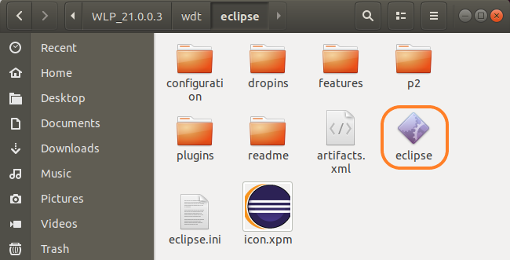

    c. Cuando el iniciador de Eclipse le solicite que seleccione un espacio de trabajo, ingrese al siguiente directorio. Luego haga clic en el botón **Iniciar** .

    ```
    /home/ibmdemo/Student/labs/lab2/workspace
    ```

    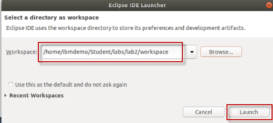

    <br>

## Explorando el servidor Liberty

1. Inicie el servidor en eclipse.

    a. Desde la vista **Servidores** , seleccione su instancia **de labServer** y haga clic en el botón **Iniciar el servidor** ( ).

    Alternativamente, también puede hacer clic derecho en el nombre del servidor y elegir la opción **Iniciar** en el menú contextual.

    b. Cambie a la vista **de consola** si es necesario. ¡Observe los mensajes para ver qué tan rápido se inicia su servidor!

    

### Explorar el uso de WDT para realizar cambios en la configuración del servidor de laboratorio

<!-- end list -->

1. Abra la configuración del servidor de laboratorio utilizando el editor de configuración del servidor WDT

    a. En la vista **Servidores** , haga doble clic en su servidor **labServer** para abrir la **Descripción general** del servidor.

    

    b. Expanda la sección **Publicación** y observe que el servidor está configurado para detectar y publicar cambios automáticamente. Mantenga esta configuración predeterminada.

    

    

2. En este ejercicio, implementará una aplicación servlet simple, así que intente habilitar la función servlet en este servidor.

    a. En la página **Descripción general** , busque la sección **Configuración del servidor Liberty**

    b. Haga clic en el enlace **Abrir configuración del servidor** para abrir el editor **server.xml** .

    > **Nota: Para ver mejor el contenido en Eclipse,** es posible que deba cambiar el tamaño de las vistas de Eclipse o aumentar el tamaño de la aplicación de escritorio de Eclipse.

    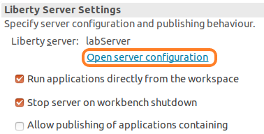

    c. Si se muestra la vista **Fuente** del archivo **server.xml** , cambie a la vista **Diseño** en el editor de configuración del servidor, haciendo clic en la pestaña **"Diseño"** en el panel del editor.

    d. Comience por proporcionar una descripción significativa de su servidor, como “Servidor Liberty para laboratorios”.

    

    e. Para agregar una función, como servlet-4.0, regrese al área **Estructura de configuración** y expándala, si es necesario, y anote la **entrada de configuración del Administrador de funciones.**

    > En este laboratorio, el Administrador de funciones ya se ha agregado a la configuración

    f. Revise la configuración del Administrador de funciones haciendo clic en “ **Administrador de funciones** ” para ver la lista de funciones ya configuradas.

    > Tenga en cuenta que las características **jsp-2.3** y **localConnector-1.0** ya se han agregado a la configuración del servidor.

    g. Haga clic en el botón **Agregar** para agregar una nueva función “servlet-4.0”

    

    h. En la ventana emergente, escriba **servlet** para filtrar las funciones relacionadas con el servlet. A continuación, seleccione **servlet-4.0.** Haga clic en **Aceptar.**

    

    i. En el editor **server.xml** , cambie a la pestaña **Origen** en la parte inferior para ver el código fuente XML de este archivo de configuración. Verá que se ha actualizado un nuevo elemento **featureManager** para incluir la función **servlet-4.0** .

    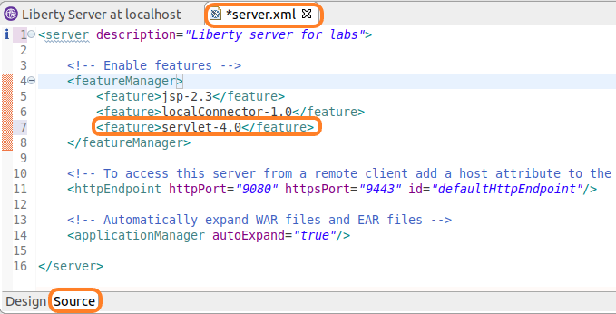

    j. Ahora tienes un servidor configurado para utilizar la función **servlet-4.0** .

    k. Haga clic en el botón **Guardar** ( ) para guardar los cambios (o use CTRL+S)

<table>
<tbody>
<tr class="odd">
<td></td>
<td>
<p><strong>CONSEJO:</strong></p>
<p>La aplicación Sample1 es una aplicación empresarial de Java que incluye una <strong>clase Servlet de Java</strong> simple. Para que Liberty Server ejecute la aplicación Sample1, la función servlet debe estar configurada en el archivo server.xml.</p>
</td>
</tr>
</tbody>
</table>

1. Cambie a la vista **de la consola** , ubicada en la parte inferior del área de trabajo, y revise los mensajes más recientes. Estos mensajes muestran que su servidor Liberty detectó automáticamente la actualización de configuración, procesó la función que habilitó y ahora está escuchando las solicitudes entrantes.

    Notarás que la configuración del servidor se actualizó automáticamente y que la actualización de funciones se completó muy rápidamente. En este ejemplo, tomó menos de un segundo.

    

2. **Cierre** el server.xml en el panel del editor.

3. **Cerrar** la página **de descripción general de Liberty Server** en Eclipse

    Ahora está listo para comenzar a trabajar con una aplicación de muestra que utiliza la función Servlet.

    <br>

## Implementación de una aplicación de muestra en Liberty

### Importar una aplicación de muestra a Eclipse

1. Se ha proporcionado un archivo WAR de servlet simple para este ejercicio; impórtelo a su banco de trabajo.

    a. En Eclipse, vaya a **Archivo &gt; Importar** .

    

    b. Expanda la sección **Web** y seleccione **Archivo WAR** . Haga clic en **Siguiente** .

    

    c. En el campo **Archivo WAR** , seleccione **Explorar** . Navegue hasta:

    ```
    /home/ibmdemo/Student/WLP_21.0.0.3/labs/gettingStarted/1_discover_20190416/Sample1.war
    ```

    d. Haga clic **en Abrir** .

    e. Asegúrese de que el **tiempo de ejecución de destino** esté configurado en **Liberty** **Runtime**

    f. **Desmarque “Agregar proyecto a un EAR”**

    g. Haga clic en **Finalizar**

    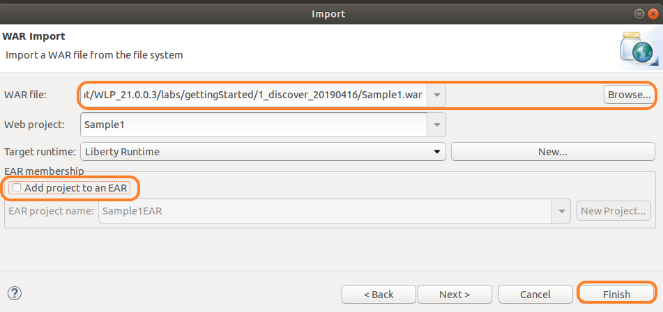

    h. Si se le solicita que abra la perspectiva web, haga clic en **Abrir perspectiva** .

    

2. Ahora tienes un proyecto web **Sample1** en tu espacio de trabajo. Expándelo en la vista **Enterprise Explorer** para ver los diferentes componentes del proyecto.

    

3. **Inicie** la aplicación de muestra.

    a. En el panel **Enterprise Explorer** , navegue hasta **SimpleServlet.java** como se muestra a continuación.

    ```
    Sample1 > src/main/java > wasdev.sample > SimpleServlet.java
    ```

    b. Haga clic derecho en **SimpleServlet.java** .

    c. En el menú contextual, seleccione **Ejecutar como &gt; Ejecutar en el servidor** .

    

    d. En el cuadro de diálogo **Ejecutar en el servidor** :

    - Verifique que **la opción Elegir un servidor existente** esté seleccionada.

    - En **localhost** , seleccione el **servidor Liberty** que definió anteriormente. El servidor debería aparecer en estado **Iniciado** .

    - Haga clic en **Finalizar** .

    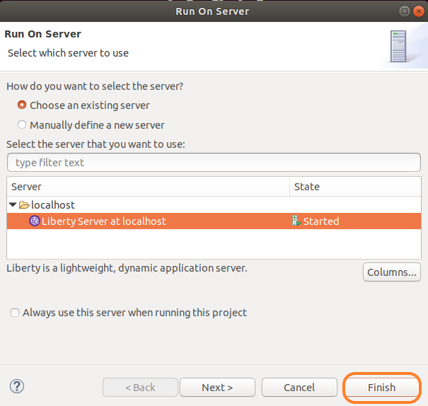

    e. Después de un momento, su aplicación se instalará y se iniciará. Consulte el panel **de la consola** para ver los mensajes correspondientes.

    

4. En el panel principal del banco de trabajo, se abrió un navegador que apuntaba a

    [http://localhost:9080/Muestra1/SimpleServlet](http://localhost:9080/Sample1/SimpleServlet) .

    a. Si recibe un error 404 la primera vez, intente actualizar el navegador una vez que la aplicación esté completamente implementada e iniciada.

    b. En este punto, debería ver el contenido HTML generado por el servlet simple.

    

En esta sección del laboratorio, exploró cómo utilizar WebSphere Developer Tools (WDT) para iniciar un servidor Liberty, modificar la configuración del servidor, importar un módulo WAR de Java EE simple e implementar la aplicación en el servidor desde el entorno de desarrollo.

En la siguiente sección, explorará el uso de WDT para realizar cambios en el código de la aplicación e implementarlo en vivo en el servidor Liberty, en su entorno de desarrollo, para ilustrar una experiencia de desarrollo simple pero sólida para desarrolladores de Java que usan WDT y Liberty.

  <br>


### Modifique la aplicación para ver cómo los cambios se recogen automáticamente en el servidor en ejecución.

1. Abra el código fuente del servlet Java.

    a. En el panel **Enterprise Explorer** , expanda el proyecto **Sample1** y luego vaya a:

    ```
    Sample1 > src/main/java > wasdev.sample
    ```

    b. Haga doble clic en el archivo fuente **SimpleServlet** .java para abrir el editor Java para el servlet.

    

    c. Este es el código fuente de **SimpleServlet.java**

    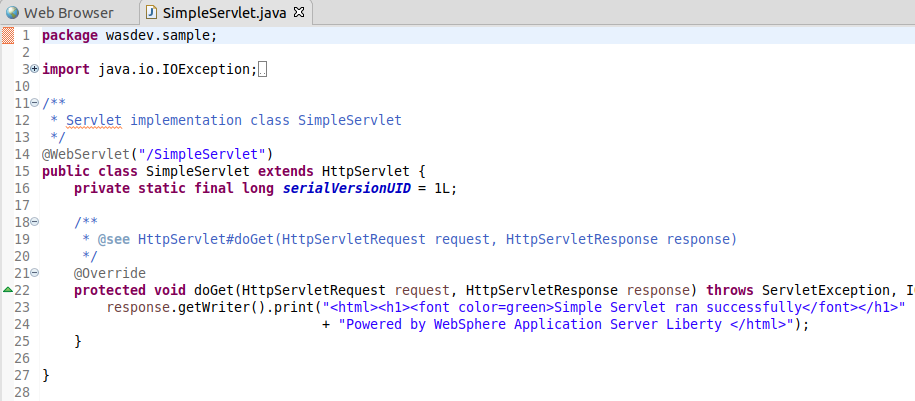

2. Examine el método doGet() en el código SimpleServlet.java

    a. Este es un servlet muy simple con un método **doGet()** que envía una cadena de fragmentos de código HTML como respuesta. El método **doGet()** se verá similar a esto (algunas de las etiquetas HTML pueden ser un poco diferentes, pero eso está bien).

    

3. Modificar la aplicación y publicar el cambio.

    a. En el método **doGet()** , ubique el elemento de encabezado **&lt;h1&gt;** de la cadena HTML y observe que contiene una **etiqueta de fuente** para establecer el color en “ **verde** ”.

    b. Modifique esta cadena cambiando el texto de verde a **morado** , de modo que su etiqueta de fuente se vea como **&lt;font color=purple&gt;** .

    ```html
    	response.getWriter().print(
    		"<html><h1><font color=purple>Simple Servlet ran successfully</font></html>"
    		+ "<html>Powered by WebSphere Application Server Liberty</html>");
    ```

    c. Guarde los cambios en el archivo fuente de Java haciendo clic en el botón **Guardar** ( ) o utilizando **CTRL+S** .

4. Recuerde que la configuración de su servidor está configurada para detectar y **publicar** automáticamente los cambios en la aplicación de inmediato. Al guardar los cambios en su archivo fuente de Java, activó automáticamente una actualización de la aplicación en el servidor.

    a. Para ver esto, vaya a la vista de la **consola** en la parte inferior del entorno de trabajo. La actualización de la aplicación comenzó casi inmediatamente después de guardar el cambio en la aplicación y se completó en segundos.

    

5. Acceda a la aplicación actualizada.

    a. Actualice el **navegador** en su entorno de trabajo para ver el cambio en la aplicación. El título ahora debería aparecer en texto violeta.

    

6. Opcionalmente, continúe experimentando con las modificaciones de la aplicación y vea qué tan rápido esos cambios están disponibles en la aplicación implementada. Tal vez pueda agregar algún texto adicional para mostrar en la página o agregar etiquetas HTML adicionales para ver los cambios de formato (podría agregar una etiqueta de título para configurar el texto que se muestra en la barra de título del navegador, por ejemplo, **&lt;head&gt;&lt;title&gt;Liberty Server&lt;/title&gt;&lt;/head&gt;** ).

    ¡La clave es que este **<span class="underline">ciclo de edición/publicación/depuración es muy simple y rápido!</span>**

     <br>
    

### Modifique los puertos HTTP del servidor para asegurarse de que los cambios de configuración de Liberty Serer también se detecten automáticamente en el servidor en ejecución.

Con Liberty, los cambios en la configuración del servidor se monitorean y se actualizan dinámicamente en la instancia en ejecución del servidor. En esta sección, realizará algunas actualizaciones en el archivo server.xml de Liberty y observará la capacidad de actualizaciones dinámicas del servidor en Liberty.

1. Abra el editor de configuración del servidor.

    a. En la vista **Servidores** , haga doble clic en el servidor **de configuración del servidor** labServer para abrir el editor de configuración server.xml.

    

    b. Asegúrese de estar en el modo de Diseño seleccionando la pestaña **Diseño** en el editor de configuración del servidor.

2. Seleccione el elemento **Aplicación web: Sample1** en la **Configuración del servidor** y observe los detalles de configuración. Desde aquí, puede configurar los parámetros básicos de la aplicación, incluida la raíz del contexto de la aplicación, y el inicio automático de la aplicación.

    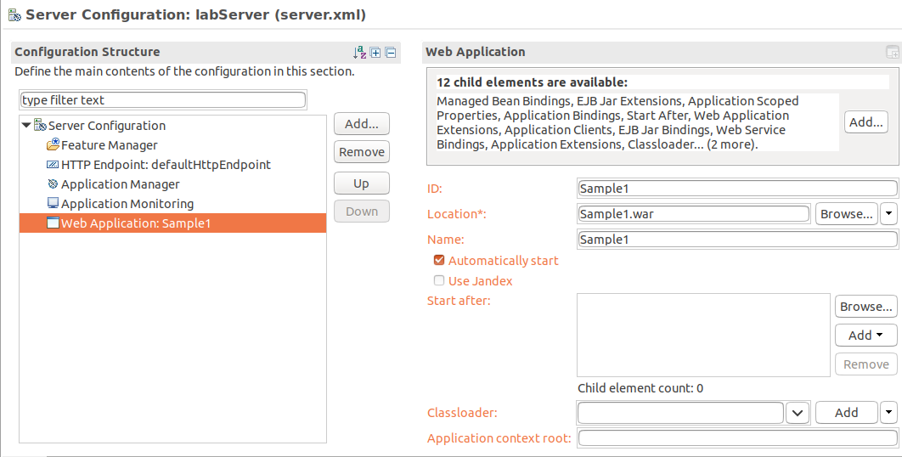

3. Seleccione el elemento **de Monitoreo de aplicaciones** en la **Configuración del servidor** y observe los detalles de configuración. Puede ver que el monitor sondea los cambios cada **500 ms** mediante un disparador **mbean** .

    

4. Seleccione el elemento **Administrador de funciones** para ver las funciones que están configuradas en su servidor. Agregó la función **servlet-4.0** porque sabía que iba a ejecutar una aplicación servlet. Sin embargo, las herramientas de desarrollo agregaron automáticamente la función **localConnector-1.0.** a su servidor para admitir notificaciones y actualizaciones de aplicaciones.

    De hecho, no habría sido necesario agregar la función de servlet a su servidor al principio. Las herramientas habrían habilitado esa función automáticamente, según el contenido de la aplicación.

    

5. Cambiar el puerto HTTP.

    Usar el puerto HTTP predeterminado (9080) es una forma sencilla de iniciar rápidamente una aplicación, pero es habitual querer usar un puerto diferente. Esto es algo fácil de cambiar.

    a. En el área **Estructura de configuración** , seleccione **Configuración del servidor** y, a continuación, seleccione **Punto final HTTP.**

    

    b. En el área **Detalles del punto final HTTP** , cambie el Puerto HTTP a **9085** .

    

    c. **Guarde** los cambios en la configuración del servidor (CTRL+S).

6. Puede revisar la configuración completa de su servidor en el archivo fuente **server.xml** . De nuevo en el editor de configuración del servidor, cambie a la pestaña **Fuente** en la parte inferior para ver la fuente XML completa de la configuración de su servidor.

    

7. Después de guardar los cambios de configuración, la configuración de

    > Su servidor en ejecución se actualizó automáticamente. El panel **de la consola** mostrará que el servlet Sample1 ahora está disponible en el puerto 9085.

    

8. Ahora, puede acceder a su aplicación de muestra mediante el nuevo puerto. En el navegador de su entorno de trabajo, cambie el puerto de **9080** a **9085** y actualice la aplicación.

    

     <br>
    

## Agregar salida de registro INFO a la consola

WebSphere Traditional y Liberty brindan la posibilidad de establecer el nivel de registro en cualquiera de los niveles de registro admitidos definidos en la documentación: [https://www.ibm.com/docs/en/was-liberty/base?topic=liberty-logging-trace](https://www.ibm.com/docs/en/was-liberty/base?topic=liberty-logging-trace)

El registro de **AUDITORÍA** permite registrar “Eventos significativos que afectan el estado o los recursos del servidor”

El registro de **INFO** permite “Información general que describe el progreso general de la tarea”

De forma predeterminada, el servidor Liberty tiene el nivel de registro de la consola establecido en AUDITORÍA.

En esta sección, cambiará el nivel de los mensajes de registro escritos en la consola de AUDIT a INFO, lo que generará mensajes de registro adicionales.

Realizará esta actividad en el archivo server.xml mediante la interfaz de usuario. También es posible configurar las opciones de registro predeterminadas en el archivo bootstrap.properties.

Si las opciones de registro se configuran en el archivo bootstrap.properties, las opciones de registro tendrán efecto muy temprano en el inicio del servidor, por lo que puede ser útil para depurar problemas de inicialización del servidor.

1. Abra el editor de configuración del servidor.

    a. En la vista **Servidores** , haga doble clic en el servidor **de configuración del servidor** labServer para abrir el editor de configuración server.xml.

    

    b. Asegúrese de estar en el modo de Diseño seleccionando la pestaña **Diseño** en el editor de configuración del servidor.

2. Agregue la opción de configuración **de registro** al servidor

    a. En la sección **Estructura de configuración** , haga clic en **Configuración del servidor** y, a continuación, haga clic en el **botón Agregar.**

    

    b. Escriba **logging** en el campo “Contexto: Configuración del servidor” para limitar la lista de opciones de configuración que se muestran

    

    c. En el cuadro de diálogo **Agregar elemento** , seleccione **Registro** y, a continuación, haga clic en el botón **Aceptar** .

    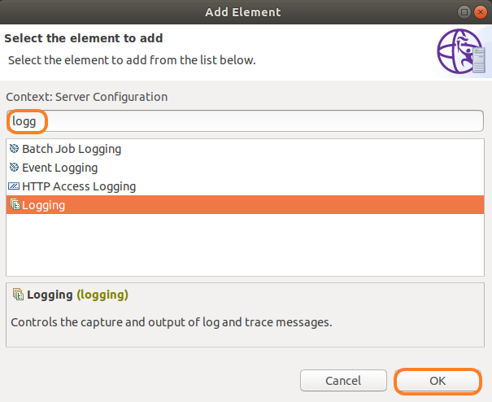

    d. La página de registro muestra las propiedades de la configuración de registro, como el nombre de los archivos de registro, el tamaño máximo de los archivos de registro y la cantidad máxima de archivos de registro a conservar.

    Se muestra información de configuración adicional sobre el seguimiento. Tenga en cuenta que el **nivel de registro de la consola** está configurado en **AUDITORÍA** de manera predeterminada.

    

3. Cambie el nivel de registro de la consola a **INFO** usando el menú desplegable.

    

    a. Cambie a la vista **Fuente** del archivo server.xml para ver los cambios de configuración agregados a server.xml.

    ```html
    <logging consoleLogLevel="INFO"></logging>
    ```

    b. **Guarde** el archivo de configuración.

    Los cambios realizados son dinámicos y surten efecto inmediatamente.

    

    <br>

## Actualizar la especificación de seguimiento

De manera predeterminada, la especificación de seguimiento de Liberty Server está establecida en ***=info=enabled** . Lo mismo ocurre con el servidor de aplicaciones WebSphere (WAS) tradicional.

La actualización de la especificación de seguimiento para la depuración se realiza fácilmente mediante el editor de configuración del servidor. Puede especificar la especificación de seguimiento en la interfaz de usuario o copiar y pegar la especificación de seguimiento directamente en el archivo server.xml.

En esta sección, especificará una especificación de seguimiento mediante el editor de configuración y, luego, verá el resultado en el archivo de origen server.xml.

1. Abra el editor de configuración del servidor, si aún no está abierto.

    a. En la vista **Servidores** , haga doble clic en el servidor **de configuración del servidor** labServer para abrir el editor de configuración server.xml.

    

    b. Asegúrese de estar en el modo de Diseño seleccionando la pestaña **Diseño** en el editor de configuración del servidor.

2. Actualice la **especificación de seguimiento** en la configuración **de registro** .

    a. Haga clic en **Registro** en la sección Configuración del servidor. Esto mostrará los detalles de registro y seguimiento.

    b. Actualice el campo **Especificación de seguimiento** con la siguiente cadena de seguimiento:

    ```
     webcontainer=all=enabled:*=info=enabled
    ```

    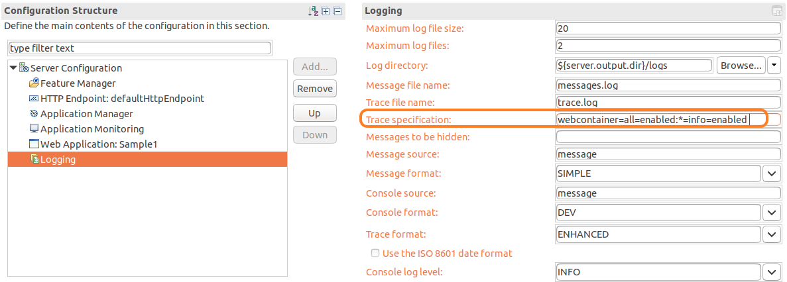

    c. Cambie a la pestaña **Fuente** en el editor de configuración y vea la configuración de registro. :

    ```
     <logging consoleLogLevel="INFO" traceSpecification="webcontainer=all=enabled:*=info=enabled"></logging>
    ```

    d. **Guarde** los cambios de configuración.

    e. Verifique la vista de la consola para verificar que se haya actualizado la especificación de seguimiento.

    

3. Verifique que el archivo **trace.log** contenga datos de seguimiento.

    a. Navegue hasta el directorio de registros del servidor.

    ```
     Home > Student > WLP_21.0.0.3 > wlp > usr > servers > labServer > logs
    ```

    Se ha creado el archivo **trace.log** y contiene contenido.

    

    b. Haga doble clic en el archivo **trace.log** para verlo en el editor de texto.

4. También puede ver el archivo trace en Eclipse. En la vista **Enterprise Explorer** , expanda el proyecto **Liberty** **Runtime** y sus subdirectorios y encontrará el archivo **trace.log** en el directorio de registros.

    a. Actualice el proyecto Liberty Runtime para que el archivo trace.log sea visible en la vista, ya que se creó fuera del IDE de Eclipse. **Haga clic con el botón derecho del mouse** en el proyecto **Liberty Runtime** y seleccione **Actualizar** en el menú contextual.

    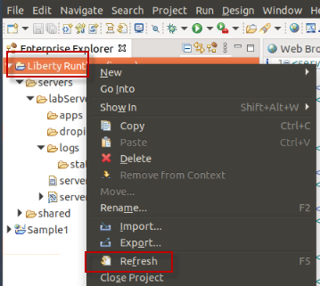

    b. Vaya a **Liberty Runtime &gt; servidores &gt; labServer &gt; registros**

    c. El archivo trace.log se puede ver desde dentro del IDE

    

5. **Muy importante, restablezca la especificación de seguimiento al valor predeterminado.**

    a. Cambie a la pestaña **Fuente** en el editor de configuración y actualice la configuración de registro a:

    ```
     <logging consoleLogLevel="AUDIT" traceSpecification="*=info=enabled "></logging>
    ```

    

    b. **Guarde** la configuración.

     <br>
    

## Personalización de las opciones de JVM de Liberty

Los argumentos genéricos de JVM se utilizan para configurar y ajustar cómo se ejecuta la JVM.

En esta sección del laboratorio, explorará el archivo de opciones de JVM. Una configuración de opción de JVM común es establecer el tamaño mínimo y máximo del montón de JVM, según los requisitos de tiempo de ejecución de la aplicación.

WebSphere Application Server Liberty está preconfigurado con una configuración mínima definida. Los siguientes pasos le indicarán cómo definir argumentos JVM genéricos personalizados, como configuraciones de montón para un servidor Liberty.

1. Primero, cree el archivo jvm.options, utilizando las herramientas de WebSPhere Developer

    a. En la vista **Servidores** Eclipse, haga clic con el botón derecho en el servidor Liberty.

    b. Seleccione del menú contextual

    ```
    New > Server Environment File > jvm.options > in
     ${server.config.dir}
    ```

    

    Esto creará un archivo **jvm.options** en el directorio de configuración del servidor con las opciones más utilizadas disponibles en los comentarios:

    

2. Si es necesario, haga doble clic para abrir el archivo en el editor de texto de Eclipse.

3. Ingrese las siguientes dos líneas en el archivo **jvm.options** para establecer el tamaño de montón mínimo y máximo para el servidor labServer.

    Las siguientes opciones establecerán el tamaño mínimo/máximo del montón de JVM en 25 MB y 500 MB respectivamente.

    ```
     -Xms25m
     -Xmx500m
    ```

4. **Guardar** el archivo. Ctrl + S

5. **Reinicie** el servidor para habilitar los cambios

    

6. **DETENER** el servidor

    

7. **Salir de** Eclipse

    Con esto concluye la parte de personalización del laboratorio. En las siguientes secciones, se le presentará la configuración de Liberty mediante la línea de comandos.

    

# Explora Liberty a través de la línea de comandos

En la sección anterior del laboratorio, utilizó WebSphere Developer Tools en el IDE de Eclipse para implementar una aplicación y trabajar con la configuración de Liberty.

También es posible crear servidores, iniciarlos y detenerlos, implementar aplicaciones y anular la configuración del servidor desde la línea de comandos. En esta sección del laboratorio, aprenderá a trabajar con Liberty desde la línea de comandos.

## Crear, iniciar y configurar un nuevo servidor Liberty

1. Navegar al directorio de Liberty

    a. Abra una ventana de Terminal y cambie al directorio de instalación de Liberty

    ```
    cd /home/ibmdemo/Student/WLP\_21.0.0.3/wlp
    ```

2. Cree un nuevo servidor Liberty llamado “myServer”. El directorio “bin” contiene los comandos de Liberty.

    a. Utilice el comando **server** con la opción “create” para crear un nuevo servidor llamado “myServer”. El servidor se crea en cuestión de segundos.

    ```
    bin/server create myServer
    ```

3. Inicie el servidor Liberty utilizando la opción “start” del comando **server** . El servidor se inicia en cuestión de segundos.

    ```
    bin/server start myServer
    ```

4. Modifique la configuración del servidor para agregar la función **servlet-3.1** que estará en la aplicación de muestra que implementará en un paso posterior.

    a. Abra un editor para editar el archivo **server.xml** del servidor llamado “myServer”.

    ```
     gedit /home/ibmdemo/Student/WLP_21.0.0.3/wlp/usr/servers/myServer/server.xml
    ```

    b En el administrador de funciones, reemplace las funciones existentes con la función servlet-3.1:

    ```xml
    <featureManager>
       <feature>servlet-3.1</feature>
    </featureManager>
    ```

    

    c. **Guardar** los cambios

    d. **Cerrar** el editor

5. Mire la cola de {LAB_HOME}/wlp/usr/servers/myServer/logs/messages.log

    Debería ver mensajes sobre actualizaciones de funciones. El archivo messages.log es el archivo de registro principal de Liberty y, de forma predeterminada, se encuentra en el directorio **de registros** en la configuración del servidor.

    ```
     tail /home/ibmdemo/Student/WLP_21.0.0.3/wlp/usr/servers/myServer/logs/messages.log
    ```

    **Por ejemplo:**

    ```
    [4/16/19 14:29:29:276 CDT] 00000037
    com.ibm.ws.kernel.feature.internal.FeatureManager CWWKF0007I: Feature
    update started.

    [4/16/19 14:29:29:400 CDT] 00000035
    com.ibm.ws.config.xml.internal.ConfigRefresher CWWKG0017I: The server
    configuration was successfully updated in 0.240 seconds.
    ```

    Ahora está listo para comenzar a trabajar con una aplicación de muestra que utiliza la función Servlet.

     <br>
    

## Implementación de una aplicación de muestra en Liberty

En la primera parte de este laboratorio, utilizó WebSphere Developer Tools en el IDE de Eclipse para implementar una aplicación y trabajar con la configuración de Liberty.

En esta sección del laboratorio, implementará una aplicación en Liberty utilizando dos técnicas diferentes.

Primero, simplemente copiará el módulo WAR de la aplicación en el directorio “ **dropins** ” de Liberty. El directorio dropins es monitoreado por Liberty. A medida que se agregan unidades implementables (WAR, EAR, JAR) al directorio, Liberty implementa e inicia automáticamente la aplicación en el servidor de Liberty.

A medida que las unidades implementables se eliminan de la carpeta dropins, las aplicaciones se detienen y se eliminan del servidor Liberty en ejecución.

Ahora, pruébalo.

### Implementar una aplicación en el directorio dropins

###

<table>
<tbody>
<tr class="odd">
<td></td>
<td>
<p><strong>Información:</strong></p>
<p>El directorio <strong>dropins</strong> se puede utilizar para aplicaciones que no requieren configuración adicional, como la asignación de roles de seguridad.</p>
</td>
</tr>
</tbody>
</table>

1. Primero, use el comando “ **tail -f”** para ver el archivo **messages.log** del servidor Liberty para ver los mensajes que se generan una vez que el archivo war de la aplicación se copia a la carpeta “dropins” de su servidor.

    a. Abra una nueva ventana de Terminal

    b. Utilice el comando **tail -f** para ver el archivo messages.log.

    ```
    tail -f /home/ibmdemo/Student/WLP_21.0.0.3/wlp/usr/servers/myServer/logs/messages.log
    ```

2. La forma más sencilla de implementar una aplicación en Liberty es copiarla al directorio **dropins** del servidor.

    El **archivo Sample1.war** se proporciona en el laboratorio. Es la misma aplicación que se implementó utilizando el IDE de Eclipse en la primera parte del laboratorio.

    a. Regrese a la ventana de terminal que se encuentra en el directorio: ~/Student/WLP_21.0.0.3/wlp

    b. Copie la aplicación **Sample1.war** proporcionada a la carpeta dropins de su servidor “myServer”.

    ```
    cp /home/ibmdemo/Student/WLP_21.0.0.3/labs/gettingStarted/1_discover_*/Sample1.war /home/ibmdemo/Student/WLP_21.0.0.3/wlp/usr/servers/myServer/dropins
    ```

3. Revise el **archivo messages.log** del servidor para asegurarse de que se haya implementado la aplicación. Verá mensajes que muestran que se está iniciando la aplicación Sample1.

    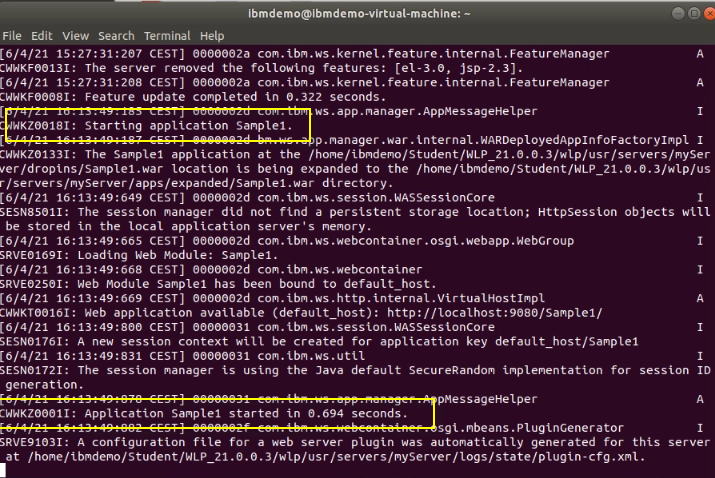

4. Compruebe que la aplicación se está ejecutando abriendo un navegador en:

    [http://localhost:9080/Ejemplo1/ServletSimple](http://localhost:9080/Sample1/SimpleServlet)

    

5. Elimina el archivo Sample1.war del directorio **dropins** y luego verifica que ya no sea accesible desde el navegador.

    ```
     rm /home/ibmdemo/Student/WLP_21.0.0.3/wlp/usr/servers/myServer/dropins/Sample1.war
    ```

    

    [http://localhost:9080/Ejemplo1/ServletSimple](http://localhost:9080/Sample1/SimpleServlet)

    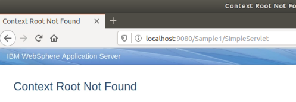

     <br>
    

### Implemente la aplicación agregándola al archivo server.xml

Si bien el directorio **dropins** se puede usar para aplicaciones que no requieren configuración adicional, implementar la aplicación agregándola al archivo server.xml brinda la libertad de configurar el servidor Liberty según los requisitos de configuración de la aplicación.

En esta sección, implementará la aplicación Sample1 agregándola al archivo server.xml.

En este caso deberás depositar la solicitud en una de las siguientes ubicaciones:

- ${server.config.dir}/apps (es decir, *directorio_servidor* /usuario/servidores/ *nombre_servidor* /apps)

- ${shared.app.dir} (es decir, *liberty_install_location* /usr/shared/apps)

    <br>

1. Copie el archivo Sample1.war al directorio ${server.config.dir}/apps.

    ```
    cp /home/ibmdemo/Student/WLP_21.0.0.3/labs/gettingStarted/1_discover_*/Sample1.war /home/ibmdemo/Student/WLP_21.0.0.3/wlp/usr/servers/myServer/apps
    ```

2. Agregue la configuración de la aplicación Sample1.war al archivo server.xml.

    a. Use **gedit** para editar el **archivo server.xml** y agregar Sample1.war a la configuración, que apunta al directorio “apps” de manera predeterminada.

    ```
    gedit /home/ibmdemo/Student/WLP_21.0.0.3/wlp/usr/servers/myServer/server.xml
    ```

    b. Agregue la siguiente línea al archivo server.xml, como se ilustra a continuación:

    ```html
    <webApplication id="Sample1" location="Sample1.war" name="Sample1" />
    ```

    

    c. **Guarde y CIERRE el archivo server.xml**

3. Verifique el **archivo messages.log** del servidor para verificar que la aplicación se haya iniciado.

    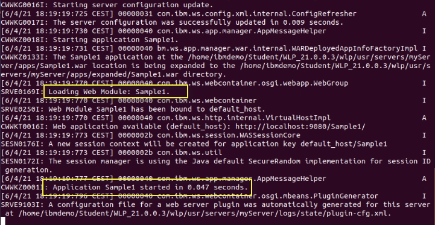

4. Compruebe que la aplicación se está ejecutando abriendo un navegador en:

    [http://localhost:9080/Ejemplo1/ServletSimple](http://localhost:9080/Sample1/SimpleServlet)

    

    <br>

## Agregar salida de registro INFO a la consola

De forma predeterminada, el servidor Liberty tiene el nivel de registro de la consola establecido en AUDITORÍA.

En esta sección, cambiará el nivel de los mensajes de registro escritos en la consola de AUDIT a INFO.

Para realizar esta actividad, deberá modificar el archivo **server.xml** con un editor. También es posible configurar las opciones de registro predeterminadas en el archivo bootstrap.properties. Si las opciones de registro se configuran en el archivo bootstrap.properties, estas tendrán efecto muy pronto en el inicio del servidor, por lo que pueden resultar útiles para depurar problemas de inicialización del servidor.

1. Edite **server.xml** y agregue la configuración de registro:

    a. Abra el archivo server.xml con el editor.

    ```
    gedit /home/ibmdemo/Student/WLP_21.0.0.3/wlp/usr/servers/myServer/server.xml
    ```

    b Agregue la siguiente línea al archivo server.xml para actualizar el nivel de registro de AUDIT a INFO.

    ```html
    <logging consoleLogLevel="INFO"/>
    ```

    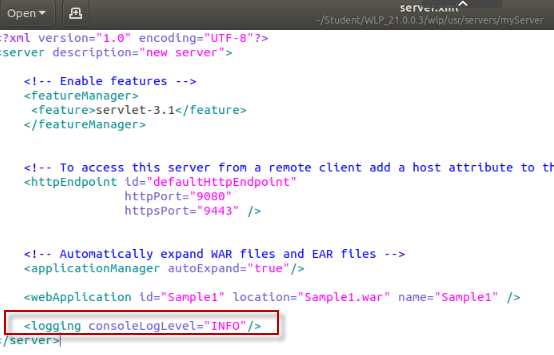

    c. **Guarde** los cambios y verifique en messages.log que se actualizó el cambio de configuración.

    d. Desde la ventana de terminal donde se ejecuta el comando “ **tail -f** ”, verifique que se haya actualizado la configuración del servidor.

    

    <br>

## Actualizar la especificación de seguimiento

De forma predeterminada, la especificación de seguimiento de Liberty Server está establecida en *=info=enabled. Lo mismo ocurre con el servidor de aplicaciones WebSphere tradicional.

La actualización de la especificación de seguimiento para la depuración se realiza fácilmente actualizando server.xml.

1. Actualice la estrofa de registro para incluir una especificación de seguimiento para rastrear el contenedor web.

    a. Use gedit para editar **server.xml** y **actualizar** la sección de registro a:

    ```html
    <logging consoleLogLevel="INFO" traceSpecification="webcontainer=all=enabled:*=info=enabled" />
    ```

    b. **Guarde** el archivo server.xml:

    

    c. Verifique que el archivo messages.lof haya registrado la especificación de seguimiento actualizada

    

2. Utilice **CTRL-C** para **detener** el comando “ **tail -f** ” que se está ejecutando en la ventana del terminal.

3. Verifique que el archivo de seguimiento contenga datos de seguimiento. El archivo de seguimiento se encuentra en:

    ```
     cat /home/ibmdemo/Student/WLP_21.0.0.3/wlp/usr/servers/myServer/logs/trace.log
    ```

4. **Muy importante: evite el seguimiento excesivo revirtiendo la especificación de seguimiento a:**

    ```html
    <logging consoleLogLevel="INFO"/>
    ```

    

5. **Guarde** los cambios en el archivo server.xml.

6. **Cerrar el editor**

     <br>
    

## Personalización de las opciones de Liberty JVM

Los argumentos genéricos de JVM se utilizan para configurar y ajustar cómo se ejecuta la JVM.

WebSphere Application Server Liberty está preconfigurado con una configuración mínima definida. Los siguientes pasos le indicarán cómo definir argumentos JVM genéricos personalizados, como configuraciones de montón para un servidor Liberty.

1. Crea un archivo **jvm.options** que afecte a todos los servidores

    a. Cambie el directorio a {LAB_HOME}/wlp/usr/servers/myServer

    ```
    cd /home/ibmdemo/Student/WLP_21.0.0.3/wlp/usr/servers/myServer
    ```

    b. Cree un nuevo archivo llamado **jvm.options** en el directorio “myServer”

    ```
    gedit jvm.options
    ```

    c. Agregue las siguientes líneas para establecer el tamaño de montón mínimo y máximo.

    Las siguientes opciones establecerán el tamaño mínimo/máximo del montón de JVM en 25 MB y 500 MB respectivamente.

    ```
    -Xms25m
    -Xmx500m
    ```

    

2. **Guarde** y **cierre** el archivo jvm.options

3. **Reinicie** el servidor para que los cambios surtan efecto.

    ```
     cd /home/ibmdemo/Student/WLP_21.0.0.3/wlp

     bin/server stop myServer
     
     bin/server start myServer
    ```

    

4. **Detener** el servidor

    ```
     cd /home/ibmdemo/Student/WLP_21.0.0.3/wlp

     bin/server stop myServer
    ```

Con esto concluye la parte de personalización del laboratorio mediante la línea de comandos. En las siguientes secciones, se le presentarán los archivos de configuración de Liberty para personalizar la inicialización del servidor y la configuración del entorno.

  <br>


# Presentación de la configuración de la variable de entorno de Liberty

Puede personalizar el entorno de Liberty utilizando ciertas variables específicas para admitir la ubicación de binarios de productos y recursos compartidos.

Las variables de entorno de Liberty se especifican mediante el archivo **server.env** .

Puede utilizar el archivo **server.env** en los niveles de instalación y servidor para especificar variables de entorno como JAVA_HOME, WLP_USER_DIR y WLP_OUTPUT_DIR.

<table>
<tbody>
<tr class="odd">
<td></td>
<td>
<p><strong>Importante:</strong></p>
<p><strong>NOTA:</strong> <strong>NO</strong> modificará la configuración del entorno predeterminada en este laboratorio.</p>
<p>Revise la información de esta sección para familiarizarse con las variables de entorno que están disponibles para personalizar el entorno Liberty.</p>
</td>
</tr>
</tbody>
</table>

Las siguientes variables específicas de Liberty se pueden utilizar para personalizar el entorno de Liberty:

- **${wlp.install.dir}**

    Esta variable de configuración tiene una ubicación inferida. El directorio de instalación siempre se establece en el directorio principal del directorio que contiene el script de inicio o en el directorio principal del directorio /lib que contiene los archivos jar de destino.

    > **SUGERENCIA:** Para este laboratorio, *${wlp.install.dir}* es ““ **{LAB_HOME}/wlp** ”

- **WLP_DIR_USUARIO**

    Esta variable de entorno se puede utilizar para especificar una ubicación alternativa para ${wlp.install.dir}/usr. Esta variable solo puede ser una ruta absoluta. Si se especifica, el entorno de ejecución busca recursos compartidos y la definición del servidor en el directorio especificado.

    ${server.config.dir} es equivalente a ${wlp.user.dir}/servers/serverName y se puede configurar en una ubicación diferente cuando se ejecuta un servidor (para usar archivos de configuración desde una ubicación fuera de wlp.user.dir).

    > **SUGERENCIA:** Para este laboratorio, ${server.config.dir} depende del servidor utilizado, ya sea “ **{LAB_HOME}/wlp*/usr/servers/labServer** *” o “ **{LAB_HOME}/wlp*/usr/servers/myServer** *”.

- **Directorio de salida WLP**

    Esta variable de entorno se puede utilizar para especificar una ubicación alternativa para la salida generada por el servidor, como registros, el directorio del área de trabajo y los archivos generados. Esta variable solo puede ser una ruta absoluta.

    Si se especifica esta variable de entorno, ${server.output.dir} se establece en el equivalente de WLP_OUTPUT_DIR/serverName. Si no se especifica, ${server.output.dir} es el mismo que ${server.config.dir}.

    > **SUGERENCIA:** Para este laboratorio, ${server.output.dir} es **{LAB_HOME}/wlp* /usr/servers/labServer* **” o “ **{LAB_HOME}/wlp*/usr/servers/myServer** *”, que es lo mismo que ${server.config.dir}.

    <br>

# Presentamos Liberty bootstrap.properties

En esta sección del laboratorio, comprenderá cómo y cuándo se requieren las propiedades de arranque durante la inicialización del entorno.

<table>
<tbody>
<tr class="odd">
<td></td>
<td>
<p><strong>Importante:</strong></p>
<p><strong>NOTA:</strong> <strong>NO</strong> modificará la configuración del entorno predeterminada en este laboratorio.</p>
<p>Esta información se proporciona en el laboratorio para su referencia.</p>
</td>
</tr>
</tbody>
</table>

Las propiedades de Bootstrap se utilizan para inicializar el entorno de ejecución de un servidor en particular. Por lo general, son atributos que afectan la configuración y la inicialización del entorno de ejecución.

Las propiedades de Bootstrap se configuran en un archivo de texto llamado **bootstrap.properties** . Este archivo debe estar ubicado en el directorio del servidor junto con el archivo raíz de configuración server.xml.

De forma predeterminada, el directorio del servidor es **usr/servers/ *server_name*** .

El archivo **bootstrap.properties** contiene dos tipos de propiedades:

- Un conjunto pequeño y predefinido de propiedades de inicialización.

- Cualquier propiedad personalizada que elija definir podrá utilizarla luego como variable en otros archivos de configuración (es decir, server.xml y archivos incluidos).

Puede crear bootstrap.properties mediante cualquier mecanismo de creación de archivos o utilizando el mismo método que se muestra arriba para la creación del archivo jvm.options en Eclipse. Puede editar el archivo bootstrap.properties utilizando un editor de texto o utilizando el editor que forma parte de las herramientas para desarrolladores de Liberty.

Los cambios en el archivo bootstrap.properties se aplican cuando se reinicia el servidor.

**CONSEJO:**

> Por ejemplo, el servicio de registro se puede controlar a través del archivo de configuración del servidor (server.xml). En ocasiones, es necesario configurar las propiedades de registro para que surtan efecto antes de que se procesen los archivos de configuración del servidor.

> En este caso, configúrelos en el archivo bootstrap.properties en lugar de en la configuración del servidor.

> Normalmente no es necesario hacer esto para obtener el registro de su propio código, que se carga después del procesamiento de configuración del servidor, pero es posible que deba hacerlo para analizar problemas en el inicio temprano del servidor o en el procesamiento de configuración.

**=== FIN DEL LABORATORIO ===**

[Regresar a la página principal de laboratorios](../README.md)
