# Laboratorio: Uso de herramientas Open Liberty con VS Code

[Regresar a la página principal de laboratorios](../README.md)

## Objetivos

En este ejercicio, aprenderá cómo los desarrolladores pueden usar Liberty en modo "dev" con el entorno de desarrollo integrado de VS Code para lograr un ciclo iterativo eficiente de desarrollo, prueba y depuración al desarrollar aplicaciones y microservicios basados en Java.

Al finalizar este laboratorio usted podrá:

- Experiencia en el uso de la extensión Open Liberty Tools disponible en VS Code para desarrollar, probar y depurar de manera eficiente aplicaciones nativas de la nube Java.

- Experimente la recarga en caliente del código de la aplicación y los cambios de configuración utilizando el modo de desarrollo

Necesitará aproximadamente entre **60 y 90 minutos** para completar este laboratorio.

## Requisitos de laboratorio

- Utilice el entorno de laboratorio que hemos preparado para este laboratorio. Ya tiene el software necesario instalado y configurado.

## Introducción: extensión Open Liberty Tools para VS Code

En un laboratorio separado, aprendió cómo se puede ejecutar el modo de desarrollo Open Liberty desde una línea de comando y al mismo tiempo le permite editar su código con cualquier editor de texto o IDE.


En este laboratorio, utilizará la **extensión VS Code** “ **Open Liberty Tools”** para iniciar Open Liberty en modo de desarrollo, realizar cambios en su aplicación mientras el servidor está activo, ejecutar pruebas y ver resultados, e incluso depurar la aplicación sin salir del editor.

Su código se compila y se implementa automáticamente en su servidor en ejecución, lo que facilita la iteración de sus cambios.

Las herramientas Open Liberty para VS Code contienen las siguientes características clave

- Ver **proyectos liberty-maven-plugin** en el espacio de trabajo (versión 3.1 o superior)

- Ver **proyectos liberty-gradle-plugin** en el espacio de trabajo (versión 3.0 o superior)

- Iniciar/detener Open Liberty Server en modo de desarrollo

- Iniciar el modo de desarrollo de Open Liberty Server con parámetros personalizados

- Ejecutar pruebas unitarias y de integración

- Ver informes de pruebas unitarias y de integración

Open Liberty Tools para VS Code tiene una dependencia de la extensión **Tools for MicroProfile** VS Code para respaldar el desarrollo de microservicios basados en MicroProfile.

La extensión **Herramientas para MicroProfile** VS Code tiene dependencias de lo siguiente:

- Java JDK (o JRE) 11 o más reciente

- Soporte de lenguaje para Java mediante la extensión Red Hat VS Code.

### **Complemento Maven de Liberty**

El **complemento Maven de Liberty** proporciona varios objetivos para administrar un servidor y aplicaciones de Liberty.

Se recomienda Maven 3.5.0 o posterior para utilizar el complemento Liberty Maven.

Para habilitar el complemento Maven de Liberty en su proyecto, simplemente agregue la siguiente estrofa XML a su archivo **pom.xml** .

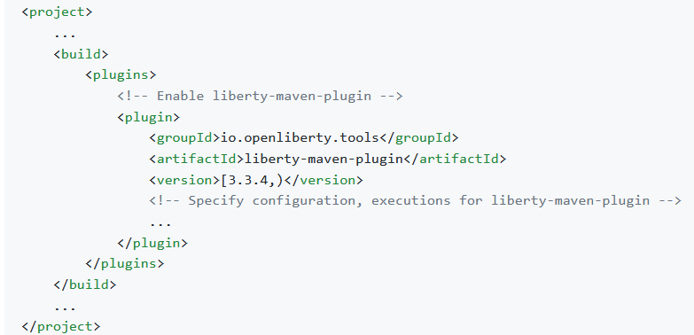

Para obtener información detallada sobre los objetivos de Maven compatibles con el complemento Maven de Liberty, visite:

[https://github.com/OpenLiberty/ci.maven](https://github.com/OpenLiberty/ci.maven)

### **Interactuando con el modo de desarrollo**

Una vez que se especifica el **complemento Maven de Liberty** en su archivo **pom.xml** , el nombre de su proyecto aparece en el **Panel de desarrollo de Liberty** en el panel lateral de VS Code, como se ilustra a continuación.

Puede interactuar con el modo de desarrollo haciendo clic derecho en el nombre de su proyecto y seleccionando uno de los comandos compatibles con la extensión Open Liberty Tools.

> 

### **Comandos del modo de desarrollo de Liberty**

Los siguientes comandos se pueden seleccionar desde el menú desplegable después de hacer clic derecho en el nombre de su proyecto en el Panel de desarrollo de Liberty.


  <br>


## Accediendo al entorno del laboratorio

Si está realizando este laboratorio como parte de un taller dirigido por un instructor (virtual o presencial), ya se le ha proporcionado un entorno. El instructor le proporcionará los detalles para acceder al entorno del laboratorio.

De lo contrario, deberá reservar un entorno para el laboratorio. Puede obtener uno aquí. Siga las instrucciones en pantalla para la opción “ **Reservar ahora** ”.

[https://techzone.ibm.com/my/reservations/create/63877af037f8a600183c737b](https://techzone.ibm.com/my/reservations/create/63877af037f8a600183c737b)

El entorno de laboratorio contiene una (1) máquina virtual Linux, denominada **Workstation** .


La máquina virtual **de la estación de trabajo** Ubuntu Linux tiene el siguiente software instalado para el laboratorio:

- Proyecto de aplicación con Liberty
- Maven 3.6.0

  <br>


1. Acceda al entorno de laboratorio desde su navegador web.

    Se configura un `Published Service` para proporcionar acceso a la máquina virtual **de la estación de trabajo** a través de la interfaz noVNC para el entorno de laboratorio.

    a. Cuando se haya aprovisionado el entorno de demostración, haga clic en el **mosaico del entorno** para abrir su vista de detalles.

    b. Haga clic en el enlace **Servicio publicado** que mostrará una **lista del directorio.**

    c. Haga clic en el enlace **"vnc.html"** para abrir el entorno de laboratorio a través de la interfaz **noVNC** .

    

    d. Haga clic en el botón **Conectar**

    

    d. Ingrese la contraseña como: **passw0rd** . Luego haga clic en el botón **Enviar credenciales** para acceder al entorno de laboratorio.

    > Nota: Ese es un cero numérico en passw0rd

    

2. Inicie sesión con el ID **de ibmdemo** .

    a. Haga clic en el ícono “ **ibmdemo** ” en la pantalla de Ubuntu.

    

    b. Cuando se le solicite la contraseña para el usuario “ **ibmdemo** ”, ingrese “ **passw0rd** ” como contraseña:

    Contraseña: **passw0rd** (minúscula con un cero en lugar de la o)

    

     <br>
    

3. Una vez que accedas a la **VM del Estudiante** a través del servicio publicado, verás el Escritorio, que contiene todos los programas que utilizarás (navegadores, terminal, etc.)

|                                                   |                                                                                                                                                                                                                                                                            |
|---------------------------------------------------|:---------------------------------------------------------------------------------------------------------------------------------------------------------------------------------------------------------------------------------------------------------------------------|
|  | <p><strong>IMPORTANTE:</strong></p>                                                                                                                                                                                                                                        |
|                                                   | <p>Utilizando el entorno de laboratorio proporcionado, se han instalado para usted todas las extensiones y dependencias de VS Code necesarias.</p>                                                                                                                         |
|                                                   | <p>Esto le permite centrarse en el valor de utilizar las capacidades de las herramientas para el desarrollo, prueba y depuración de bucle interno rápidos y eficientes de aplicaciones basadas en Java y microservicios utilizando Open Liberty en modo de desarrollo.</p> |

  <br>


## Consejos para trabajar en el entorno de laboratorio

1. Puede cambiar el tamaño del área visible utilizando las opciones **de Configuración de noVNC** para cambiar el tamaño del escritorio virtual para que se ajuste a su pantalla.

    a. Desde la máquina virtual del entorno, haga clic en el **icono giratorio** en el panel de control noNC para abrir el menú.

    

    b. Para aumentar el área visible, haga clic en `Settings > Scaling Mode` y configure el valor en `Remote Resizing`

    

2. Puede copiar/pegar texto de la guía de laboratorio en el entorno de laboratorio utilizando el portapapeles en el visor noVNC.

    a. Copie el texto de la guía de laboratorio que desea pegar en el entorno de laboratorio.

    b. Haga clic en el icono **del Portapapeles** y **pegue** el texto en el portapapeles de noVNC

    

    c. Pegue el texto en la máquina virtual, por ejemplo en una ventana de terminal, una ventana del navegador, etc.

    d. Haga clic en el icono **del portapapeles** nuevamente para cerrarlo.

    > **NOTA:** A veces, pegar en una ventana de Terminal en la VM no funciona de manera consistente.

    > En este caso, puedes intentarlo nuevamente, o abrir otra ventana de terminal e intentarlo nuevamente, o pegar el texto en un **editor de texto** en la VM y luego pegarlo en la ventana de terminal en la VM.

3. Como alternativa a la opción Copiar/Pegar de noVNC, puede considerar abrir la guía de laboratorio en un navegador web dentro de la máquina virtual. Con este método, puede copiar y pegar fácilmente texto de la guía de laboratorio sin tener que usar el portapapeles de noVNC.

  <br>


### Si en cualquier momento durante el laboratorio se le solicita instalar actualizaciones, haga clic en CANCELAR.

|                                                   |                                                                                                                                                                                                                                                                                                  |
|---------------------------------------------------|:-------------------------------------------------------------------------------------------------------------------------------------------------------------------------------------------------------------------------------------------------------------------------------------------------|
|  | <p><strong>Importante:</strong> </p>                                                                                                                                                                                                                                                             |
|                                                   | <p><strong>Haga clic en CANCELAR</strong> … Si, en cualquier momento durante el laboratorio, aparece una ventana emergente que le solicita instalar un software actualizado en la máquina virtual Ubuntu.</p> <p>Lo que estamos experimentando es una actualización disponible para VS Code.</p> |
|                                                   | <p><strong>¡HAGA CLIC EN CANCELAR!</strong></p>                                                                                                                                                                                                                                                  |
|                                                   | <p></p>                                                                                                                                                                                                                          |

## Introducción a las herramientas Open Liberty en VS Code

**El modo de desarrollo de Liberty** le permite a usted, como desarrollador, centrarse en su código. Cuando Open Liberty se ejecuta en modo de desarrollo, su código se compila y se implementa automáticamente en el servidor en ejecución, lo que facilita la iteración de sus cambios.

En este laboratorio, como desarrollador, experimentará el uso de la extensión **Open Liberty Tools** en **VS Code** para trabajar con su código y ejecutar pruebas a pedido, de modo que pueda obtener comentarios inmediatos sobre sus cambios.

También trabajará con herramientas de depuración integradas y adjuntará un depurador de Java para depurar su aplicación en ejecución.

Desde la perspectiva de un desarrollador, esto supone una enorme ganancia en eficiencia, ya que todas estas actividades de desarrollo iterativas de bucle interno se producen sin tener que salir nunca del entorno de desarrollo integrado (IDE).

<br>

### **Revise el archivo pom.xm de proyectos y extensiones de VS Code utilizado para este proyecto**

La aplicación de muestra que se utiliza en este laboratorio está configurada para compilarse con Maven. Cada proyecto configurado con Maven contiene un archivo pom.xml que define la configuración del proyecto, las dependencias, los complementos, etc.

Su archivo pom.xml está en el directorio raíz del proyecto y está configurado para incluir **liberty-maven-plugin** , que le permite instalar aplicaciones en Open Liberty y administrar las instancias del servidor.

Para comenzar, navegue al directorio del proyecto y revise las extensiones IDE y el archivo pom.xml que se utiliza para el microservicio “ **sistema”** que se proporciona en el laboratorio.

Primero, agregue la carpeta del proyecto a un espacio de trabajo de VS Code

1. **Cierre** todas las ventanas **de terminal** y las pestañas **del navegador** utilizadas en cualquier laboratorio anterior.

2. Navegue hasta el directorio del proyecto e inicie VS Code desde la carpeta **de inicio** del proyecto.

    a. Abra una ventana de terminal y cambie al siguiente directorio:

    ```
    cd /home/ibmdemo/Student/labs/devmode/guide-getting-started/start
    ```

3. Inicie VS Code usando el directorio actual como carpeta raíz para el espacio de trabajo

    ```
    code .
    ```

    Cuando se inicia la interfaz de usuario de VS Code, se muestra la vista del explorador. La carpeta “START” contiene el código fuente del proyecto.

    

    <br>

4. Revise las extensiones instaladas en VS Code que se utilizan para este laboratorio.

    a. Haga clic en el ícono **Extensiones** en la barra de navegación izquierda en VS Code.

    

    b. Expanda la sección de extensiones “INSTALADAS” para enumerar las extensiones que están instaladas actualmente en este entorno. Las extensiones más importantes que se utilizan en este laboratorio son:

    - Herramientas de Open Liberty
    - Herramientas para MicroProfile
    - Compatibilidad del lenguaje con Java
    - Depurador para Java

    <br>

    c. Haga clic en la extensión “ **Abrir Liberty Tools** ” para ver sus detalles.

    d. Observe la lista de comandos compatibles con la extensión Open Liberty Tools.

    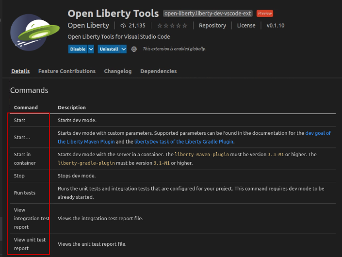

    e. Desplácese hacia abajo hasta la sección “ **Requisitos** ” de la página de detalles de Open Liberty Tools.

    Tenga en cuenta el requisito de “Herramientas para MicroProfile” para respaldar el desarrollo de microservicios que utilizan API de MicroProfile con Open Liberty.

    

    |                                                   |                                                                                                                                  |
    |---------------------------------------------------|:---------------------------------------------------------------------------------------------------------------------------------|
    |  | <p><strong>Información:</strong></p>                                                                                             |
    |                                                   | <p>La extensión <strong>Herramientas para MicroProfile</strong> requiere que los componentes estén instalados en el entorno:</p> |
    |                                                   | <p></p>                                                                                    |

    f. **Cierre** la página de detalles de la extensión Open Liberty Tools.

    <br>

5. Revise el archivo **pom.xml** utilizado para configurar y construir el microservicio "sistema".

    a. Haga clic en el icono **del Explorador** Ubicado en la barra de navegación izquierda en VS Code.

    b. Expanda la carpeta **START** si aún no está expandida

    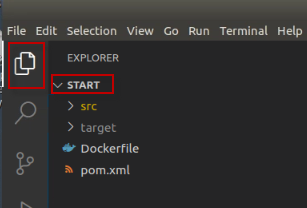

    c. Haga clic en el archivo **pom.xml** para abrirlo en el panel del editor.

    d. Cierre todos los cuadros emergentes que le pregunten si desea instalar extensiones o cambiar de vista.

    **Nota:** Es posible que veas ventanas emergentes adicionales, simplemente ciérralas o ignóralas.

    

    e. Observe el empaquetado binario del archivo WAR de la aplicación Java que se produce a partir de la compilación de Maven. El archivo WAR producido se llamará **guide-getting-started** version 1.0-SNAPSHOT.

    

    f. Se definen los puertos HTTP y HTTPS predeterminados y se sustituyen en el archivo server.xml

    

    g. El complemento Open Liberty Tools está habilitado, con una versión compatible de 3.3.4

    

    h. El complemento para ejecutar pruebas también se agrega a la configuración de Maven, que aprovecha las dependencias de prueba también definidas en el archivo pom.xml.

    

    i. **Cierre** el archivo pom.xml

    <br>

    |                                                   |                                                                                                                 |
    |---------------------------------------------------|:----------------------------------------------------------------------------------------------------------------|
    |  | <p><strong>Información:</strong></p>                                                                            |
    |                                                   | <p><strong>Consejo:</strong> Puede encontrar información adicional sobre el complemento liberty-maven aquí:</p> |
    |                                                   | <p><a href="https://github.com/OpenLiberty/ci.maven">https://github.com/OpenLiberty/ci.maven</a></p>            |

    <br>

## Uso de herramientas Open Liberty en VS Code

En esta sección del laboratorio, utilizará las **herramientas Open Liberty en** **VS Code** para trabajar con su código y ejecutar pruebas a pedido, de modo que pueda obtener comentarios inmediatos sobre sus cambios.

|                                                   |                                                                                                                                                                                                                                                                                                                      |
|---------------------------------------------------|:---------------------------------------------------------------------------------------------------------------------------------------------------------------------------------------------------------------------------------------------------------------------------------------------------------------------|
|  | <p><strong>Importante:</strong></p>                                                                                                                                                                                                                                                                                  |
|                                                   | <p><strong>Para herramientas de Open Liberty</strong> (PANEL DE CONTROL DE DESARROLLO DE LIBERTY)</p>                                                                                                                                                                                                                |
|                                                   | <p>VS Code proporciona extensiones para Java para soportar las características del lenguaje Java.</p>                                                                                                                                                                                                                |
|                                                   | <p>VS Code para Java admite dos modos.</p>                                                                                                                                                                                                                                                                           |
|                                                   | <ul>                                                                                                                                                                                                                                                                                                                 |
|                                                   | <li><p>Modo ligero</p></li>                                                                                                                                                                                                                                                                                          |
|                                                   | <li><p>Modo estándar</p></li>                                                                                                                                                                                                                                                                                        |
|                                                   | </ul>                                                                                                                                                                                                                                                                                                                |
|                                                   | <p>VS Code tiene una configuración predeterminada llamada “modo híbrido”, donde se abre un espacio de trabajo en modo liviano, pero según sea necesario, se le solicita que cambie al modo estándar.</p>                                                                                                             |
|                                                   | <p>La extensión <strong>Tools for MicroProfile</strong> , necesaria para la extensión <strong>Open Liberty Tools</strong> , requiere que el espacio de trabajo de Java se abra en modo “ <strong>STANDARD</strong> ”. De lo contrario, el PANEL DE CONTROL DE DESARROLLO DE LIBERTY no funcionará correctamente.</p> |
|                                                   | <p><strong>Consejo:</strong> En este entorno de laboratorio, el espacio de trabajo ya está configurado para usar el modo estándar.</p>                                                                                                                                                                               |
|                                                   | <p>Para obtener más detalles sobre VS Code para Java, consulte el siguiente enlace: <a href="https://code.visualstudio.com/docs/java/java-project">https://code.visualstudio.com/docs/java/java-project</a></p>                                                                                                      |

1. Utilice el panel de desarrollo de Liberty para **iniciar** el servidor Liberty en modo de desarrollo

    a. En VS Code, expanda la sección LIBERTY DEV DASHBOARD

    b. Haga clic con el botón derecho del ratón en la **guía de introducción a** Liberty Server

    c. Seleccione **Iniciar** en el menú para iniciar el servidor.

    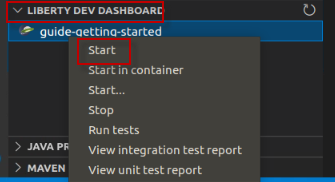

    d. Se abre la vista de la Terminal y se ven los mensajes de registro del servidor a medida que se inicia el servidor. Cuando aparece el siguiente mensaje en la Terminal, se inicia el servidor Liberty.

    

    <br>

2. Ejecute la aplicación de muestra Propiedades del sistema desde un navegador web

    a. Abra el navegador web desde dentro de la máquina virtual.

    b. Vaya a [http://localhost:9080](http://localhost:9080) para verificar que la aplicación se esté ejecutando.

    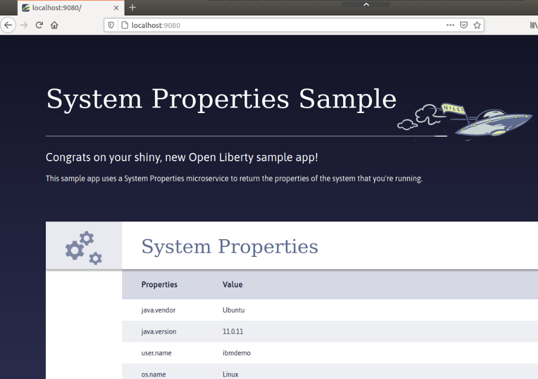

    <br>

### **Experiencia de desarrollador con herramientas Open Liberty en VS Code**

La aplicación de muestra Propiedades del sistema está funcionando en el servidor Liberty.

A continuación, como desarrollador, desea implementar una verificación del estado de la aplicación.

La experiencia del desarrollador no tiene inconvenientes, ya que todos los cambios de código y configuración que introduce el desarrollador se detectan automáticamente y el servidor y la aplicación se actualizan dinámicamente en el servidor en ejecución para reflejar el código y la configuración actualizados.

Exploremos un par de ejemplos de una experiencia de desarrollador muy eficiente al implementar alguna nueva capacidad en nuestro servicio.

En este ejemplo, aprovechará la función **mpHealth-2.2** de Open Liberty, que implementa la API mpHealth-2.2 de MicroProfile, para implementar los nuevos controles de estado de la aplicación.

La función **mpHealth-2.2** proporciona un punto final **/health** que representa un estado binario, ya sea ACTIVO o ABAJO, de los microservicios que están instalados.

Para obtener más información sobre la función mpHealth de MicroProfile, visite: [https://www.openliberty.io/docs/21.0.0.4/health-check-microservices.html](https://www.openliberty.io/docs/21.0.0.4/health-check-microservices.html)

1. Actualice el archivo de configuración del servidor Liberty (server.xml) para incluir la función mpHealth-2.2 para comenzar a implementar las comprobaciones de estado de la aplicación.

    a. En la vista del explorador de VS Code, navegue hasta **INICIO** -&gt; **src** -&gt; **main** -&gt; **liberty / config**

    b. Haga clic en **server.xml** para abrir el archivo en el panel del editor.

    

    c. Agregue la función **mpHealth-2.2** al archivo server.xml utilizando el texto que aparece a continuación:

    ```
    <feature>mpHealth-2.2</feature>
    ```

    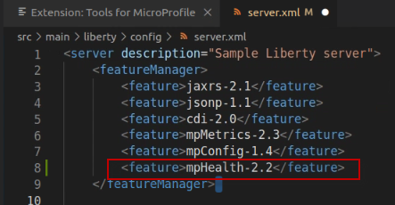

    <br>

    d. **Guarde** y **cierre** el archivo server.xml

    Cuando se guarda el archivo server.xml, se detectan los cambios de configuración y el servidor se actualiza dinámicamente, instalando la nueva función y actualizando la aplicación en el servidor en ejecución.

    <br>

2. Vea los mensajes en la vista **Terminal** , que muestran la función que se está instalando y la aplicación que se está actualizando.

    

    Una vez que se guardan los cambios y el servidor se actualiza automáticamente, el nuevo punto final **de salud** está disponible.

    <br>

3. Desde el navegador web en la VM, acceda al punto final **/health** para ver el estado de salud de la aplicación.

    ```
    http://localhost:9080/health
    ```

    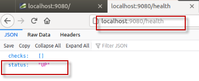

    <br>

    Actualmente, la comprobación de estado básica proporciona un estado simple que indica si el servicio está en ejecución, pero no si se encuentra en buen estado.

    En los próximos pasos, implementará una verificación **de actividad** que implementa una lógica que recopila información sobre el uso de la memoria y la CPU e informa que el servicio está CAÍDO en la verificación de estado si los recursos del sistema exceden un cierto umbral.

    También implementará una comprobación **de preparación** que verifique la configuración de propiedades externas en el archivo server.xml, que se utiliza para poner el servicio en modo de mantenimiento. Y si el servicio está en modo de mantenimiento, el servicio se marca como INACTIVO en la comprobación de estado.

    <br>

4. Copiar una implementación de **SystemReadinessCheck.java** al proyecto

    a. Abra una ventana de terminal en la máquina virtual

    b. Ejecute el siguiente comando para copiar **SystemReadinessCheck.java** al proyecto

    ```
    cp /home/ibmdemo/Student/labs/devmode/guide-getting-started/finish/src/main/java/io/openliberty/sample/system/SystemReadinessCheck.java /home/ibmdemo/Student/labs/devmode/guide-getting-started/start/src/main/java/io/openliberty/sample/system/SystemReadinessCheck.java
    ```

    |                                                   |                                                                                                                                                                                                     |
    |---------------------------------------------------|:----------------------------------------------------------------------------------------------------------------------------------------------------------------------------------------------------|
    |  | <p><strong>Información:</strong></p>                                                                                                                                                                |
    |                                                   | <p>Para los fines del laboratorio, el comando de copia anterior copia una verificación de preparación completamente implementada del proyecto “terminado” al proyecto en funcionamiento actual.</p> |

5. Revise la implementación **de SystemReadinessCheck.java**

    a. Regrese a la vista del Explorador de VS Code

    b. Vaya a **INICIO &gt; principal &gt; java / io / openliberty / sample / system**

    c. Haga clic en el archivo **SystemReadinessCheck.java** para abrirlo en el panel del editor.

    

    SystemReadinessCheck simplemente evalúa la propiedad de configuración **“inMaintenance** ”, que se implementa a través de la función MicroProfile mpConfig y se configura en el archivo server.xml del servidor Liberty.

    - Si la propiedad “inMaintenance” se establece en “ **false** ”, la verificación de preparación establece el estado de salud en **UP** .

    - Si la propiedad inMaintenance se establece en “ **true** ”, el estado se establece en **DOWN** .

    <br>

6. Desde el navegador web en la máquina virtual, vuelva a ejecutar el punto final **/health** para ver el estado de salud de la aplicación.

    ```
    http://localhost:9080/health
    ```

    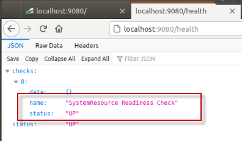

    |                                                   |                                                                                                                                                                  |
    |---------------------------------------------------|:-----------------------------------------------------------------------------------------------------------------------------------------------------------------|
    |  | <p><strong>Información:</strong></p>                                                                                                                             |
    |                                                   | <p>¿Observaste que al implementar el nuevo código de verificación de preparación en la aplicación, no tuviste que reiniciar la aplicación ni Liberty Server?</p> |
    |                                                   | <p>Open Liberty Tools detectó los cambios de código en el proyecto y actualizó dinámicamente la aplicación en el servidor en ejecución.</p>                      |

7. Copiar una implementación de **SystemLivenessCheck.java** al proyecto

    a Abra una ventana de terminal en la máquina virtual

    b. Ejecute el siguiente comando para copiar **SystemLivenessCheck.java** al proyecto

    ```
    cp /home/ibmdemo/Student/labs/devmode/guide-getting-started/finish/src/main/java/io/openliberty/sample/system/SystemLivenessCheck.java /home/ibmdemo/Student/labs/devmode/guide-getting-started/start/src/main/java/io/openliberty/sample/system/SystemLivenessCheck.java
    ```

    |                                                   |                                                                                                                                                                                                   |
    |---------------------------------------------------|:--------------------------------------------------------------------------------------------------------------------------------------------------------------------------------------------------|
    |  | <p><strong>Información:</strong></p>                                                                                                                                                              |
    |                                                   | <p>Para los fines del laboratorio, el comando de copia anterior copia una verificación de actividad completamente implementada del proyecto “terminado” al proyecto en funcionamiento actual.</p> |

8. Revise la implementación **de SystemLivenessCheck.java**

    a. Regrese a la vista del Explorador de VS Code

    b. Vaya a **INICIO** -&gt; **principal** -&gt; **java / io / openliberty / sample / system**

    c. Haga clic en el archivo **SystemLivenessCheck.java** para abrirlo en el panel del editor.

    

    SystemLivenessCheck evalúa los recursos de **“memoria”** y **“CPU”** utilizados.

    - Si la “memoria” utilizada es inferior al 90%, la sonda de actividad establece el estado en ARRIBA.

    - Si la “memoria” utilizada es mayor al 90% la sonda de actividad establece el estado en ABAJO.

    <br>

9. Desde el navegador web en la máquina virtual, vuelva a ejecutar el punto final **/health** para ver el estado de salud de la aplicación.

    ```
    http://localhost:9080/health
    ```

    

    **Nota:** en el caso en el que se estén realizando múltiples comprobaciones de estado, como en nuestro ejemplo, TODAS las comprobaciones de estado deben tener el estado ACTIVO para que el servicio se marque como ACTIVO.

    **Entonces, ¿qué sucede cuando cambiamos la propiedad inMaintenance a “true”?**

    Modifiquemos la configuración externa para poner el servicio en modo de mantenimiento y ver los resultados de las comprobaciones de estado.

    <br>

10. Modificar la propiedad inMaintenance en el archivo server.xml

    a. Regrese a la consola VS Code y navegue a **INICIO** -&gt; **src** -&gt; **main -&gt; liberty / config**

    b. Haga clic en **server.xml** para abrir el archivo en el editor.

    c. Modifique el valor de la variable inMaintenance a “ **true** ” como se ilustra a continuación.

    d. **Guarde** el archivo server.xml. La configuración del servidor se actualiza dinámicamente para reflejar la actualización.

    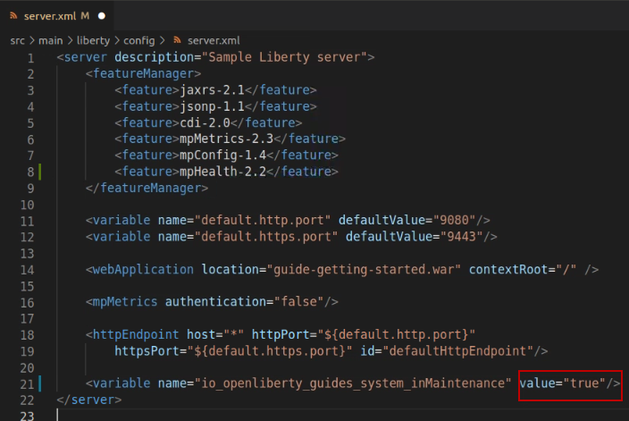

    <br>

11. Desde el navegador web en la máquina virtual, vuelva a ejecutar el punto final **/health** para ver el estado de salud de la aplicación.

    ```
    http://localhost:9080/health
    ```

    

    <br>

12. En el archivo server.xml, cambie la variable inMaintenance nuevamente a false”

    a. **Guarde** el archivo server.xml

    b. **Cierre** la vista del editor server.xml

    


    <br>
    

13. Vuelva a ejecutar el punto final **/health** para verificar que el servicio ahora esté marcado como ACTIVO nuevamente.

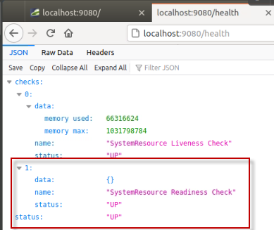

<br>

### **Ejecución de pruebas con las herramientas Open Liberty en VS Code**

En esta sección del laboratorio, realizará algunos cambios simples en el código de la aplicación de muestra y ejecutará casos de prueba directamente desde el IDE de VS Code utilizando las capacidades integradas en las herramientas Open Liberty.

Para simular un cambio importante en el código de la aplicación, modificará la ruta al punto final del servicio de **/properties** a **/all-properties** .

Debido a que el caso de prueba intenta ejecutar el servicio del sistema utilizando la ruta **/properties** , el caso de prueba fallará y devolverá un código HTTP de 404, en lugar del código de respuesta esperado de 200.

Dado que el desarrollador está introduciendo este cambio deliberadamente, es necesario actualizar el caso de prueba para reflejar la nueva ruta al servicio para que las pruebas pasen.

1. Utilice el panel de desarrollo de Liberty para **ejecutar pruebas** en el servicio de muestra de propiedades del sistema.

    a. En VS Code, expanda la sección LIBERTY DEV DASHBOARD

    b. Haga clic con el botón derecho del ratón en la **guía de introducción a** Liberty Server

    c. Seleccione **Ejecutar prueba** en el menú para ejecutar las pruebas.

    

    d. En la vista de Terminal, verá los resultados de las pruebas. Se ejecutó una prueba y se APROBÓ la otra.

    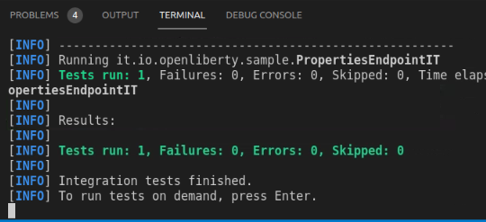

    <br>

    A continuación, como desarrollador del proyecto, se le ha pedido que cambie el código para especificar una ruta diferente al servicio de "propiedades". Si lo hace, tendrá un impacto en las pruebas. En los próximos pasos, realizará el cambio de código y actualizará las pruebas para que coincidan con los NUEVOS resultados esperados.

    <br>

2. Abra el **archivo systemResources.java** en el editor de VS Code

    a. En la vista del explorador de VS Code, expanda **INICIO** -&gt; **src** -&gt; **main -&gt; java / io / openliberty / sample / system**

    b. Haga clic en **SystemResource.java** para abrirlo en el editor.

    

    <br>

3. Actualice **@Path** en el servicio de propiedades del sistema para especificar una ruta de servicio diferente

    a. Desde el editor, realice el siguiente cambio en el archivo **systemResource.java** :

    **Cambiar la línea resaltada:**

    

    **Actualizado para leer:** @Path("/all-properties")

    

    b. **GUARDE** el archivo. El servidor y la aplicación Liberty se actualizan dinámicamente.

    c. **Cierre** la vista del editor del archivo **SystemResource.java**

    <br>

4. Desde el navegador web, ejecute el servicio utilizando la NUEVA URL del punto final

    **http://localhost:9080/system/todas-las-propiedades**

    

    <br>

5. Utilice el panel de desarrollo de Liberty para **ejecutar pruebas** en el servicio de muestra de propiedades del sistema.

    a. En VS Code, expanda la sección LIBERTY DEV DASHBOARD

    b. Haga clic con el botón derecho del ratón en la **guía de introducción a** Liberty Server

    c. Seleccione **Ejecutar prueba** en el menú para iniciar el servidor.

    

    d. Alternativamente, puede ejecutar las pruebas simplemente presionando la tecla **ENTER** en la ventana de la Terminal. Inténtelo. **Las pruebas ahora FALLAN** .

    

    <br>

6. Utilice el panel de desarrollo de Liberty para **ver el informe de prueba de integración** .

    a. En VS Code, expanda la sección LIBERTY DEV DASHBOARD

    b. Haga clic con el botón derecho del ratón en la **guía de introducción a** Liberty Server

    c. Seleccione **Ver informe de prueba de integración** en el menú.

    

     <br>
    

7. Vea los detalles de los resultados de la prueba en la “ **guía de introducción al informe Failsafe** ” que ahora se muestra en el panel del editor.

    a. Observe que el caso de prueba falló

    

    b. Desplácese hasta la parte inferior del informe para ver el mensaje de ERROR que se produjo a partir de la prueba fallida.

    

    c. El problema es obvio. Dado que cambiamos la ruta del punto final, la aserción del caso de prueba falló porque obtuvo un código de respuesta HTTP 404 (No encontrado) al intentar ejecutar el servicio utilizando la ruta original de /properties.

    d. **Cierre** el informe de seguridad en el panel Editor.

    **NOTA:** En este caso, esperábamos que el caso de prueba fallara. Como desarrollador, debes actualizar el caso de prueba para que coincida con los resultados esperados en función del cambio de código.

    <br>

8. Modifique el caso de prueba que se incluye en el proyecto de la aplicación para invocar la ruta actualizada al servicio.

    a. Desde la vista del Explorador en VS Code, navegue a **INICIO** -&gt; **src** -&gt; **test / java / it / io / openliberty / sample**

    b. Haga clic en **PropertiesEndpointIT.java** para abrirlo en un panel de edición.

    c. Desde el editor, realice el siguiente cambio en el archivo **PropertiesEndpointIT.java** :

    **Cambie la línea resaltada:** “sistema/propiedades”

    

    **Actualizado para leer:** “sistema/todas-las-propiedades”

    

    d. **GUARDE** y **CIERRE** el archivo. El servidor y la aplicación Liberty se actualizan dinámicamente.

    <br>

9. Vuelva a ejecutar las pruebas presionando la tecla **ENTER** en la vista de Terminal. La prueba PASA.

    

    En este punto, ha explorado el uso de las herramientas para desarrolladores de Liberty para desarrollar código, realizar cambios en la configuración del servidor y ejecutar casos de prueba para obtener comentarios inmediatos sobre las actualizaciones.

    El uso de las herramientas Open Liberty en VS Code proporciona un entorno de desarrollo integrado en el que las actualizaciones se detectan automáticamente y se aplican de forma dinámica al servidor en ejecución. Esto proporciona un ciclo de desarrollo interno rápido para el desarrollo y la prueba.

    En la siguiente sección del laboratorio, explorará lo sencillo que es integrar la depuración de aplicaciones en el mismo entorno de desarrollo sin tener que reiniciar el servidor Liberty.

    <br>

## OPCIONAL: Depuración integrada mediante las herramientas Open Liberty en VS Code

La depuración de aplicaciones es una parte importante del desarrollo de aplicaciones. Los desarrolladores esperan poder iterar de forma fácil y rápida a través de **desarrollo, prueba y depuración** sin tener que abandonar el entorno de desarrollo ni reiniciar servidores y aplicaciones para la depuración.

En esta sección del laboratorio, explorará lo fácil que es para los desarrolladores depurar su aplicación Java utilizando el entorno de desarrollo integrado y Open Liberty.

**<span class="underline">Estos son los pasos básicos para la depuración.</span>**

- Establecer un punto de interrupción en el código fuente

- Agregue un “Java Attach” en la configuración de lanzamiento y configure el puerto de depuración

- Vaya a la vista de depuración y seleccione la configuración "Adjuntar"

- Haga clic en el icono Iniciar depuración

- Ejecute la aplicación en el navegador

- La aplicación se detiene en el punto de interrupción.

- Recorra la aplicación en modo de depuración para explorar las variables y el código para resolver problemas.

Una de las características clave de Visual Studio Code es su gran soporte de depuración.

En esta sección del laboratorio, utilizará el debigger de VS Code para depurar la aplicación Java que se ejecuta en el servidor Liberty.

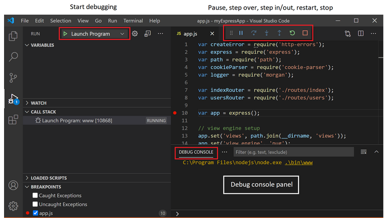

En este escenario, establecerá un punto de interrupción y depurará el código SystemLivenessCheck.java que se ejecuta al ejecutar el punto final /health en la aplicación.

1. Abra **SystemLivenessCheck.java** en el editor de VS Code

     a. En la vista del explorador de VS Code, expanda **INICIO** -&gt; **src** -&gt; **main** -&gt; **java / io / openliberty / sample / system**

     b. Haga clic en **SystemLivenessCheck.java** para abrirlo en el editor.
        
    

    <br/>

2. Establezca un punto de interrupción en el código donde se establece la variable **MemoryMaxBean**

     a. Localiza la línea con el texto:

     **MemoryMXBean memBean = ManagementFactory.getMemoryMXBean();**

     b. **Haga clic con el botón izquierdo del ratón** en el lado izquierdo del número de línea (31 en la captura de pantalla) para establecer un punto de interrupción. Aparecerá un punto rojo que indica que el punto de interrupción está establecido.

        
    

    <br/>

3. Cree una nueva **configuración de Java Attach** y especifique el puerto de depuración **7777**

     a. Seleccione **Ejecutar &gt; Agregar configuración…** en el menú principal de VS Code

    

     Se creó un nuevo archivo llamado **launch.json** en el directorio **.vscode** . Puedes ver el nuevo archivo en la vista del explorador.

     b. En el archivo **launch.json** que se abrió en la vista Editor, haga clic en el botón “ **Agregar configuración** ” ubicado en la esquina inferior derecha de la pantalla.

    

     c. Seleccione **Java: Adjuntar** en el menú.

    

     d. Se agrega una nueva configuración al archivo launch.json, que incluye un parámetro “ **port”** para adjuntar el depurador para Open Liberty.

     **Nota:** Open Liberty está configurado para utilizar el puerto de depuración 7777 de forma predeterminada.
        
    

    <br/>

4. Cambie el parámetro “puerto” a 7777

     a. Desde el editor, realice el siguiente cambio en el archivo **lauch.json** :

     **Cambie la línea resaltada:** "puerto": "<debug port="" of="" the="" debugger=""> " </debug>

    

     **Actualizado para leer:** “puerto”: 7777

     **Nota:** Asegúrese de ELIMINAR las comillas dobles alrededor de 7777, como se ilustra a continuación.

    

     b. **GUARDE y CERRE** el archivo. El servidor y la aplicación Liberty se actualizan dinámicamente.

5. Ahora, adjunte la nueva configuración de Java Attach

     a. Cambie a la perspectiva **de depuración** en VS Code, seleccionando el **ícono de depuración** en el menú de navegación del lado izquierdo

    

     b. Utilizando el menú desplegable de inicio en la perspectiva Depurar, configure la **acción de Inicio** en la configuración “ **Adjuntar** ” que creó.

    

     c. Ahora está seleccionada la configuración “Adjuntar”. Ya está listo para depurar.

6. Haga clic en el icono **Inicio** para iniciar el depurador.

    

     Ahora el depurador está conectado y la PILA DE LLAMADAS y los PUNTOS DE INTERRUPCIÓN se muestran en la perspectiva Depuración, como se ilustra a continuación:
    
    

    <br/>

7. Desde el navegador web de la máquina virtual, ejecute el punto de conexión **/health** para ver el estado de la aplicación. La aplicación se detendrá en el punto de interrupción del código SystemLivenessCheck.java.

    ```
    http://localhost:9080/health
    ```

    En la perspectiva del depurador de VS Code, la aplicación se detuvo en el punto de interrupción establecido en SystemLivenessCheck.java, como se ilustra a continuación.

    

    <br/>

8. Ahora puedes utilizar las acciones “Pasar por encima”, “Pasar dentro”, “Pasar fuera”, “Ejecutar” o “Desconectar”.

     a. Haga clic en “ **Pasar por encima** ” para ejecutar la línea de código existente y pasar a la siguiente línea de código en la aplicación.
    
    

    <br/>

9. Cuando haya terminado de recorrer el depurador y explorar las variables locales, haga clic en el ícono " **Desconectar** " para desconectar el depurador.
    
    

    <br/>

10. Utilice el panel de desarrollo de Liberty para **DETENER** el servidor Liberty en modo de desarrollo

     a. En VS Code, vuelva a la vista **del Explorador**

     b. Expanda la sección PANEL DE CONTROL DE LIBERTY DEV

     c. Haga clic con el botón derecho del ratón en la **guía de inicio** de Liberty Server

     d. Seleccione **Detener** en el menú para detener el servidor.
   
    

    <br/>

11. **Salir de** la interfaz de usuario de VS Code

     a. Seleccione **Archivo &gt; Salir** en el menú principal de VS Code para salir de la interfaz de usuario.

     <br>

12. **Cierre** todas las ventanas **de terminal** y las pestañas **del navegador** abiertas

¡Felicitaciones! Ha utilizado con éxito la **extensión Liberty Dev VS Code** para iniciar Open Liberty en modo de desarrollo, realizar cambios en su aplicación y en la configuración del servidor Liberty mientras el servidor está activo, ejecutar pruebas y ver resultados, e incluso depurar la aplicación sin salir del editor.

A medida que exploraba la experiencia de desarrollo de bucle interno rápido y eficiente utilizando las herramientas Open Liberty y VS Code IDE, su código se compilaba y se implementaba automáticamente en su servidor en ejecución, lo que facilitaba la iteración de sus cambios.

**===== FIN DEL LABORATORIO =====**

[Regresar a la página principal de laboratorios](../README.md)
