# Laboratorio 1020: Implementaciones de aplicaciones Liberty en Colectivos


**Última actualización:** marzo de 2023

**Duración:** 60 minutos

¿Necesita ayuda? Póngase en contacto con **Kevin Postreich, Yi Tang**

[Regresar a la página principal de laboratorios](../README.md)

## **Introducción al laboratorio**

El objetivo de este laboratorio es brindar experiencia práctica utilizando prácticas recomendadas para implementar aplicaciones Java en Liberty en colectivos, utilizando automatización y metodologías de implementación flexibles.

Siguiendo la metodología, comprenderá cómo puede aplicar sus propios procesos o automatización de Devops para lograr una agilidad y flexibilidad significativas al administrar las implementaciones de Liberty con procesos automatizados repetibles que reducen significativamente el riesgo para su negocio.

Después de completar el laboratorio, deberías poder apreciar lo sencillo que es administrar Liberty a través de la automatización, lo que también se aplica a la integración con tus propias herramientas Devops.

**Este laboratorio contiene las siguientes actividades prácticas:**

- Crear paquetes de servidor Liberty

- Crear un Liberty Collective Controller

- Implementar paquetes de Liberty Server en el colectivo

- Aplicar modificaciones de configuración de Liberty durante la implementación

- Utilice el Centro de administración de Liberty para iniciar servidores de Liberty en el colectivo

- Validar la implementación y probar la aplicación

**El entorno de laboratorio consta de dos máquinas virtuales host:**

- servidor0.gimnasio.lan

- servidor1.gimnasio.lan

Utilizará los scripts de shell de Linux proporcionados para el laboratorio para crear paquetes de servidor Liberty, construir un Liberty Collective que abarque dos máquinas virtuales host e implementar el paquete de servidor en ambas máquinas virtuales host.

El Liberty Collective que crearás se ilustra a continuación:


<span class="underline">La máquina virtual host “ <strong>server0.gym.lan</strong> ”, que es la máquina virtual principal, contiene los siguientes componentes:</span>

- **Paquetes de servidor y compilaciones de Liberty:** piense en esto como una "máquina de compilación" donde un proceso de compilación compila las aplicaciones, ejecuta pruebas y produce un paquete de servidor que está listo para implementarse. Un paquete de servidor contiene los binarios de Liberty, la aplicación y las configuraciones de servidor predeterminadas, que se implementan como una unidad para alojar las máquinas virtuales.

- **Controlador colectivo:** El controlador colectivo es un servidor Liberty que está configurado con la función “ **collectualController-1.0** ”, que permite que el servidor actúe como servidor de administración para el colectivo.

    > **Nota:** En la mayoría de los casos, el controlador colectivo probablemente se colocaría en un host dedicado, pero para minimizar el tamaño de este entorno de demostración, se ubica junto con el host utilizado para las compilaciones.

- **Miembro colectivo:** los miembros colectivos son servidores Liberty que ejecutan su aplicación y están unidos al colectivo con la función “ **collectiveMember-1.0** ”. Los miembros colectivos se pueden administrar de forma centralizada y pueden aprovechar funciones como “enrutamiento dinámico” sin necesidad de licencias Liberty ND para los miembros colectivos.

    > **Nota:** En la mayoría de los casos, los miembros del colectivo Liberty no se encuentran en el mismo host que los controladores colectivos, pero para minimizar el tamaño de este entorno de demostración, un miembro del colectivo se ubica junto a un controlador colectivo.

- **Servidor HTTP:** El servidor HTTP de IBM se utiliza en algunos laboratorios para mostrar las capacidades de Liberty, como enrutamiento dinámico, persistencia de sesión y escenarios de conmutación por error.

    > **Nota:** En la mayoría de los casos, el servidor HTTP se ubica en un host dedicado ubicado en la DMZ, pero para minimizar el tamaño de este entorno de demostración, se ubica junto con los procesos de Liberty.

<span class="underline">La máquina virtual “ <strong>server1.gym.lan</strong> ” contiene los siguientes componentes:</span>

- **Miembro colectivo:** Los miembros colectivos son servidores Liberty que ejecutan su aplicación y están unidos al colectivo con la función “ **collectualMember-1.0** ”.

## **Accediendo al entorno**

Si está realizando este laboratorio como parte de un taller dirigido por un instructor (virtual o presencial), ya se le ha proporcionado un entorno. El instructor le proporcionará los detalles para acceder al entorno del laboratorio.

De lo contrario, deberá reservar un entorno para el laboratorio. Puede obtener uno aquí. Siga las instrucciones en pantalla para la opción “ **Reservar ahora** ”.

KLP: ENLACE A RESERVA ENV POR DETERMINAR

El entorno de laboratorio contiene dos (2) máquinas virtuales Linux.


Se configura un servicio publicado para proporcionar acceso a la VM **server0** a través de la interfaz noVNC para el entorno de laboratorio.

1. Acceda al entorno de laboratorio desde su navegador web.

    a. Cuando el entorno esté aprovisionado, haga clic con el botón derecho en el enlace **Servicio publicado** . Luego, seleccione “ **Abrir enlace en nueva pestaña** ” en el menú contextual.

    

    b. Haga clic en el enlace **"vnc.html"** para abrir el entorno de laboratorio a través de la interfaz **noVNC** .

    

    c. Haga clic en el botón **Conectar**

    

    d. Ingrese la contraseña como: **passw0rd** . Luego haga clic en el botón **Enviar credenciales** para acceder al entorno de laboratorio.

    **Nota:** Ese es un cero numérico en passw0rd


1. Inicie sesión en la máquina virtual **server0** utilizando las credenciales que aparecen a continuación:

    - ID de usuario: **techzone**

    - Contraseña: **IBMDem0s!**

## **Consejos para trabajar en el entorno de laboratorio**

1. Puede cambiar el tamaño del área visible utilizando las opciones **de Configuración de noVNC** para cambiar el tamaño del escritorio virtual para que se ajuste a su pantalla.

    a. Desde la máquina virtual del entorno, haga clic en el icono **giratorio** en el panel de control noNC para abrir el menú.

    

    b. Para aumentar el área visible, haga clic en `Settings > Scaling Mode` y configure el valor en `Remote Resizing`

    

2. Puede copiar/pegar texto de la guía de laboratorio en el entorno de laboratorio utilizando el portapapeles en el visor noVNC.

    a. Copie el texto de la guía de laboratorio que desea pegar en el entorno de laboratorio.

    b. Haga clic en el icono **del Portapapeles** y **pegue** el texto en el portapapeles de noVNC

    

    c. Pegue el texto en la máquina virtual, por ejemplo en una ventana de terminal, una ventana del navegador, etc.

    d. Haga clic en el icono **del portapapeles** nuevamente para cerrarlo.

    > **NOTA:** A veces, pegar en una ventana de Terminal en la VM no funciona de manera consistente.

    > En este caso, puedes intentarlo nuevamente, o abrir otra ventana de terminal e intentarlo nuevamente, o pegar el texto en un **editor de texto** en la VM y luego pegarlo en la ventana de terminal en la VM.

3. Como alternativa a la opción Copiar/Pegar de noVNC, puede considerar abrir la guía de laboratorio en un navegador web dentro de la máquina virtual. Con este método, puede copiar y pegar fácilmente texto de la guía de laboratorio sin tener que usar el portapapeles de noVNC.

<br>

## **Revisar las prácticas comunes de implementación de Liberty**

Un servidor Liberty es liviano debido a su arquitectura modular, por lo que puede empaquetar fácilmente una instalación de servidor y aplicaciones en un paquete comprimido tipo “zip” o “jar”. Luego puede almacenar este paquete y usarlo para implementar la instalación en diferentes nodos o máquinas en su Liberty Collective.

En este laboratorio, implementará Liberty y aplicaciones de muestra en un Liberty Collective, siguiendo varias prácticas comunes como se ilustra a continuación.


- **Práctica recomendada:** **Producir paquetes de servidor como salida de compilación**

    Se recomienda crear paquetes de servidor inmutables que incluyan los binarios de Liberty, la configuración del servidor, la aplicación y la configuración compartida como salida de compilación.

    El resultado de la compilación, “ **paquete de servidor** ”, es la unidad que se puede implementar para los miembros del colectivo Liberty. El uso de esta práctica es muy similar a las prácticas recomendadas para las implementaciones de imágenes de contenedores en plataformas Kubernetes.

- **Práctica recomendada:** **Automatice la creación y la implementación de paquetes de servidor en el colectivo**

    Siempre se recomienda automatizar la instalación, la implementación y la configuración para lograr una mayor agilidad, repetibilidad y productividad.

    En este laboratorio, seguirá esta práctica recomendada de utilizar scripts de automatización que realizan los siguientes procesos:

    - Construya los paquetes de servidor para su implementación en el colectivo

    - Crear un Liberty Collective Controller

    - Implementar los paquetes del servidor en el colectivo

- **Práctica recomendada:** **Agregar modificaciones de configuración al servidor después de descomprimir el paquete del servidor**

    Los scripts de automatización que se utilizan en el laboratorio siguen esta práctica. El paquete del servidor se crea como una plantilla que contiene la aplicación, las bibliotecas y la configuración predeterminada.

    Luego, cuando el paquete del servidor se implementa y se descomprime en la máquina de destino, se agregan las modificaciones de configuración. Estas modificaciones pueden anular cualquier configuración predeterminada del paquete del servidor.

    Sin embargo, en este laboratorio, los puertos http y https se anulan para cada implementación del servidor de paquetes para evitar conflictos de puertos en caso de escalamiento vertical de los servidores Liberty en la VM.

    En los laboratorios, se aplican modificaciones adicionales en el contexto de los módulos de aprendizaje.

<table>
<tbody>
<tr class="odd">
<td></td>
<td>
<p><strong>Nota:</strong> existen otras alternativas para aplicar las anulaciones al servidor después de expandir el archivo.</p>
<p>Algunos clientes optan por anular el uso de variables de entorno del sistema operativo que anulan los valores predeterminados en server.xml, otros clientes aplican las anulaciones en la configuración de Liberty creando el archivo utilizando las anulaciones para un entorno específico.</p>
</td>
</tr>
</tbody>
</table>

## **Revisar los scripts de automatización utilizados en el laboratorio.**

Siguiendo las prácticas recomendadas para automatizar las tareas administrativas y de implementación de Liberty, hemos proporcionado tres scripts de shell de Linux diseñados para aprovechar las capacidades de implementación flexible de Liberty.

A continuación se presenta cada uno de los scripts. Sin embargo, se proporcionan más detalles en secciones separadas del laboratorio, cuando se crean e implementan las aplicaciones de muestra.


1. **Compilaciones de Liberty Server (mavenBuild.sh)**

    El script produce la salida de la compilación en forma de un archivo zip de paquete de servidor Liberty que proporciona la flexibilidad de implementar y actualizar Liberty y la aplicación como un paquete inmutable, de manera similar a cómo se implementan las imágenes de contenedor en las plataformas de contenedores de Kubernetes.

2. **Crear colectivo y controlador colectivo (createController.sh)**

    El script crea un Colectivo y un Controlador Colectivo. Los paquetes de servidor se implementarán en un Colectivo Liberty. El controlador colectivo es un servidor Liberty que se configura con funciones que le permiten funcionar como servidor administrativo para el colectivo.

3. **Implementar Liberty como miembros colectivos a través de implementaciones de paquetes de servidor en nodos/máquinas**

    - El script implementa paquetes de servidor Liberty en nodos/máquinas y une los servidores al Liberty Collective.
    - Los miembros colectivos son servidores Liberty que están configurados para ser miembros del colectivo.
    - Los miembros colectivos se pueden administrar de forma centralizada desde el Controlador colectivo a través de la interfaz de usuario del Centro de administración o scripts de administración.

## **Parte 1: Clonar el repositorio de GitHub para este taller**

Este laboratorio requiere artefactos almacenados en un repositorio de GitHub. Ejecute el siguiente comando para clonar el repositorio en la máquina virtual local que se utiliza para el laboratorio.

1. Si aún no ha clonado el repositorio de GitHub en un laboratorio anterior, hágalo ahora. El repositorio contiene los artefactos necesarios para el laboratorio.

2. Abra una nueva ventana de terminal en la máquina virtual “ **server0.gym.lan** ”

> 

1. Clonar el repositorio de GitHub necesario para el laboratorio

    ```
    git clone https://github.com/IBMTechSales/liberty_admin_pot.git
    ```

2. Navegue hasta el directorio “ **lab-scripts** ” en el repositorio clonado

    ```
    cd ~/liberty_admin_pot/lab-scripts
    ```

3. Agregue los permisos de “ **ejecución** ” a los directorios de scripts de laboratorio y a los scripts de shell

    ```
    chmod -R 755 ./
    ```

## **Parte 2: Producir “paquetes de servidor” de Liberty como salida de compilación**

Siguiendo las prácticas recomendadas para la implementación flexible de aplicaciones Liberty, producirá un paquete de servidor como salida de compilación, que incluye el entorno de ejecución de Liberty, la configuración del servidor y la aplicación, como un archivo zip.

Producir la salida de la compilación en forma de un archivo zip del paquete del servidor Liberty proporciona la flexibilidad de implementar y actualizar su versión de Liberty y sus aplicaciones como un paquete inmutable, de manera similar a cómo se implementan las imágenes de contenedores en las plataformas de contenedores de Kubernetes.

En el laboratorio, el script “ **mavenBuid.sh** ” proporciona las siguientes capacidades para producir paquetes de servidor para su implementación en un colectivo Liberty.

- Extraiga el código fuente de la aplicación del repositorio de código fuente (GitHub)

- Construya la aplicación y produzca un paquete de Liberty Server

- Guarde el paquete del servidor Liberty en un “directorio de trabajo” para el laboratorio.

<table>
<tbody>
<tr class="odd">
<td></td>
<td>
<p><strong>El script mavenBuild.sh NO es una herramienta oficial de IBM.</strong></p>
<p>Es un script simple que proporcionamos para este PoT para demostrar la facilidad de automatización de tareas comunes de Liberty.</p>
</td>
</tr>
</tbody>
</table>


En esta sección del laboratorio, utilizará el script de shell proporcionado que automatiza las tareas para producir un paquete de servidor para su implementación en el colectivo.

## **Utilice el script Maven Build para producir un paquete de servidor**

1. Ejecute el script de shell **Maven Build** para compilar las aplicaciones y producir un paquete Liberty Server

    a. Ejecute el siguiente comando para **mostrar la declaración de uso** del script

    ```
    ~/liberty_admin_pot/lab-scripts/mavenBuild.sh
    ```

    

    **Nota:** Se requiere el parámetro de entrada **“-v** ”, que define la versión del kernel Liberty que debe incluirse en la salida de la compilación.

    b. Ejecute el siguiente comando para crear las aplicaciones y generar un paquete de servidor, que utilizará el kernel WebSphere Liberty, versión 22.0.0.8

    ```
    ~/liberty_admin_pot/lab-scripts/mavenBuild.sh -v 22.0.0.8
    ```

    **Nota:** hay pasos adicionales que se realizan además de lo que se muestra en el resultado anterior, que solo muestra la finalización.

    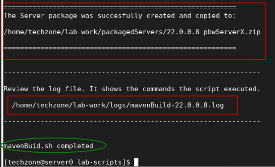

2. Revise el archivo de registro y comprenda los pasos que realizó el script.

    ```
    gedit ~/lab-work/logs/mavenBuild-22.0.0.8.log
    ```

    El archivo de registro muestra el comando que ejecutó, una lista de información del entorno y los comandos que ejecutó el script.

    En el registro, observará que el script realizó las siguientes acciones.

    - **Paso para clonar el repositorio Git:**

        - Clonar el repositorio de código fuente que contiene la fuente de la aplicación como un proyecto Maven.

    - **Paso de compilación de Maven:**

        - Ejecute el comando Maven para crear las aplicaciones y producir un paquete de servidor

    - **Paso posterior a la construcción:**

        - Cree la “estructura de directorio de trabajo” donde se colocarán los paquetes de Liberty: **(lab-work/packagedServers)**

        - Copie el paquete del servidor del directorio “target” de Maven al nuevo “directorio de trabajo” utilizado en los laboratorios.

            > **/home/techzone/lab-work/packgedServers/22.0.0.8-pbwServerX.zip**

    

    

    

3. **Cierre** el editor cuando haya completado la revisión del archivo de registro.

4. Utilizando el visor de archivos en el escritorio de la máquina virtual, vea que se produjo el paquete del servidor.

    a. Haga doble clic con el mouse en la carpeta “ **Inicio”** en la máquina virtual de escritorio

    

    b. Desde el explorador de archivos, navegue hasta el directorio **techzone/lab-work/packagedServers** .

    **SUGERENCIA:** el paquete del servidor se nombra según la versión de Liberty en el paquete y el nombre del servidor de marcador de posición; “ **22.0.0.8-pbwServerX.zip** ”.

    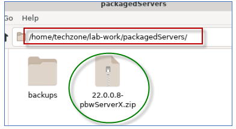

### **¿Qué hizo la compilación Maven?**

La actividad principal que realiza el script es ejecutar Maven para crear las aplicaciones y generar un paquete de servidor Liberty. El paquete de servidor está un poco personalizado para incluir artefactos adicionales y modificaciones de configuración que son necesarias para ejecutar las aplicaciones en Liberty.

El proceso de compilación de Maven aprovecha el “ **complemento Liberty Maven** ”, que proporciona la capacidad de recuperar binarios de Liberty del repositorio de Maven, compilar la aplicación y crear un paquete de servidor Liberty.

Como se ilustra a continuación, Maven configura Liberty utilizando los artefactos proporcionados en los proyectos y producidos por la compilación.

- Maven agrega el archivo server.xml y los binarios de la aplicación (WAR, EAR)

- Maven agrega los configDropins/overrides según sea necesario para el entorno:


La documentación del complemento Maven de Liberty “ **build** ” se encuentra aquí: [https://github.com/OpenLiberty/ci.maven#build](https://github.com/OpenLiberty/ci.maven#build)

La documentación del complemento Maven de Liberty “ **paquete** ” se encuentra aquí: [https://github.com/OpenLiberty/ci.maven/blob/main/docs/package.md#package](https://github.com/OpenLiberty/ci.maven/blob/main/docs/package.md#package)

**<span class="underline">A continuación se muestra una lista de alto nivel de tareas que realiza el proceso de compilación de Maven:</span>**

- > Descargue el kernel Liberty según la versión especificada en el comando; por ejemplo, versión 22.0.0.8

- > Cree los artefactos implementables de la aplicación para las aplicaciones PlantsByWebSphere y WhereAmI: EAR, WAR, JAR

- > Cree un servidor Liberty llamado “ **pbwServerX** ” como servidor de plantilla que se utiliza para múltiples implementaciones en el colectivo.

- > Agregue las dos aplicaciones de ejemplo a la configuración del servidor

- > Agregue las bibliotecas DB2 necesarias al servidor

- > Reemplace el archivo de configuración del servidor server.xml con el server.xml generado por Transformation Advisor

- > Agregue el archivo de configuración/anulaciones “ **memberOverrides.xml** ”

- > Instale todas las funciones de Liberty según lo requiera el archivo **server.xml**

- > Instalar la función de miembro colectivo para que los servidores puedan incluirse como miembros en un colectivo Liberty

- > Instale la función de base de datos de sesión para que la aplicación funcione con persistencia de sesión con conmutación por error

- > Produzca el paquete Liberty Server como un archivo zip, que contiene los binarios de Liberty, las aplicaciones y las configuraciones predeterminadas.

El resultado del script “ **mavenBuild** ” es un paquete de Liberty Server. El paquete de servidor se encuentra en el siguiente directorio de trabajo.

> **/inicio/techzone/laboratorio/servidores-envasados**

**¡Felicitaciones!** Ha utilizado Maven y ha producido con éxito un paquete de servidor Liberty que cumple con las prácticas recomendadas de implementación flexible.

Ahora que tiene un paquete de servidor, se puede implementar en hosts locales o remotos (máquinas virtuales/máquinas) donde los miembros del colectivo Liberty alojarán las aplicaciones de muestra.

En las siguientes secciones del laboratorio, continuará con la práctica recomendada de usar la automatización para crear un Liberty Collective e implementar el paquete de servidor en dos hosts (VM), y agregar los servidores implementados al Liberty Collective, donde el colectivo puede administrar los servidores de manera centralizada.

## **Parte 3: Crear un Liberty Collective Controller**

Un **Liberty Collective** es un conjunto de servidores Liberty en un único dominio de administración.

Un colectivo consta de al menos un servidor con la función **collectiveController-1.0** habilitada, que se denomina ***controlador colectivo*** .

**SUGERENCIA:** Los servidores Liberty que funcionan como controladores colectivos DEBEN tener licencias Liberty ND, ya que estos servidores utilizan la función **collectiveController-1.0** que solo está disponible con Liberty ND.

<table>
<tbody>
<tr class="odd">
<td></td>
<td>
<p>El controlador colectivo proporciona un punto de control administrativo centralizado para realizar operaciones como enrutamiento de MBean, transferencia de archivos y gestión de clústeres.</p>
<p>Una función fundamental de los controladores colectivos es recibir información, como atributos MBean y estado operativo, de los miembros dentro del colectivo para que los datos puedan recuperarse fácilmente sin tener que invocar una operación en cada miembro individual.</p>
</td>
</tr>
</tbody>
</table>

Un colectivo puede tener muchos servidores con la función **collectiveMember-1.0** habilitada en servidores de aplicaciones que se denominan ***miembros colectivos.***


En esta sección del laboratorio, creará el **Colectivo** y el **Controlador Colectivo** utilizando la automatización, a través del script de shell **createController** .sh.

<table>
<tbody>
<tr class="odd">
<td></td>
<td>
<p><strong>El script createController.sh NO es una herramienta oficial de IBM.</strong></p>
<p>Es un script simple que proporcionamos para este PoT para demostrar la facilidad de automatización de tareas comunes de Liberty.</p>
</td>
</tr>
</tbody>
</table>

El script “ **createController.sh** ” proporciona las siguientes capacidades

- Crear el Colectivo y el Controlador Colectivo

- Instalar la aplicación **Liberty Admin Center** en el servidor del controlador

- Iniciar el servidor del controlador colectivo


1. Ejecute los siguientes comandos para crear un controlador colectivo Liberty:

    ```
    ~/liberty_admin_pot/lab-scripts/createController.sh
    ```

    El script createController.sh crea un servidor Liberty llamado **CollectiveController.**

    - El servidor CollectiveController está en el siguiente directorio:

        > **/inicio/techzone/laboratorio/controlador-liberty/wlp/usr/servidores**

    - El servidor CollectiveController está configurado con la función **collectiveController-1.0** que permite que el servidor actúe como servidor de administración para un colectivo.

    - El servidor CollectiveController también está configurado con la función **adminCenter-1.0** , que instala la aplicación de interfaz de usuario “Liberty Admin Center”.

    - El servidor CollectiveController se ejecuta en el puerto HTTPS **9491** en este laboratorio

    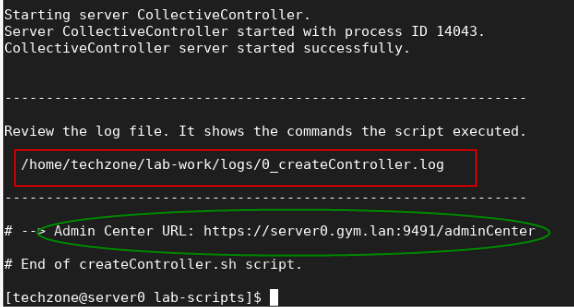

2. Una vez que se inicia el controlador colectivo, haga clic en la **URL del Centro de administración** para iniciarlo en una ventana del navegador, luego ingrese las credenciales de inicio de sesión como: **admin** / **admin** .

    **Nota:** Si ve la “Advertencia: posible riesgo de seguridad futuro”, haga clic en **Avanzado...-&gt;Aceptar riesgo y continuar** para continuar.

     datos generados por "md-type="image"&gt;

3. Inicie sesión en el **Centro de administración** con las credenciales: **admin** / **admin** .

    

    Se muestra la interfaz de usuario del “ **Centro de administración”** de Liberty Collective.

    

4. Haga clic en el ícono **Explorar** para mostrar los servidores, las aplicaciones y los hosts en el Colectivo.

     datos generados por "md-type="image"&gt;

    Se muestra la lista de recursos colectivos y puedes ver que tienes:

    - Un servidor: el servidor controlador colectivo

    - un host: el host local en el que se ejecuta el controlador

    - Un tiempo de ejecución: tiempo de ejecución de Liberty

    

5. Revise el archivo de registro para ver los pasos que ejecutó el script para crear y configurar el Colectivo.

    ```
    gedit /home/techzone/lab-work/logs/0_createController.log
    ```

    Como se ilustra a continuación, el script **createController** realiza las siguientes tareas:

    - Cree el directorio **Liberty-Controller** donde se instalará el servidor del controlador Liberty

    - Instale Liberty (con funciones ND) según sea necesario para que funcione como un controlador colectivo

    - Crear el servidor Liberty **de CollectiveController**

    - Crear un Liberty Collective Controller

    - Aplicar modificaciones de configuración del servidor, actualizando los puertos para evitar posibles conflictos de puertos

    - Iniciar el servidor del controlador colectivo

    - Mostrar la URL del Centro de administración

    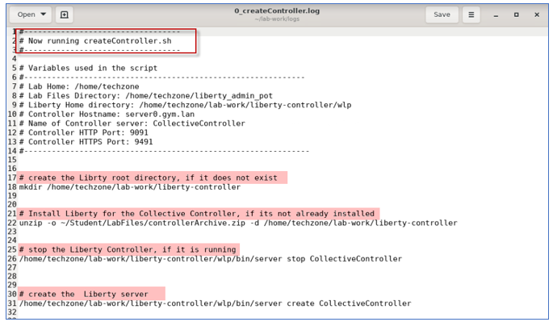

    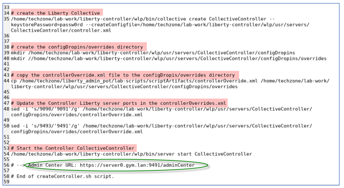

6. **Cierre** el editor **gedit** cuando haya terminado de revisar el archivo de registro.

## **Parte 4: Crear miembros del colectivo Liberty**

Los miembros del colectivo son los servidores Liberty que ejecutan sus aplicaciones. Para que los servidores Liberty se unan a un colectivo, los servidores deben tener habilitada la función **collectiveMember-1.0** .

La membresía en un colectivo Liberty es opcional. Los servidores Liberty se unen a un colectivo registrándose con un controlador colectivo para convertirse en miembros. Los miembros comparten información sobre sí mismos con el controlador a través del repositorio operativo del controlador.


En esta sección del laboratorio, unirás servidores Liberty como miembros colectivos al colectivo, utilizando el paquete de servidor que produciste previamente en el laboratorio.

El paquete de servidor que usted creó incluye los binarios de Liberty, las aplicaciones de muestra y las modificaciones de la configuración predeterminada del servidor.

La función **collectiveMember-1.0** se instaló y habilitó para el servidor Liberty que está en el paquete del servidor.

En este laboratorio, utilizará el script “ **addMember.sh** ” para implementar los paquetes del servidor en los nodos, crear los miembros del colectivo y unir los miembros al colectivo.

### El script addMember.sh realiza las siguientes tareas:

- Registre la máquina host si es una máquina virtual remota desde el controlador

- Copie o envíe el paquete del servidor a la máquina host donde se implementará Liberty

- Descomprima el paquete del servidor, que es una instalación de archivo de Liberty en las máquinas host (VM)

- Aplicar modificaciones de configuración del servidor para el miembro colectivo específico

- Únete al colectivo miembro del colectivo

- Abrir el puerto de la aplicación y el puerto del controlador colectivo para hosts remotos

<table>
<tbody>
<tr class="odd">
<td></td>
<td>
<p><strong>El script addMember.sh NO es una herramienta oficial de IBM.</strong></p>
<p>Es un script simple que proporcionamos para este PoT para demostrar la facilidad de automatización de tareas comunes de Liberty.</p>
</td>
</tr>
</tbody>
</table>


### **Agregue un miembro colectivo a la máquina virtual del host local, server0.gym.lan**

Utilice el script de automatización para implementar el servidor Liberty desde el paquete de servidor que creó anteriormente y unir el servidor como miembro del colectivo.

1. Ejecute el script addMember.sh sin ningún parámetro para mostrar la declaración de uso del script.

    ```
    ~/liberty_admin_pot/lab-scripts/addMember.sh
    ```

    Tenga en cuenta que el script requiere cuatro parámetros.

    Los parámetros de entrada instruyen al script a implementar la versión deseada del paquete del servidor Liberty y proporcionan el nombre del servidor y los puertos a utilizar para anular la configuración predeterminada en el paquete del servidor una vez que se descomprime en el host.

    

2. Ejecute los siguientes comandos para crear un miembro colectivo local de Liberty en la máquina virtual **server0.gym.lan** .

    El siguiente comando realiza estas tareas:

    > - Implementar el paquete del servidor para la versión 22.0.0.8 de Liberty

    > - Aplicar anulaciones para los puertos HTTP y HTTPS con 9081:9441

    > - Cambie el nombre del servidor predeterminado a “appServer1”

    > - Une el servidor Liberty al colectivo

    ```
    ~/liberty_admin_pot/lab-scripts/addMember.sh -n appServer1 -v 22.0.0.8 -p 9081:9441 -h server0.gym.lan
    ```

    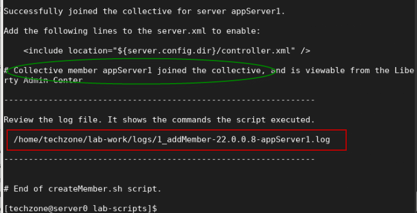

    Cuando se completa el script, se crea la aplicación del servidor **appServer1** y se agrega al colectivo.

    - El script **addMember.sh** creó un servidor Liberty local llamado **appServer1** en el siguiente directorio de la VM **server0.gym.lan** :

        > **/home/techzone/lab-work/liberty-staging/22.0.0.8-appServer1/wlp/usr/servers**

3. Regrese a la página **del Centro de administración** del colectivo Liberty. Podrá ver que el servidor **appServer1** se agregó al colectivo como un servidor nuevo. El servidor se encuentra en estado “ **Detenido** ”.

    

4. En el Centro de administración, haga clic en la fila **Servidores** para enumerar los dos servidores que están en el colectivo.

    

    El nuevo servidor “ **appServer1** ” se muestra junto con el servidor controlador colectivo.

    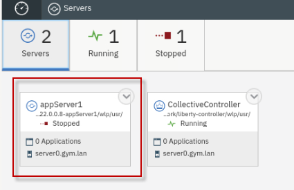

5. En el Centro de administración, haga clic en el ícono “ **Explorador** ” para regresar a la vista del “ **panel de control** ”.

    

    Ahora estás nuevamente en la vista del panel del explorador.

    

6. Vea el registro que muestra los comandos que ejecutó el script addMember.sh para implementar el paquete del servidor Liberty y unir al miembro al colectivo

    ```
    gedit /home/techzone/lab-work/logs/1_addMember-22.0.0.8-appServer1.log
    ```

    Como se ilustra a continuación, el script **addMembe** r realizó las siguientes tareas:

    - Cree el directorio **de prueba de Liberty** donde se instalarán los servidores miembros de Liberty

    - Implemente Liberty descomprimiendo el paquete del servidor

    - Aplicar el nombre del servidor “appServer1”

    - Aplicar modificaciones de configuración del servidor, actualizando los puertos para evitar posibles conflictos de puertos

    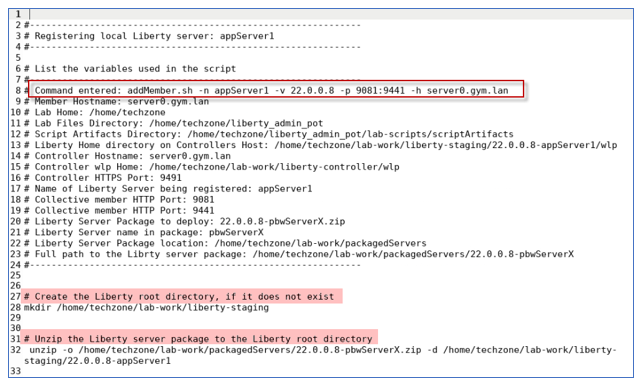

    

7. **Cerrar** el editor **gedit**

### **Agregue un miembro colectivo a la máquina virtual del host remoto, server1.gym.lan**

Ahora, ejecute nuevamente el script **addMember.sh** , usando parámetros ligeramente diferentes, para implementar Liberty en la VM remota, server1.gym.lan.

Unir miembros remotos a un colectivo requiere un par de pasos adicionales que el script realiza por usted en el entorno de laboratorio y que se identifican a continuación.

**El script realiza las siguientes tareas:**

- Registrar el host remoto en el colectivo Liberty

- Copia segura del paquete del servidor al host remoto

- Copia segura de un script que se ejecutará en el host remoto

- Inicie sesión en el host remoto y ejecute el script que hace lo siguiente:

    - Implementar el paquete del servidor para la versión 22.0.0.8 de Liberty

    - Aplicar anulaciones para los puertos HTTP y HTTPS con 9081”9441

    - Cambie el nombre del servidor predeterminado a “appServer1”

    - Únete al colectivo de miembros

1. Ejecute el siguiente script para crear un miembro colectivo Liberty remoto en la máquina virtual **server1.gym.lan** , especificando un nombre de servidor y puertos diferentes.

    ```
    ~/liberty_admin_pot/lab-scripts/addMember.sh -n appServer2 -v 22.0.0.8 -p 9082:9442 -h server1.gym.lan
    ```

    

    Cuando se completa el script, se crea la aplicación del servidor **appServer2** y se agrega al colectivo.

    - El script **addMember.sh** creó un servidor Liberty llamado **appServer2** en el siguiente directorio de la VM **server1.gym.lan** :

        > **/opt/IBM/liberty-staging/22.0.0.8-appServer2/wlp/usr/servers**

    - El servidor utiliza **9082** y **9442** como sus puertos HTTP/HTTPS, según lo definido en los parámetros de entrada del script.

2. Regrese a la página **del Centro de administración** del colectivo Liberty y podrá ver que el nuevo miembro, **appServer2** , se ha agregado a la lista de servidores y se encuentra en estado **Detenido** .

    

    Al mostrar todos los servidores se muestra el nuevo servidor “ **appServer2** ” en el colectivo

    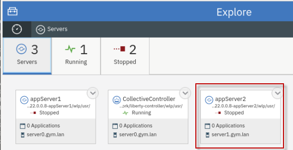

3. Vea el registro que muestra el comando que ejecutó el script addMember.sh para implementar el paquete del servidor Liberty y unir al **miembro remoto** al colectivo

    ```
    gedit /home/techzone/lab-work/logs/1_addMember-22.0.0.8-appServer2.log
    ```

    Como se ilustra a continuación, el script **addMembe** r realizó las siguientes tareas:

    - Puerto abierto para comunicación con el controlador colectivo y el host remoto

    - Registrar el host remoto con el colectivo

    - Probar la conexión

    - Copia segura del paquete del servidor y del script al servidor remoto

    - Inicie sesión en el servidor remoto mediante SSH y ejecute el script para implementar Liberty y agregar el servidor al colectivo.

    - Recuperar el registro del servidor remoto, verificar si se informaron errores

    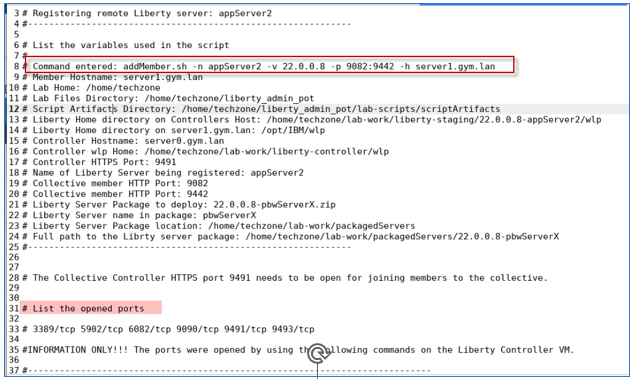

    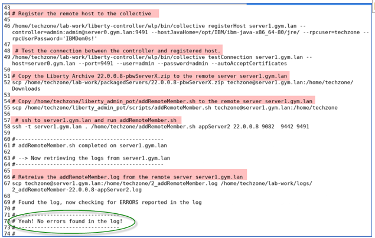

4. **Cerrar** el editor gedit

## **Parte 5: Verificar la implementación de la aplicación en el colectivo**

Ha implementado dos servidores Liberty como miembros colectivos. En esta sección, iniciará estos dos servidores desde el Centro de administración de Liberty y ejecutará las aplicaciones de ejemplo en los servidores Liberty individuales para garantizar que las aplicaciones se ejecuten correctamente.

### **Inicie la base de datos de la aplicación DB2 para PlantsByWebSphere**

La aplicación PlantsByWebSphere requiere una base de datos de aplicación, que debe asegurarse de que esté en funcionamiento.

<table>
<tbody>
<tr class="odd">
<td></td>
<td>
<p><strong>Información:</strong></p>
<p>Es posible que ya haya iniciado el contenedor db2 en un laboratorio anterior.</p>
<p>Para saber si el contenedor db2 ya está en ejecución, ejecute el siguiente comando:</p>
<strong>docker ps | grep db2_demo_data</strong>
<p><strong>Para su información:</strong> está bien ejecutar el comando docker start a continuación, incluso si el contenedor ya está ejecutándose.</p>
</td>
</tr>
</tbody>
</table>

1. Antes de iniciar los servidores Liberty, debe iniciar la base de datos db2 utilizada por la aplicación **PlantsByWebSphere** con el siguiente comando.

    ```
    docker start db2_demo_data
    ```

### **Inicie los servidores Liberty desde el Centro de administración**

1. Para iniciar el miembro colectivo desde la página **del Explorador** del Centro de administración de Liberty, haga clic en el ícono **SERVIDORES** para ir a su página de detalles.

    

2. En la página de detalles del servidor, haga clic en el ícono del menú desplegable de **appServer1** y seleccione **Iniciar** para iniciar el servidor.

    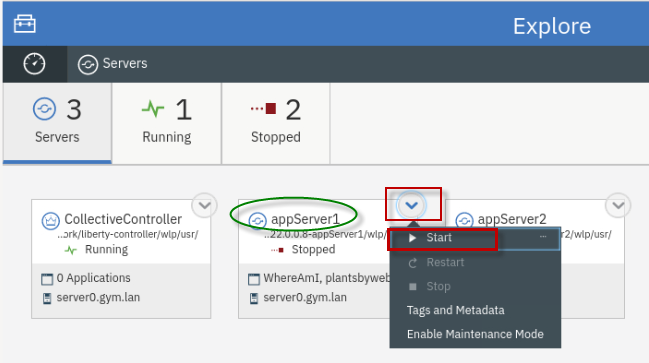

    **Nota:** Si se le solicitan credenciales, ingrese el nombre de usuario y la contraseña del Centro de administración como: **admin** / **admin** .

3. Haga clic en **Iniciar** para confirmar el comando de inicio del servidor **appServer1** .

    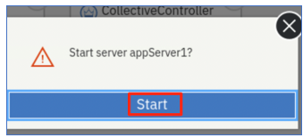

    Se iniciará la aplicación Server **appServer1** y podrás ver que ahora está en estado **de ejecución** .

    El servidor appServer1 ahora muestra que tiene dos aplicaciones en ejecución, que se utilizan en los laboratorios de este taller.

    - PlantasByWebSphere
    - ¿Quién soy yo?

    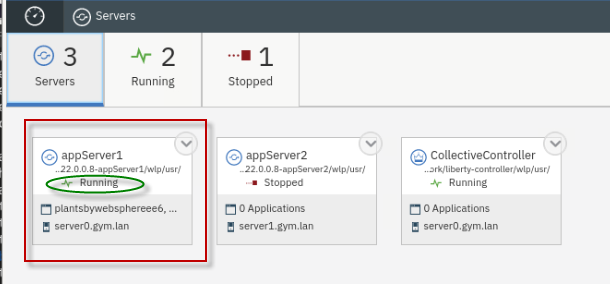

4. Repita el mismo procedimiento de inicio del servidor para el servidor **appServer2** . Una vez hecho esto, el servidor **appServer2** se inicia como se muestra a continuación:

    

5. Haga clic en el ícono del panel **del Explorador** para volver a la vista del panel.

    

    Explora las “ **Aplicaciones** ”, “ **servidores** ” y “ **hosts** ” que están registrados y ejecutándose en el colectivo

    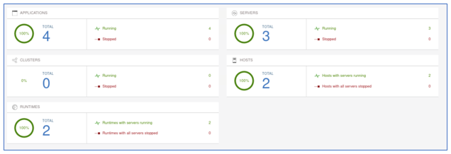

    **Vista de aplicaciones:**

    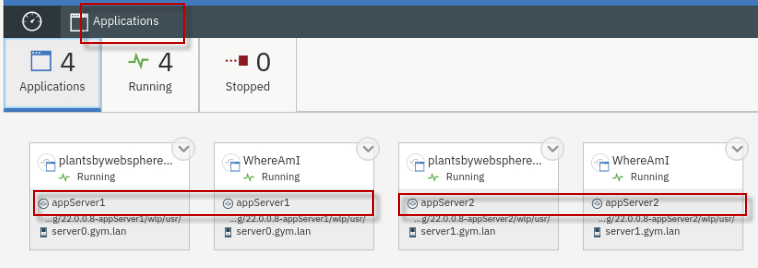

    **Vista de servidores:**

    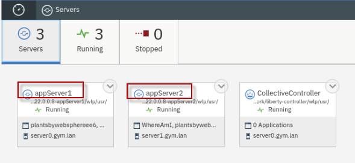

    **Opinión de los anfitriones:**

    

### **Pruebe las dos aplicaciones de ejemplo utilizadas en los laboratorios de esta serie de talleres**

En esta sección, probará las dos aplicaciones que están implementadas en el colectivo.

### **Pruebe la aplicación PlantsByWebSphere:**

1. Para acceder a la aplicación **PlantsByWebSphere** en appServer1

    a. Abra una nueva pestaña en el navegador Firefox y pruebe PlantsByWebSphere en **appServer1** , que está en **server0.gym.lan**

    ```
    https://server0.gym.lan:9441/PlantsByWebSphere
    ```

    **Nota:** Si ve la “Advertencia: posible riesgo de seguridad futuro”, haga clic en **Avanzado...-&gt;Aceptar riesgo y continuar** para continuar.

    

    b. En la aplicación, haga clic en la pestaña “ **Flores** ” para ver el catálogo de flores. Esta acción recupera los detalles del catálogo de la base de datos DB2 de la aplicación.

    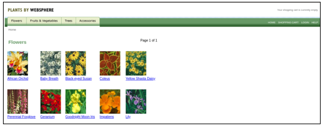

2. Repita los pasos para acceder a la aplicación **PlantsByWebSphere** en appServer2 en el host server1.gym.lan

    a. Abra una nueva pestaña en el navegador Firefox y pruebe PlantsByWebSphere en **appServer2** , que está en **server1.gym.lan**

    ```
    https://server1.gym.lan:9442/PlantsByWebSphere
    ```

    **Nota:** Si ve la “Advertencia: posible riesgo de seguridad futuro”, haga clic en **Avanzado...-&gt;Aceptar riesgo y continuar** para continuar.

    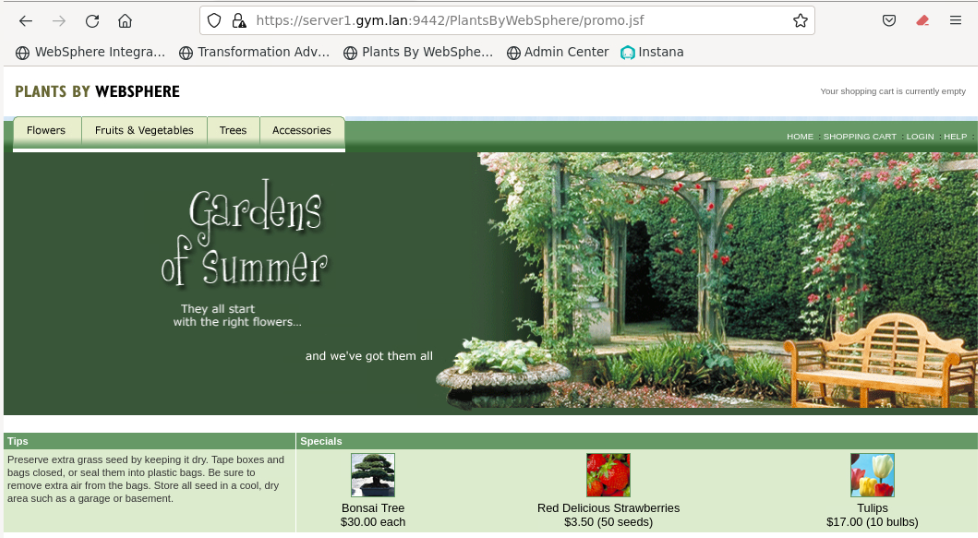

### **Pruebe la aplicación WhereAmI:**

1. Para acceder a la aplicación **WhereAmI** en appServer1

    a. Abra una nueva pestaña en el navegador Firefox y pruebe WhereAmI en **appServer1** , que está en **server0.gym.lan**

    ```
    https://server0.gym.lan:9441/WhereAmI
    ```

    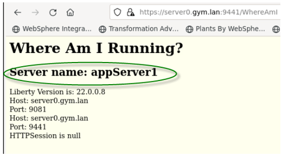

2. Repita los pasos para acceder a la aplicación **WhereAmI** en appServer2 en el host server1.gym.lan

    a. Abra una nueva pestaña en el navegador Firefox y pruebe WhereAmI en **appServer2** , que está en **server1.gym.lan**

    ```
    https://server1.gym.lan:9442/WhereAmI
    ```

    

3. **Cierre** las ventanas/pestañas del navegador que muestran las aplicaciones PlantsByWebSphere y WhereAmI

**¡Felicitaciones!** Ha implementado con éxito Liberty y las aplicaciones de muestra en un colectivo Liberty, siguiendo las prácticas recomendadas comunes para una metodología de implementación flexible para WebSphere Liberty.

## **Resumen**

**¡Felicidades!**

**Has completado con éxito el laboratorio “Implementaciones de aplicaciones Liberty en colectivos”**

En este laboratorio, implementó aplicaciones Liberty en un colectivo, siguiendo las prácticas recomendadas, incluidas implementaciones flexibles utilizando paquetes de servidor como salida de compilación, aplicando anulaciones de configuración a servidores durante la implementación y utilizando la automatización para lograr una mayor agilidad al administrar colectivos Liberty e implementaciones de aplicaciones.

**<span class="underline">En este laboratorio, usted ha adquirido experiencia con estas tareas administrativas clave de Liberty:</span>**

- Crear paquetes de servidor Liberty

- Crear un Liberty Collective Controller

- Implementar paquetes de Liberty Server como miembros colectivos

- Aplicar modificaciones de configuración de Liberty a los miembros colectivos

- Utilice el Centro de administración de Liberty para iniciar servidores miembros de Liberty

- Valide la implementación probando las aplicaciones de muestra en los servidores Liberty individuales


**===== FIN DEL LABORATORIO =====**

[Regresar a la página principal de laboratorios](../README.md)
