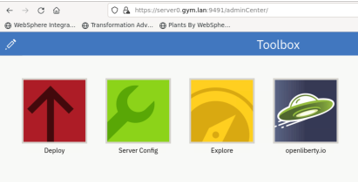
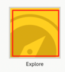
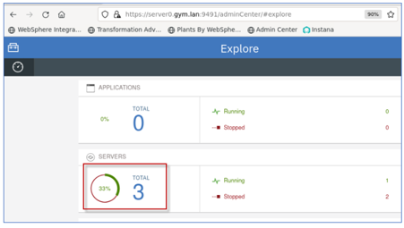
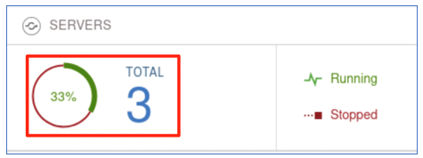
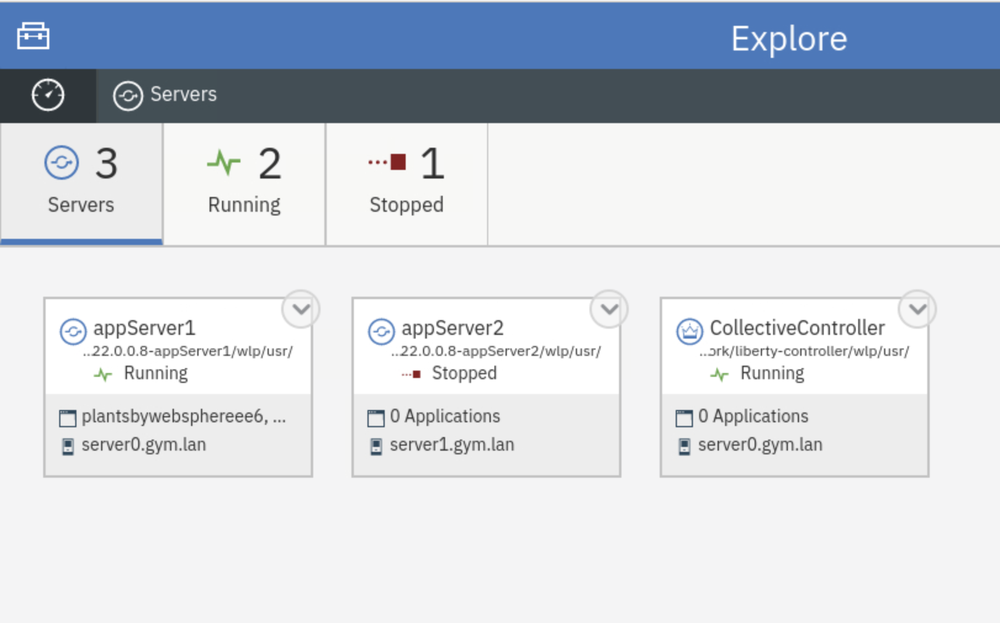
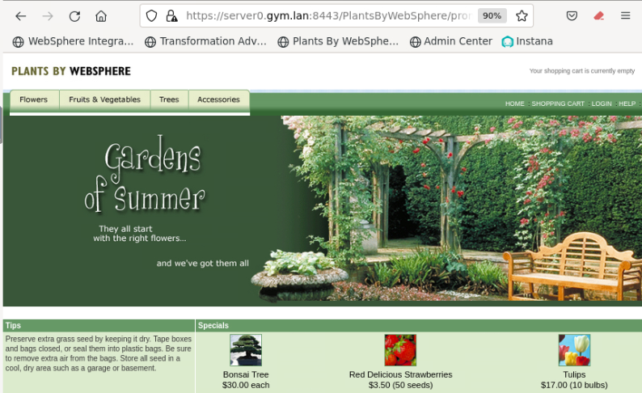
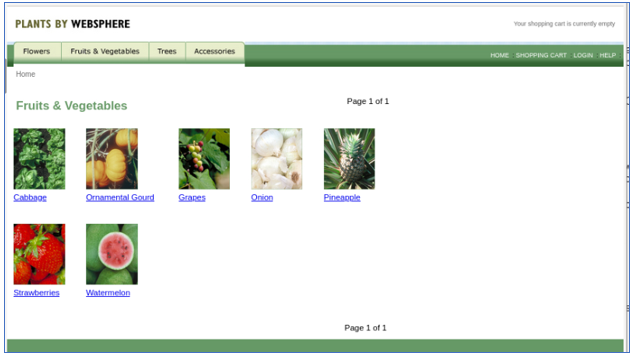
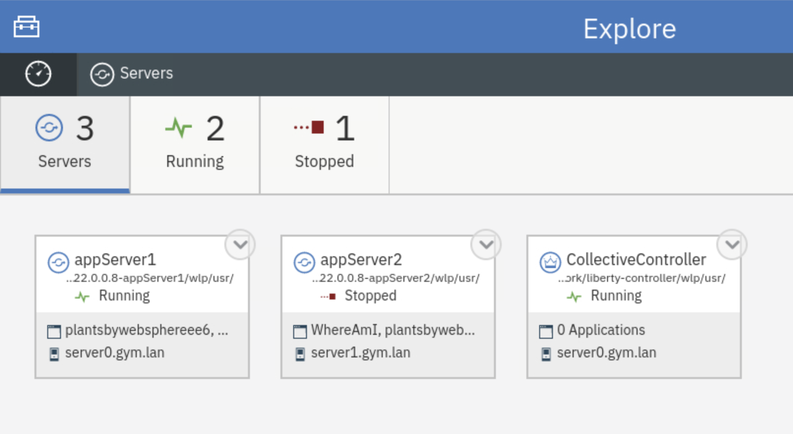
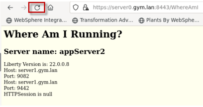
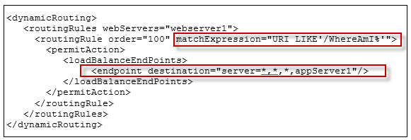

# Laboratorio 1030: El valor del enrutamiento dinámico con Liberty


**Última actualización:** marzo de 2023

**Duración:** 45 minutos

¿Necesita ayuda? Póngase en contacto con **Kevin Postreich, Yi Tang**

[Regresar a la página principal de laboratorios](../README.md)

## **Introducción**

En las empresas de hoy en día, la aplicación es la reina. Para proporcionar equilibrio de carga de trabajo y protección contra fallos para una alta disponibilidad de la aplicación, el complemento WebSphere se puede utilizar con un servidor web Apache para enrutar las solicitudes HTTP a la aplicación que se ejecuta en los servidores de aplicaciones.

Tradicionalmente, esto se hace creando la configuración del complemento para cada servidor de aplicaciones y utilizando una utilidad para fusionar estas configuraciones en un solo archivo y luego copiarlo a la instalación del servidor web.

La función de enrutamiento dinámico de Liberty permite el enrutamiento de solicitudes HTTP a miembros de colectivos de Liberty sin regenerar el archivo de configuración del complemento WebSphere cuando cambia el entorno.

Cuando se agregan, eliminan, inician, detienen o modifican servidores, miembros colectivos, aplicaciones o hosts virtuales, la nueva información se entrega dinámicamente al complemento WebSphere a través del controlador colectivo Liberty.

Las solicitudes se enrutan en función de la información actualizada. En este enfoque, el archivo de configuración del complemento del servidor web (plugin-cfg.xml) solo debe contener información de enrutamiento sobre los procesos del controlador colectivo.

Luego, el complemento se comunica con el controlador para obtener información sobre todos los servidores del colectivo y dirige las solicitudes HTTP a los servidores Liberty apropiados en el colectivo.


En este laboratorio, aprenderá cómo configurar y utilizar la capacidad de enrutamiento dinámico de Liberty para brindar alta disponibilidad para sus aplicaciones.

## **Accediendo al entorno**

Si está realizando este laboratorio como parte de un taller dirigido por un instructor (virtual o presencial), ya se le ha proporcionado un entorno. El instructor le proporcionará los detalles para acceder al entorno del laboratorio.

De lo contrario, deberá reservar un entorno para el laboratorio. Puede obtener uno aquí. Siga las instrucciones en pantalla para la opción “ **Reservar ahora** ”.

KLP: ENLACE A RESERVA ENV POR DETERMINAR

El entorno de laboratorio contiene dos (2) máquinas virtuales Linux.


Se configura un servicio publicado para proporcionar acceso a la VM **server0** a través de la interfaz noVNC para el entorno de laboratorio.

1. Acceda al entorno de laboratorio desde su navegador web.

    a. Cuando el entorno esté aprovisionado, haga clic con el botón derecho en el enlace **Servicio publicado** . Luego, seleccione “ **Abrir enlace en nueva pestaña** ” en el menú contextual.

    

    b. Haga clic en el enlace **"vnc.html"** para abrir el entorno de laboratorio a través de la interfaz **noVNC** .

    

    c. Haga clic en el botón **Conectar**

    

    d. Ingrese la contraseña como: **passw0rd** . Luego haga clic en el botón **Enviar credenciales** para acceder al entorno de laboratorio.

    **Nota:** Ese es un cero numérico en passw0rd

    

2. Inicie sesión en la máquina virtual **server0** utilizando las credenciales que aparecen a continuación:

    - ID de usuario: **techzone**

    - Contraseña: **IBMDem0s!**

## **Consejos para trabajar en el entorno de laboratorio**

1. Puede cambiar el tamaño del área visible utilizando las opciones **de Configuración de noVNC** para cambiar el tamaño del escritorio virtual para que se ajuste a su pantalla.

    a. Desde la máquina virtual del entorno, haga clic en el icono **giratorio** en el panel de control noNC para abrir el menú.

    

    b. Para aumentar el área visible, haga clic en `Settings > Scaling Mode` y configure el valor en `Remote Resizing`

    

2. Puede copiar/pegar texto de la guía de laboratorio en el entorno de laboratorio utilizando el portapapeles en el visor noVNC.

    a. Copie el texto de la guía de laboratorio que desea pegar en el entorno de laboratorio.

    b. Haga clic en el icono **del Portapapeles** y **pegue** el texto en el portapapeles de noVNC

    

    c. Pegue el texto en la máquina virtual, por ejemplo en una ventana de terminal, una ventana del navegador, etc.

    d. Haga clic en el icono **del portapapeles** nuevamente para cerrarlo.

    > **NOTA:** A veces, pegar en una ventana de Terminal en la VM no funciona de manera consistente.

    > En este caso, puedes intentarlo nuevamente, o abrir otra ventana de terminal e intentarlo nuevamente, o pegar el texto en un **editor de texto** en la VM y luego pegarlo en la ventana de terminal en la VM.

3. Como alternativa a la opción Copiar/Pegar de noVNC, puede considerar abrir la guía de laboratorio en un navegador web dentro de la máquina virtual. Con este método, puede copiar y pegar fácilmente texto de la guía de laboratorio sin tener que usar el portapapeles de noVNC.

<br>

## Laboratorio: El valor del enrutamiento dinámico con Liberty

Para que la función de enrutamiento dinámico funcione, la característica **dynamicRouting-1.0** solo es necesaria para los **controladores colectivos** .

No es necesario actualizar cada miembro del colectivo. El enrutamiento dinámico se puede utilizar para enrutar aplicaciones instaladas en cualquier servidor Liberty de un colectivo, incluidas:

- Implementación de red del servidor de aplicaciones Liberty

- Servidor de aplicaciones Liberty Edición base de Liberty

- Núcleo del servidor de aplicaciones Liberty

<table>
<tbody>
<tr class="odd">
<td></td>
<td>
<p><strong>Consejo:</strong></p>
<p>La capacidad de aprovechar la capacidad de enrutamiento dinámico de Liberty para cualquier edición de Liberty es poderosa y rentable.</p>
<p>Obtienes alta disponibilidad por solicitud para las ediciones Liberty Base y Core, sin necesidad de licencias Liberty ND. También elimina las fusiones de complementos que consumen mucho tiempo y las actualizaciones manuales de la configuración del complemento del servidor HTTP si se agregan o eliminan servidores de la configuración.</p>
</td>
</tr>
</tbody>
</table>


## **Clonar el repositorio de GitHub para este taller**

Este laboratorio requiere artefactos almacenados en un repositorio de GitHub. Ejecute el siguiente comando para clonar el repositorio en la máquina virtual local que se utiliza para el laboratorio.

1. Si aún no lo hizo en un laboratorio anterior, clone el repositorio de GitHub que contiene los artefactos de laboratorio necesarios para el laboratorio.

    a. Abra una nueva ventana de terminal en la máquina virtual “ **server0.gym.lan** ”

    

    b. Clonar el repositorio de GitHub necesario para el laboratorio.

    ```
    git clone https://github.com/IBMTechSales/liberty_admin_pot.git
    ```

    c. Navegue hasta el directorio “ **lab-scripts** ” en el repositorio clonado.

    ```
    cd ~/liberty_admin_pot/lab-scripts
    ```

    d. Agregue los permisos de “ **ejecución** ” a los directorios de scripts de laboratorio y a los scripts de shell.

    ```
    chmod -R 755 ./
    ```

## **Parte 1: Verificar el servidor HTTP**

En este laboratorio, generará un archivo de configuración de complemento de servidor web especial que proporciona información de enrutamiento dinámico para permitir que un servidor web distribuya solicitudes HTTP en dos servidores Liberty que ejecutan las dos aplicaciones de muestra, **PlantsByWebSphere** y **WhereAmI** .

Iniciará y detendrá miembros en el colectivo para experimentar el comportamiento de enrutamiento dinámico.

**Este laboratorio contiene las siguientes actividades:**

- Verificar el servidor HTTP

- Crea un Liberty Collective **(Si no completaste Lab_1020)**

- Configurar enrutamiento dinámico

- Iniciar servidores miembros de Liberty desde el Centro de administración de Liberty

- Pruebe las funciones de enrutamiento dinámico

- Configurar y probar reglas de enrutamiento dinámico

- Resumen

Un **servidor web** y **un complemento de WebSphere** (Plug-in) son dos componentes importantes de esta solución de protección contra errores y equilibrio de carga de trabajo. Debe tener un servidor web compatible con el complemento de servidor web para WebSphere Application Server.

En este laboratorio el servidor web utilizado es **IBM HTTP Server** (IHS).

Para simplificar el laboratorio, IHS y el complemento se han preinstalado y configurado en la máquina virtual **server0.gym.lan** en las siguientes ubicaciones de directorio y puerto HTTP.

- El directorio de instalación de IHS es **/opt/IBM/HTTPServer**

- El directorio de instalación del complemento es **/opt/IBM/WebSphere/Plugins** .

- IHS está configurado para escuchar en el puerto seguro **8443**

En esta sección, se asegura de que IBM HTTP Server se inicie y se ejecute como se espera

1. Haga doble clic en el icono **del Sistema de archivos** en el escritorio para abrir el explorador de archivos

     datos generados por "md-type="image"&gt;

2. Desde una nueva ventana de terminal, ejecute el comando para iniciar el servidor **IHS**

    ```
    /opt/IBM/HTTPServer/bin/apachectl start
    ```

3. Abra una ventana del navegador web haciendo doble clic en el ícono **de Firefox** en el escritorio.

    

4. Desde el navegador, vaya a la URL **de IHS** :

    ```
    https://server0.gym.lan:8443
    ```

    **Nota:** El servidor HTTP se ejecuta en el puerto seguro **8443** , no en el puerto seguro predeterminado 443

    Se muestra la página de inicio **de IHS** .

     datos generados por "md-type="image"&gt;

5. Ejecute el siguiente comando para **detener** el servidor **IHS**

    ```
    /opt/IBM/HTTPServer/bin/apachectl stop
    ```

## **Parte 2: Asegurarse de que se implemente el Liberty Collective**

El enrutamiento dinámico de Liberty requiere un colectivo Liberty y los servidores de aplicaciones que alojan las aplicaciones utilizadas en los laboratorios deben ser miembros del colectivo Liberty. El módulo de aprendizaje para crear el colectivo Liberty es “Lab_1020”.

En esta sección, se asegurará de que un colectivo administrativo de Liberty esté disponible y de que los servidores de aplicaciones estén implementados en el colectivo.

<table>
<tbody>
<tr class="odd">
<td></td>
<td>
<p><strong>IMPORTANTE: ¡Por favor leer!</strong></p>
<p>Si has completado el <strong>Laboratorio 1020</strong> de esta serie, ya has creado el controlador colectivo Liberty.</p>
<p>En otras palabras, puede omitir <strong>la Parte 2</strong> del laboratorio y continuar con <strong>la Parte 3</strong> si ya ha completado el Laboratorio 1020 de esta serie.</p>
<p>El ULR del Centro de administración es: <a href="https://server0.gym.lan:9491/adminCenter">https://server0.gym.lan:9491/adminCenter</a></p>
<p>Las credenciales del Centro de administración son: <strong>admin</strong> / <strong>admin</strong></p>
</td>
</tr>
</tbody>
</table>

### 2.1: Si no ha completado el laboratorio 1020, los siguientes pasos proporcionan una “ruta rápida” para crear el colectivo Liberty requerido para este laboratorio, "Laboratorio 1030".

1. Ejecute el siguiente comando para garantizar que se cree un colectivo Liberty:

    ```
    /home/techzone/liberty_admin_pot/lab-scripts/deployCollective.sh --lab1030
    ```

    El script deploymentCollectve.sh hará lo siguiente:

    - Si el controlador ya existe, el script se ABORTARÁ, ya que ya existe un colectivo
    - Si el Controlador NO existe, se creará
    - Construir y producir un paquete de Liberty Server para implementarlo en servidores de aplicaciones Liberty
    - Cree dos servidores Liberty, “appServer1” y “appServer2”, implemente el paquete del servidor y una los servidores al Colectivo Liberty

2. Una vez que se complete el script, acceda al **Centro de administración** . Ingrese las credenciales de inicio de sesión como: **admin** / **admin**

    ```
    https://server0.gym.lan:9491/adminCenter
    ```

    **Nota:** Si ve la “Advertencia: posible riesgo de seguridad futuro”, haga clic en **Avanzado...-&gt;Aceptar riesgo y continuar** para continuar.

    Se muestra la página del Centro de administración del colectivo Liberty.

    

3. Haga clic en el icono **Explorar**

    

    Se muestra la lista de recursos colectivos y puedes ver que tienes tres servidores.

    

4. Haga clic en la lista de Servidores para ver los tres servidores, appServer1, appServer2 y CollectiveController

    

    **¡EVITE PROBLEMAS!**

    Si ejecutó el comando “ **deployCollectve.sh --skip1030** ” y terminó con la siguiente información, como se ilustra en la captura de pantalla a continuación, significa que el script detectó que el Controlador Colectivo ya ha sido creado.

    Por lo tanto, los scripts existían y mostraban la URL del Centro de administración.

    Vaya a la URL del Centro de administración y verifique que el colectivo contenga los dos miembros del colectivo, “appServer1” y “appServer2”, como se ilustra arriba.

    **¡Solución de problemas!**

    La aplicación del Centro de administración no puede ejecutarse o los dos servidores de aplicaciones no son parte del colectivo; en ese caso, se requiere una limpieza manual del colectivo y debe comunicarse con el instructor del laboratorio.

    

## **Parte 3: Configurar la función de enrutamiento dinámico**

En esta sección, configurará la función de enrutamiento dinámico para enrutar solicitudes HTTP a miembros de colectivos de Liberty sin tener que regenerar el archivo de configuración del complemento WebSphere cuando cambia el entorno.

La característica de enrutamiento dinámico, “ **dynamicRouting-1.0** ”, proporciona el servicio de enrutamiento dinámico, que recupera dinámicamente información de enrutamiento del repositorio colectivo y entrega esta información al complemento WebSphere.

Para configurar el enrutamiento dinámico para un colectivo Liberty, debe realizar las siguientes tareas:

- **Agregue la función dynamicRouting-1.0 al controlador colectivo**

    Esta función debe agregarse al archivo server.xml del controlador colectivo.

- **Crear un archivo de configuración de complemento para el servidor HTTP**

    El comando “dynamicRouting setup” genera el “almacén de claves” y los “archivos de configuración del complemento” necesarios para el enrutamiento dinámico.

- **Establecer una conexión segura entre el complemento y el controlador colectivo**

    El archivo de configuración del complemento generado y las claves deben copiarse en las ubicaciones adecuadas para establecer la conexión segura.

### Los pasos de alto nivel para configurar el enrutamiento dinámico se enumeran a continuación, como se describe en la documentación de IBM:

<table>
<tbody>
<tr class="odd">
<td></td>
<td>
<p><strong>Consejo:</strong></p>
<p>En este laboratorio, se le proporcionará un <strong>script de automatización</strong> que realiza TODOS los pasos siguientes por usted.</p>
</td>
</tr>
</tbody>
</table>

- Habilite el enrutamiento dinámico en el controlador agregando la función dynamicRouting-1.0 al archivo server.xml del controlador colectivo

- Asegúrese de que el servidor del controlador se haya iniciado una vez que se habilite el enrutamiento dinámico

- Ejecute el comando “ **configuración de enrutamiento dinámico** ” desde el servidor controlador, que genera los archivos de configuración del almacén de claves y del complemento

- Copie los archivos plugin-key.p12 y plugin-cfg.xml generados en un directorio temporal en el host del servidor web

- Convierte el almacén de claves al formato del Sistema de gestión de certificados (CMS), que es el formato compatible con el servidor HTTP

- Copiar los archivos de complemento generados al servidor IHS

- Iniciar el servidor HTTP

Se pueden encontrar detalles adicionales sobre cómo configurar el enrutamiento dinámico para un colectivo y ejecutar el comando “dynamicRouting” en los enlaces de la documentación de IBM que aparecen a continuación:

**Documentación de IBM: Configuración de enrutamiento dinámico para un colectivo:**

[https://www.ibm.com/docs/en/was-liberty/nd?topic=SSAW57_liberty/com.ibm.websphere.wlp.zseries.doc/ae/twlp_wve_enabledynrout_single.htm](https://www.ibm.com/docs/en/was-liberty/nd?topic=SSAW57_liberty/com.ibm.websphere.wlp.zseries.doc/ae/twlp_wve_enabledynrout_single.htm)

**Documentación de IBM: Comando de enrutamiento dinámico:**

[https://www.ibm.com/docs/en/was-liberty/nd?topic=SSAW57_liberty/com.ibm.websphere.wlp.zseries.doc/ae/rwlp_wve_dynroutcollect.htm](https://www.ibm.com/docs/en/was-liberty/nd?topic=SSAW57_liberty/com.ibm.websphere.wlp.zseries.doc/ae/rwlp_wve_dynroutcollect.htm)

### **Configurar enrutamiento dinámico**

En esta sección, utilizará un script de automatización, que proporcionamos en el entorno de laboratorio, para realizar los pasos descritos anteriormente para configurar el enrutamiento dinámico.

1. Ejecute el script setupDynamicRouting.sh que se muestra a continuación para configurar el complemento para el enrutamiento dinámico.

    El script **setupDynamicRouting.sh** realiza todas las tareas descritas anteriormente que configuran el enrutamiento dinámico en el colectivo.

    ```
    /home/techzone/liberty_admin_pot/lab-scripts/setupDynamicRouting.sh
    ```

    Una vez que se completa el comando, se crean los archivos de configuración del complemento y se configuran para el servidor IHS.

     datos generados por "md-type="image"&gt;

**¡El enrutamiento dinámico en Liberty Collective ya está listo para usar!**

### **Examine el archivo “plugin-cfg.xml” generado**

El archivo **plugin-cfg.xml** contiene información de configuración que determina cómo el complemento del servidor web reenvía solicitudes a los servidores Liberty en el colectivo.

El complemento solo necesita conectarse al controlador colectivo para obtener información de topología. No necesita conocer el host o el puerto de los servidores de aplicaciones.

El archivo plugin-cfg.xml está en el siguiente directorio:

> **/opt/IBM/WebSphere/Plugins/config/webserver1**

1. Examine el **plugin-cfg.xml** generado

    ```
    gedit /opt/IBM/WebSphere/Plugins/config/webserver1/plugin-cfg.xml
    ```

    Con el enrutamiento dinámico, las solicitudes HTTP se envían a los miembros de los colectivos Liberty sin regenerar el archivo de configuración del complemento WebSphere cuando cambia el entorno.

    <table>
    <tbody>
    <tr class="odd">
    <td></td>
    <td>
    <p><strong>Nota:</strong></p>
    <p>El plugin-cfg.xml no contiene la información del host y del puerto para los servidores de aplicaciones.</p>
    <p>En cambio, plugin-cfg.xml contiene la información del host y del puerto para el controlador colectivo que proporciona la información de la aplicación y del servidor de aplicaciones de forma dinámica al complemento.</p>
    </td>
    </tr>
    </tbody>
    </table>

    Cuando se agregan, eliminan, inician, detienen o modifican servidores, miembros del clúster, aplicaciones o hosts virtuales, la nueva información se entrega dinámicamente al complemento WebSphere desde Liberty Collective Controller.

    En esta configuración, las solicitudes se enrutan en función de información actualizada.

    

2. **Cierre** el editor **gedit** . ¡NO GUARDE NINGÚN CAMBIO!

### **Examine el archivo “httpd.conf” del servidor web**

El archivo **httpd.conf** contiene la configuración del servidor HTTP.

El módulo de complemento WebSphere se carga agregando la configuración al archivo httpd.conf en el servidor web.

El archivo httpd.conf del servidor web se encuentra en el siguiente directorio:

> **/opt/IBM/HTTPServer/conf**

1. Examine el archivo **httpd.conf** generado

    ```
    gedit /opt/IBM/HTTPServer/conf/httpd.conf
    ```

    a. Desplácese hasta la última línea del archivo httpd.conf, que es la configuración para cargar el módulo de complemento de WebSphere.

    b. Observe que la configuración apunta al archivo **plugin-cfg.xml** , que se utiliza para determinar cómo dirigir las solicitudes http a los servidores Liberty en el colectivo.

    

2. **Cierre** el editor **gedit** . ¡NO GUARDE NINGÚN CAMBIO!

## **Parte 4: Iniciar los servidores de miembros del colectivo Liberty**

En este punto, deberías tener dos miembros del colectivo Liberty que ahora deben crearse en el colectivo y nombrarse de la siguiente manera:

- servidor de aplicaciones1

- servidor de aplicaciones2

    En esta sección, **iniciará** estos dos servidores desde el Centro de administración de Liberty si aún no están iniciados.

La aplicación PlantsByWebSphere requiere una base de datos de aplicación, que debe asegurarse de que esté en funcionamiento.

<table>
<tbody>
<tr class="odd">
<td></td>
<td>
<p><strong>Información:</strong></p>
<p>Es posible que ya haya iniciado el contenedor db2 en un laboratorio anterior.</p>
<p>Para saber si el contenedor db2 ya está en ejecución, ejecute el siguiente comando:</p>
<p><strong>docker ps | grep db2_demo_data</strong></p>
<p><strong>Para su información:</strong> está bien ejecutar el comando docker start a continuación, incluso si el contenedor ya está ejecutándose.</p>
</td>
</tr>
</tbody>
</table>

<br>

1. Antes de iniciar los servidores Liberty, debe iniciar la base de datos db2 utilizada por la aplicación **PlantsByWebSphere** con el siguiente comando.

    ```
    docker start db2_demo_data
    ```

2. Acceda al Centro de administración de Liberty desde el navegador

    a. Ingrese las credenciales de inicio de sesión como: admin / admin

    ```
    https://server0.gym.lan:9491/adminCenter
    ```

3. Vaya a la vista Servidores en el Centro de administración

    a. Desde el Centro de administración, vaya a la página **Explorador** y haga clic en el ícono **SERVIDORES** para ir a su página de detalles.

    

    

    <table>
    <tbody>
    <tr class="odd">
    <td></td>
    <td>
    <p><strong>IMPORTANTE: ¡Por favor leer!</strong></p>
    <p>Si los dos servidores ilustrados arriba NO están en tu colectivo, entonces no podrás continuar con el laboratorio.</p>
    <p>Asegúrese de haber completado <strong>el Laboratorio 1020</strong> de esta serie o de haber completado la <strong>Parte 2</strong> de este laboratorio.</p>
    <p>Si ya completó el Laboratorio 1020, entonces no necesita realizar la Parte 4, si los dos servidores Liberty están en estado " <strong>en ejecución</strong> ".</p>
    </td>
    </tr>
    </tbody>
    </table>

4. Iniciar appServer1

    a. En la página de detalles del servidor, haga clic en el ícono del menú desplegable de **appServer1** y seleccione **Iniciar** para iniciar el servidor.

    

    b. Haga clic en **Iniciar** para confirmar el comando de inicio del servidor **appServer1** .

    

    Se iniciará la aplicación Server **appServer1** y podrás ver que está en estado " **En ejecución** " con 2 aplicaciones.

    

5. Repita el mismo procedimiento de inicio del servidor para el servidor **appServer2** . Una vez hecho esto, el servidor **appServer2** se inicia como se muestra a continuación:

    

6. Haga clic en el ícono del panel **del Explorador** para volver a la vista del panel.

    

    Verá que las dos aplicaciones en ambos servidores miembros están activas y funcionando.

    

## **Parte 5: Prueba de las funciones de enrutamiento dinámico**

En esta sección, probará el enrutamiento dinámico que configuró para el colectivo Liberty.

Realizarás dos escenarios de prueba:

- En el primer caso de prueba, utiliza la aplicación **PlantsByWebSphere** para probar la alta disponibilidad de la aplicación y verificar que siempre puede acceder a la aplicación directamente desde el servidor IHS si al menos uno de los servidores miembros está en ejecución.

    > Cuando se detiene uno de los servidores de aplicaciones, el enrutamiento dinámico redirige automáticamente el tráfico a otro servidor de aplicaciones sobreviviente sin ninguna intervención del usuario ni interrupción de la aplicación.

- El segundo caso de prueba demuestra el equilibrio de carga round robin y el enrutamiento dinámico distribuye el tráfico a los miembros colectivos en función de sus cargas de trabajo.

    > La aplicación **WhereAmI** se utiliza en esta prueba porque NO utiliza sesiones persistentes, mientras que la aplicación PlantsByWebSphere sí lo hace.
    >
    > Cuando actualiza el enlace URL de la aplicación en la ventana del navegador web, puede ver que el enrutamiento dinámico realiza un enrutamiento de estilo round-robin entre los servidores.

### **Caso de prueba 1:**

Este caso de prueba utiliza la aplicación PlantsByWebSphere. El diseño de esta aplicación utiliza sesiones HTTP para almacenar el estado de la aplicación en el objeto de sesión HTTP interno. De manera predeterminada, el objeto de sesión HTTP es local en el servidor Liberty y no se almacena en ningún almacenamiento externo.

En este caso, WebSphere tradicional y WebSphere Liberty utilizan un JSESSIONID que identifica al servidor que procesa la solicitud que incluye una sesión http. Luego, en las transacciones o solicitudes posteriores, el complemento del servidor web lee el JSESSIONID y las solicitudes continúan enrutándose al MISMO servidor.

Si el servidor que procesa las solicitudes deja de funcionar, el complemento del servidor web redirigirá las solicitudes a cualquier servidor restante.

Sin embargo, si no se configura la persistencia de sesión, se pierden todos los datos de la sesión, como los artículos de un carrito de compras o las cookies de inicio de sesión, etc.

1. Para acceder a la aplicación **PlantsByWebSphere** a través del servidor y el complemento IHS, abra una nueva ventana del navegador e ingrese la URL de la aplicación como:

    ```
    https//server0.gym.lan:8443/PlantsByWebSphere
    ```

    Se muestra la **página “Inicio”** de la aplicación.

    

2. Puede navegar y visitar diferentes páginas de la aplicación. Puede ver que, aunque la aplicación se ejecuta en dos servidores Liberty con diferentes puertos HTTP/HTTPS, la función de enrutamiento dinámico del colectivo Liberty puede dirigir el tráfico entrante a través del puerto de servidor IHS especificado (8080) hacia la aplicación.

    

3. Haga clic en el enlace **Ayuda** para ir a la página **de ayuda** de la aplicación.

    

    Se muestra la página de ayuda de la aplicación. En esta página, puede ver a qué servidor Liberty se dirigió la solicitud.

    Como se muestra en la captura de pantalla a continuación, la aplicación se ejecuta desde **appServer2,** que podría ser diferente en su caso.

    

4. **Detenga** el servidor Liberty identificado como el que maneja la solicitud, como se muestra en la página de **“Ayuda”** de la aplicación PlantsByWebSphere.

    a. Regrese a la página **de servidores del Centro de administración** de Liberty Collective

    b. **Detenga** el servidor que se identificó en la página de ayuda de la aplicación, como se ilustra a continuación:

    

    Si se le solicita, ingrese las credenciales del Centro de administración como: **admin / admin** .

    El servidor está detenido.

    

5. Desde la página de la aplicación **PlantsByWebSphere** , haga clic en la pestaña “ **Flores** ” para mostrar el catálogo de flores.

    

6. Haga clic en el enlace **Ayuda** para ir a la página de **Ayuda** de la aplicación; ahora podrá ver que la aplicación se está ejecutando desde un servidor de aplicaciones diferente.

    

    Esto demuestra que el enrutamiento dinámico de Liberty detecta que el servidor de aplicaciones está inactivo y dirige el tráfico a otro servidor de aplicaciones automáticamente.

    **Se ha completado la prueba de alta disponibilidad de la aplicación.**

    <br>

### **Caso de prueba 2:**

En este caso de prueba, se utiliza la aplicación **WhereAmI** . Esta aplicación no utiliza sesiones http y, por lo tanto, el complemento de servidor web puede dirigir las solicitudes a los servidores Liberty en un estilo round-robin.

1. **Inicie** ambos servidores de aplicaciones (appServer1 y appServer2) desde el Centro de administración colectivo de Liberty.

2. Abra una nueva ventana del navegador e ingrese la URL de la aplicación **WhereAmI** como:

    ```
    https://server0.gym.lan:8443/WhereAmI
    ```

    La salida muestra que actualmente la aplicación se está ejecutando desde el servidor **appServer1** .

    En su prueba, es posible que vea que **appSever2** maneja la solicitud inicial.

    

3. Actualice la página de la aplicación haciendo clic en el **icono de actualización** en el navegador.

    Puede ver el resultado que muestra que la función de enrutamiento dinámico de Liberty dirige el tráfico de solicitud a otro servidor de aplicaciones de manera rotatoria.

    

4. Actualice el navegador nuevamente unas cuantas veces más y observe que las solicitudes se enrutan a **appServer1** y **appServer2** según corresponda.

**Se ha completado la prueba de equilibrio de carga round robin.**

## **Parte 6: Configurar y probar reglas de enrutamiento dinámico**

Con el enrutamiento dinámico habilitado, puede usar reglas de enrutamiento en Liberty para personalizar exactamente qué servidores se utilizan para manejar solicitudes específicas.

De forma predeterminada, el enrutamiento dinámico equilibra las solicitudes de carga entre todos los servidores que pueden gestionar la solicitud. Para anular el comportamiento predeterminado, debe configurar reglas de enrutamiento. Las reglas de enrutamiento pueden enrutar solicitudes a recursos de servidor específicos, redirigir solicitudes o rechazar solicitudes.

Cada elemento **&lt;routing Rules&gt;** puede definir el conjunto de **servidores web** correspondiente donde se publican las reglas. En este ejemplo, solo hay un servidor web, llamado “ **webserver1** ”.

Cuando un servidor web se conecta al servicio DynamicRouting, el servicio envía reglas a ese servidor web.

**Ejemplo:**

En este ejemplo, las reglas de enrutamiento se aplicarán al servidor HTTP “ **webserver1** ”.


- El servidor web compara las solicitudes con las **expresiones coincidentes** que se encuentran en &lt;routingRule&gt;.

- &lt;loadBalanceEndpoints&gt; define el conjunto de servidores ( **destinos de puntos finales** ) que tienen permiso para manejar la solicitud en función de las expresiones de coincidencia de las reglas de enrutamiento.

**Ejemplo:**

En el ejemplo, las solicitudes que coincidan con **“/WhereAmI%”** se enrutarán al servidor Liberty, appServer1.



**Documentación de IBM** : Configuración de reglas de enrutamiento desde Enrutamiento dinámico:

[https://www.ibm.com/docs/en/was-liberty/nd?topic=SSAW57_liberty/com.ibm.websphere.wlp.zseries.doc/ae/twlp_wve_routing_rules.htm](https://www.ibm.com/docs/en/was-liberty/nd?topic=SSAW57_liberty/com.ibm.websphere.wlp.zseries.doc/ae/twlp_wve_routing_rules.htm)

1. Desde el navegador, vaya nuevamente a la URL de la aplicación **WhereAmI** :

    ```
    https//server0.gym.lan:8443/WhereAmI
    ```

2. Actualice la ventana del navegador de **WhereAmI** para que pueda ver que las solicitudes se enrutan a **appServer1** y **appServer2** según lo observado en la sección anterior del laboratorio.

3. Ejecute el siguiente script, que se proporciona para el laboratorio, para agregar las reglas de enrutamiento dinámico de modo que solo appServer1 maneje las solicitudes de la aplicación WhereAmI.

    ```
    ~/liberty_admin_pot/lab-scripts/applyRoutingRules.sh -s appServer1
    ```

    

    <table>
    <tbody>
    <tr class="odd">
    <td></td>
    <td>
    <p><strong>Consejo:</strong></p>
    <p>Las reglas dinámicas se agregan al controlador colectivo incluyendo la configuración en el directorio <strong>configDropins/overrides</strong> del servidor.</p>
    <p>Liberty aplica dinámicamente la configuración actualizada al controlador.</p>
    </td>
    </tr>
    </tbody>
    </table>

4. Actualice la ventana del navegador para **WhereAmI** nuevamente y ahora verá que las solicitudes solo se enrutan a **appServer1** .

    

5. Vea la nueva regla de enrutamiento que se ilustra a continuación. La nueva regla de enrutamiento establece lo siguiente:

    - Las reglas se aplican al servidor HTTP “webserver1”

    - La regla se aplica a las solicitudes que coinciden con el URI “/WhereAmI”

    - Si la regla de enrutamiento coincide con la expresión, enruta las solicitudes al servidor Liberty SOLAMENTE “ **appServer1** ”

    - La aplicación WhereAmI ahora solo se enrutará a “ **appServer1** ”

    

6. Ejecute el siguiente script nuevamente para cambiar el destino a SOLO **appServer2**

    ```
    ~/liberty_admin_pot/lab-scripts/applyRoutingRules.sh -s appServer2
    ```

    

7. Actualice la ventana del navegador para **WhereAmI** nuevamente y ahora verá que las solicitudes solo se enrutan a **appServer2** .

    

8. Ejecute el siguiente script nuevamente para cambiar el destino a **ambos** servidores Liberty

    ```
    ~/liberty_admin_pot/lab-scripts/applyRoutingRules.sh -s all
    ```

    

9. Actualice la ventana del navegador de **WhereAmI** varias veces. Verá que las solicitudes se enrutan a **appServer1** y **appServer2** de forma rotatoria.

## Resumen

**¡Felicidades!**

**Has completado con éxito el laboratorio “El valor del enrutamiento dinámico”**

En este laboratorio, vio cómo configurar la función de enrutamiento dinámico en el colectivo Liberty para proporcionar información de enrutamiento dinámico al complemento del servidor web.

La capacidad de aprovechar la capacidad de enrutamiento dinámico de Liberty para cualquier edición de Liberty es poderosa y rentable.

Obtienes HA para las ediciones **Liberty Base** y **Liberty Core** , sin necesidad de licencias Liberty ND. También eliminas las fusiones de complementos que consumen mucho tiempo y las actualizaciones manuales de la configuración si se agregan o eliminan servidores de la configuración.

Esto también puede ser muy útil en topologías donde se agregan, modifican o eliminan servidores o aplicaciones periódicamente.


**===== FIN DEL LABORATORIO =====**

[Regresar a la página principal de laboratorios](../README.md)
