# Introducción a la orquestación de contenedores con Openshift


**Última actualización:** marzo de 2024

**Duración:** 45 minutos

¿Necesita ayuda? Póngase en contacto con **Kevin Postreich, Yi Tang**

[Regresar a la página principal de laboratorios](../README.md)

## Introducción

En este laboratorio, le presentaremos los conceptos básicos de la orquestación de contenedores con Openshift.

- Realizar navegación básica mediante la consola web
- Implemente la imagen `httpd` de ejemplo a través de la consola web.
- Implemente la imagen `httpd` de ejemplo a través de la línea de comando.

## Accediendo al entorno

Si está realizando este laboratorio como parte de un taller dirigido por un instructor (virtual o presencial), ya se le ha proporcionado un entorno. El instructor le proporcionará los detalles para acceder al entorno del laboratorio.

De lo contrario, deberá reservar un entorno para el laboratorio. Puede obtener uno aquí. Siga las instrucciones en pantalla para la opción “ **Reservar ahora** ”.

[https://techzone.ibm.com/my/reservations/create/65eb652a747d7a00108fb5db](https://techzone.ibm.com/my/reservations/create/65eb652a747d7a00108fb5db)

El entorno de laboratorio contiene seis (6) máquinas virtuales Linux.


<br>

1. Acceda al entorno de laboratorio desde su navegador web.

    Se configura un `Published Service` para proporcionar acceso a la máquina virtual **`Workstation`** a través de la interfaz noVNC para el entorno de laboratorio.

    a. Cuando se haya aprovisionado el entorno de demostración, haga clic en el **`environment tile`** para abrir su vista de detalles.

    b. Haga clic en el enlace **`Published Service`** que mostrará una **lista del directorio.**

    c. Haga clic en el enlace **`vnc.html`** para abrir el entorno de laboratorio a través de la interfaz **noVNC** .

    

    d. Haga clic en el botón **`Connect`**

    

    e. Ingrese la contraseña como: **`passw0rd`** . Luego haga clic en el botón **`Send Credentials`** para acceder al entorno de laboratorio.

    > Nota: Ese es un cero numérico en passw0rd

    

     <br>
    

2. Si se le solicita iniciar sesión en la máquina virtual de la "estación de trabajo", utilice las credenciales a continuación:

    Las credenciales de inicio de sesión para la **estación de trabajo** VM son:

    - ID de usuario: **techzone**

    - Contraseña: **IBMDem0s!**

    > Nota: Ese es un cero numérico en la contraseña.

     <br>


    

     <br>
    

## Consejos para trabajar en el entorno de laboratorio

1. Puede cambiar el tamaño del área visible utilizando las opciones **de Configuración de noVNC** para cambiar el tamaño del escritorio virtual para que se ajuste a su pantalla.

    a. Desde la máquina virtual del entorno, haga clic en el icono **giratorio** en el panel de control noNC para abrir el menú.

    

    b. Para aumentar el área visible, haga clic en `Settings > Scaling Mode` y configure el valor en `Remote Resizing`

    

2. Puede copiar/pegar texto de la guía de laboratorio en el entorno de laboratorio utilizando el portapapeles en el visor noVNC.

    a. Copie el texto de la guía de laboratorio que desea pegar en el entorno de laboratorio.

    b. Haga clic en el icono **del Portapapeles** y **pegue** el texto en el portapapeles de noVNC

    

    c. Pegue el texto en la máquina virtual, por ejemplo en una ventana de terminal, una ventana del navegador, etc.

    d. Haga clic en el icono **del portapapeles** nuevamente para cerrarlo.

3. Como alternativa a la opción Copiar/Pegar de noVNC, puede considerar abrir la guía de laboratorio en un navegador web dentro de la máquina virtual. Con este método, puede copiar y pegar fácilmente texto de la guía de laboratorio sin tener que usar el portapapeles de noVNC.

     <br>
    

## Implementar la imagen de ejemplo 'httpd' a través de la consola web

### Inicie sesión en la consola web de OpenShift

1. Abra el navegador web Firefox desde la máquina virtual.

    

      <br>
    

2. Seleccione el marcador **`OpenShift Console`** en la parte superior izquierda de la ventana del navegador para acceder a la consola web de OpenShift Container Platform.

    

      <br>
    

3. Inicie sesión en la cuenta utilizando las siguientes credenciales:

    - Nombre de usuario: **`ocadmin`**
    - Contraseña: **`ibmrhocp`**

    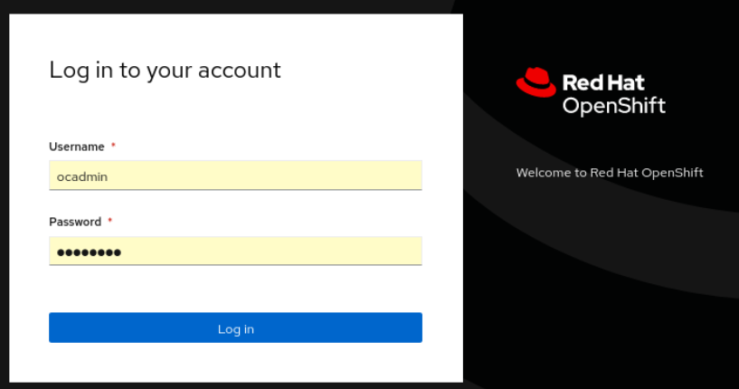

### Descripción general

1. Haga clic en la pestaña **`Overview`** en **`Home`** en el menú de la izquierda para ver un resumen de los eventos:

    

      <br>
    

2. Desplácese hacia abajo para ver los recursos `Cluster utilization` :

    

      <br>
    

3. Vea la información `Cluster inventory` en la página Descripción general. Puede hacer clic en cada elemento del inventario para obtener más información:

    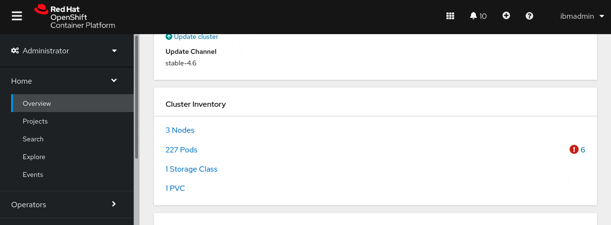

    Tenga en cuenta que:

    - **`Nodes`** representan el hardware físico o virtual que ejecuta su clúster Openshift.
    - **`Pods`** se utilizan para alojar y ejecutar uno o más contenedores. Cada nodo puede ejecutar varios pods. Los contenedores del mismo pod comparten la misma red y almacenamiento.
    - **`Storage classes`** representan los diferentes tipos de almacenamiento configurados y disponibles para su clúster Openshift.
    - **`Persistent Volume Claims`** (PVC) representan el uso del almacenamiento por parte de los pods. Una vez que se elimina un pod, los datos que no son persistentes en el almacenamiento persistente desaparecen.

### Proyectos

`projects` de Openshift permiten agrupar recursos relacionados y asignarles políticas de gestión independientes. Es habitual que los artefactos relacionados con diferentes aplicaciones se asignen a diferentes `projects` . Los recursos que pertenecen al mismo proyecto se almacenan en el mismo `namespace` de Kubernetes.

1. Haga clic en la pestaña **`Projects`** en **`Home`** en el menú de la izquierda, seguido de **`Create Project`** :

    

     <br>
    

2. En el cuadro de diálogo, ingrese `myproject` como nombre del proyecto y luego haga clic en **`Create`** :

    

      <br>
    

3. Después de la creación, haga clic en cada una de las pestañas de mi proyecto que acaba de crear.

    Tenga en cuenta lo siguiente:

    - La pestaña `YAML` muestra la representación YAML de su proyecto. Cada recurso en Openshift se representa como una estructura de datos REST. Trabajaremos mucho más con archivos YAML cuando interactuemos con Openshift a través de la línea de comandos.
    - La pestaña `Role Bindings` muestra las configuraciones de seguridad que se aplican a su proyecto. Por ahora, solo tenga en cuenta que hay muchos roles diferentes ya definidos cuando se crea un proyecto. Cada uno de estos **roles** se utiliza para un propósito diferente y ya están asignados a diferentes **usuarios** y **grupos** o **cuentas de servicio** .

    

### Primera aplicación

Los artefactos típicos que necesitarás para ejecutar una aplicación en Openshift son:

- Una `container image` que contiene su aplicación, alojada en un registro de contenedores

- Uno o más `pods` que especifican dónde obtener una imagen y cómo debe alojarse.

- Una `deployment` para controlar la cantidad de pods de instancias. Normalmente, no se configura un `pod` directamente. En cambio, se configura una `deployment` para administrar un conjunto de `pods` .

- Un `service` que expone la aplicación dentro de la red interna y permite equilibrar la carga de la aplicación dentro del clúster Openshift.

- Una `route` o `ingress` para hacer que la aplicación sea accesible fuera del firewall del clúster Openshift.

    

#### Primer despliegue

1. En la pestaña **`Workloads`** , haga clic en **`Deployments`** . Luego, haga clic **`Create Deployment`** :

    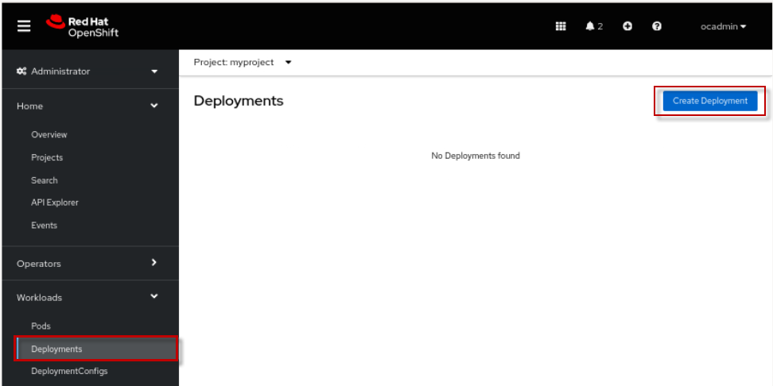

      <br>
    

2. Tenga en cuenta que la consola le muestra el archivo YAML para la implementación.

    Realice los siguientes cambios en el yaml como se describe e ilustra a continuación.

    a. Escriba `'example'` como **"nombre"** de la implementación. Asegúrese de conservar las comillas simples, como se muestra a continuación.

    b. Cambie el número de `replicas` de 3 a **`2`**

    c. cambie **'app: name'** a `app: httpd` en 'matchLabels' y 'labels'

    d. Haga clic en **`Create`** :

    

    A continuación se muestra la especificación del despliegue en su totalidad:

    ```yaml
    apiVersion: apps/v1
    kind: Deployment
    metadata:
      namespace: myproject
      name: 'example'
    spec:
      selector:
        matchLabels:
          app: httpd
      replicas: 2
      template:
        metadata:
          labels:
            app: httpd
        spec:
          containers:
            - name: container
              image: >-
                image-registry.openshift-image-registry.svc:5000/openshift/httpd:latest
              ports:
                - containerPort: 8080
                  protocol: TCP
      strategy:
        type: RollingUpdate
        rollingUpdate:
          maxSurge: 25%
          maxUnavailable: 25%
    ```

3. Repasemos este recurso:

    - Cada recurso en Openshift tiene un grupo, una versión y un tipo. Para el recurso `Deployment` :
        - El grupo es `apps`
        - La versión es `v1`
        - El tipo es `Deployment`
    - Los `metadata` especifican los datos necesarios para el tiempo de ejecución:
        - El nombre de esta instancia es `example`
        - El namespace donde se ejecuta el recurso es `myproject`
        - Aunque no se muestran aquí, se incluyen todas las etiquetas asociadas con el recurso. Veremos el uso de las etiquetas más adelante.
    - La sección `spec` define los detalles específicos de este tipo de recurso:
        - El `selector` define los detalles de los `pods` que administrará esta `deployment` . El atributo `matchLabels` con el valor `app: httpd` significa que esta instancia `deployment` buscará y administrará todos los pods cuyas etiquetas contengan `app: httpd` .
    - El campo `replicas: 2` especifica el número de instancias a ejecutar.
    - La sección `template` describe información sobre cómo ejecutar la imagen del contenedor y crear los `pods` :
        - La sección `labels` especifica qué etiquetas se deben agregar a los pods que se van a crear. Tenga en cuenta que coinciden con las etiquetas definidas en el `selector` .
        - La sección `containers` especifica dónde obtener la imagen del contenedor y qué puertos exponer. En nuestro ejemplo, la imagen que se ejecutará es `openshift/httpd` .
    - La sección `stratey` define cómo crear, actualizar o degradar diferentes versiones de aplicaciones.
        - La estrategia `RollingUpdate` es la estrategia predeterminada. Le permite actualizar un conjunto de pods sin tiempo de inactividad. Reemplaza los pods que ejecutan la versión anterior de la aplicación con la nueva versión, uno por uno.

     <br>
    

4. Espere a que ambos pods estén en ejecución:

    

     <br>
    

5. Haga clic en la pestaña `Pods` .

    Tenga en cuenta que los recursos de pods son administrados por el controlador para su `deployment` .

    No creas los recursos de pod tú mismo. Ese es el motivo por el que la pestaña `Pods` se encuentra debajo del recurso `deployment` que acabas de crear.

    

     <br>
    

6. Haga clic en una de las cápsulas:

    

     <br>
    

7. Explora las distintas **pestañas** de tu pod

    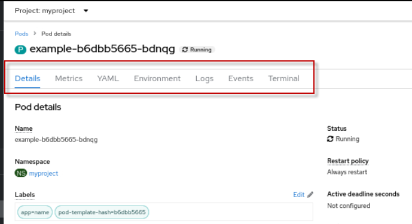

     <br>


    - **`Detils:`** muestra los detalles de alto nivel del pod.
    - **`Metrics:`** muestra el uso general de recursos de su pod. Tenga en cuenta que para el uso de CPU, la unidad es m, o mili-núcleo, que es 1/1000 de un núcleo.
    - **`YAML:`** examina el YAML que describe tu pod. Este YAML lo crea el controlador de implementación según la especificación que proporcionaste en tu implementación. Ten en cuenta que las etiquetas asociadas con tu pod son las que habías especificado en la implementación.
    - **`Environment:`** enumera las variables de entorno definidas para su pod. Para nuestro pod `httpd` , no hay ninguna.
    - **`Logs:`** muestra el registro de la consola de su contenedor.
    - **`Events:`** son un tipo de recurso en Kubernetes que se crean automáticamente cuando otros recursos tienen cambios de estado, errores u otros mensajes que deben transmitirse al sistema.
    - **`Terminal:`** abre un shell remoto en el contenedor. Al igual que en el laboratorio Introducción a Docker, no hay ningún shell disponible dentro del contenedor para esta imagen. Esto la hace más segura, pero también más difícil de depurar.

### Primer servicio

Un **`service`** permite que los pods que acabamos de crear tengan equilibrio de carga dentro del clúster Openshift.

1. Desplácese hacia abajo hasta la pestaña **`Networking`** en la navegación izquierda, haga clic en **`Services`** y luego en **`Create Service`** :

    

     <br>
    

2. Actualice los parámetros `YAML` de la siguiente manera:

    **(Antes de la actualización)** 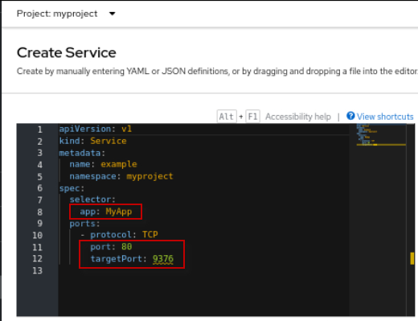

    a. En el selector de especificaciones:

    - cambiar `MyApp` a `httpd`

        De esta manera, el servicio encontrará los pods para equilibrar la carga. Por lo tanto, coincide con las etiquetas ( `spec.selector.matchLabels` ) que usamos al crear la implementación para la aplicación httpd.

     <br>


    b. En spec.ports:

    - cambia `80` a `8080` y
    - cambiar `9376` a `8080` (los mismos puertos que usamos en el laboratorio de contenedores).

     <br>


    c. Haga clic en `Create`

    **(Después de la actualización)** 

     <br>
    

3. Una vez creado el servicio, haga clic en la pestaña **`YAML`** :

    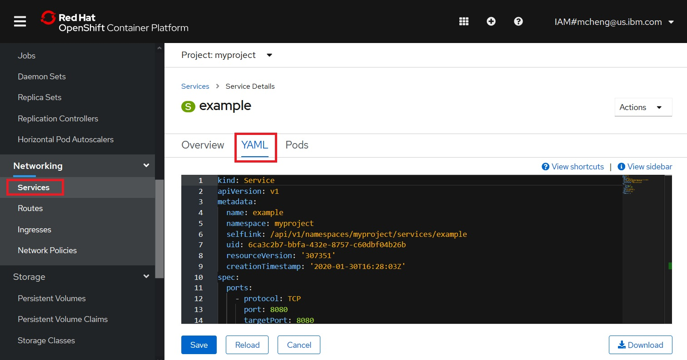

    El archivo YAML se ve así:

    ```yaml
    kind: Service
    apiVersion: v1
    metadata:
      name: example
      namespace: myproject
      uid: d716f19c-3fbe-4917-89f3-7ea426d66494
      resourceVersion: '12721128'
      creationTimestamp: '2024-02-12T23:21:02Z'
      managedFields:
        - manager: Mozilla
          operation: Update
          apiVersion: v1
          time: '2024-02-12T23:21:02Z'
          fieldsType: FieldsV1
          fieldsV1:
            'f:spec':
              'f:internalTrafficPolicy': {}
              'f:ports':
                .: {}
                'k:{"port":8080,"protocol":"TCP"}':
                  .: {}
                  'f:port': {}
                  'f:protocol': {}
                  'f:targetPort': {}
              'f:selector': {}
              'f:sessionAffinity': {}
              'f:type': {}
    spec:
      clusterIP: 172.30.14.92
      ipFamilies:
        - IPv4
      ports:
        - protocol: TCP
          port: 8080
          targetPort: 8080
      internalTrafficPolicy: Cluster
      clusterIPs:
        - 172.30.14.92
      type: ClusterIP
      ipFamilyPolicy: SingleStack
      sessionAffinity: None
      selector:
        app: httpd
    status:
      loadBalancer: {}
    ```

4. Tenga en cuenta que para este servicio se creó una dirección IP para todo el clúster y que se está equilibrando la carga. Además, no se establece la afinidad de sesión para este servicio.

### Primera ruta

Una ruta expone sus puntos finales internos fuera del firewall integrado de su clúster.

1. Haga clic en la pestaña **`Route`** en **`Networking`** en la navegación izquierda, luego haga clic en **`Create Route`** :

    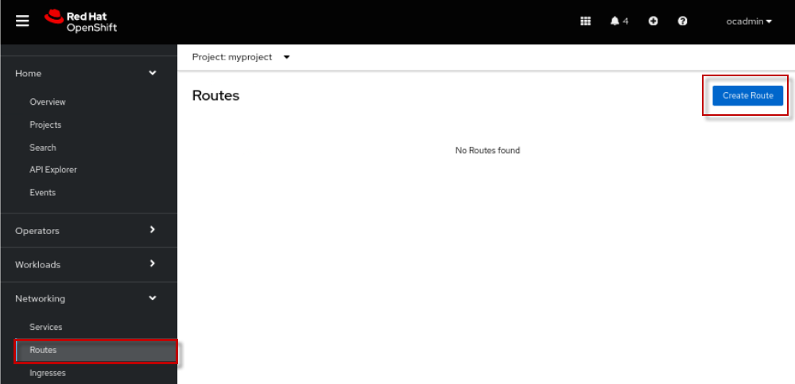

     <br>
    

2. Proporcione entrada a los siguientes parámetros:

    - Nombre: `example`
    - Servicio: `example`
    - Puerto de destino: `8080 --> 8080 (TCP)`
    - Haga clic en `Create`

     <br>


    

    Tenga en cuenta que ignoramos la configuración de TLS solo para los fines de este laboratorio. La seguridad se abordará en otro laboratorio.

     <br>
    

3. Acceda a la ruta en el enlace que se proporciona en el campo `Location` del recurso Ruta. La ubicación de la ruta se abrirá en una nueva pestaña del navegador.

    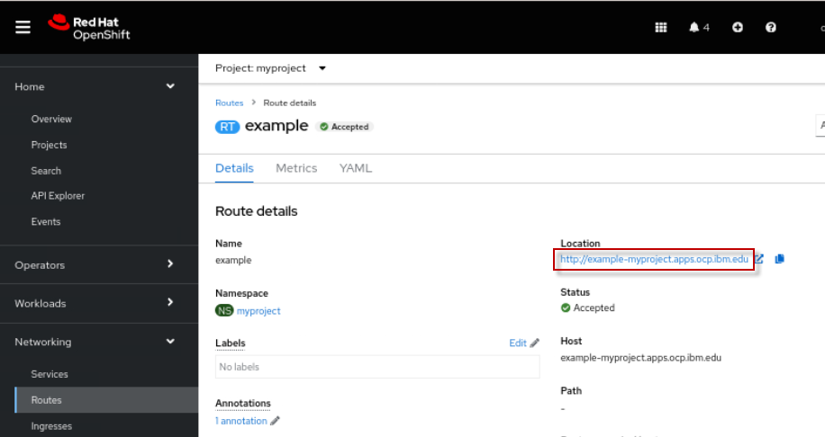

     <br>
    

4. Si ha configurado todo correctamente, el navegador mostrará la `Red Hat Enterprise Linux Test page` .

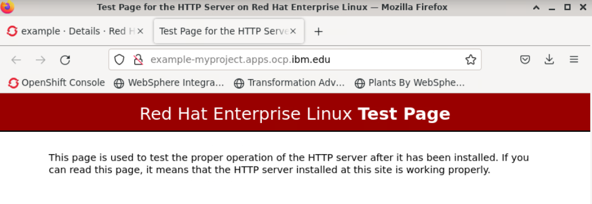

<br>

**Felicitaciones** , acaba de implementar su primera aplicación en Openshift.

<br>

### Cambio de instancias de réplica

1. Haga clic en la pestaña **`Projects`** en **`Home`** desde la navegación izquierda, luego escriba `myproject` en el campo **de filtro** :

    

2. Haga clic en `myproject` :

    

     <br>
    

3. Desplácese hacia abajo hasta la sección `Inventory` para ver los recursos que se crearon. Recuerde que hemos creado una implementación con 2 pods en la especificación. También creamos un servicio y una ruta.

    

     <br>
    

4. En la sección **Inventario** , haga clic en el enlace **de 2 pods** :

    

      <br>
    

5. Elimina uno de los pods haciendo clic en el menú de la derecha y seleccionando `Delete pod` . Cuando se te solicite, haz clic en `Delete` .

    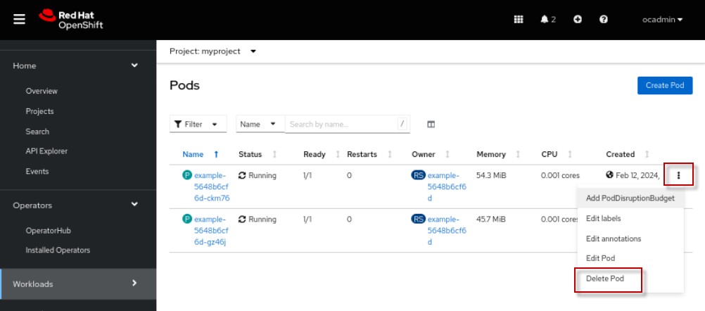

    a. Haga clic en `Delete` para confirmar la eliminación del pod.

    

    Esta no es la forma correcta de reducir la cantidad de instancias. Notarás que tan pronto como se termina uno de los pods, se crea otro.

    El motivo es que el controlador del recurso `deployment` sabe que su especificación es para **2 instancias** y respeta esa especificación creando otra. Esto también le brinda recuperación automática ante fallas si uno de los pods falla por sí solo.

    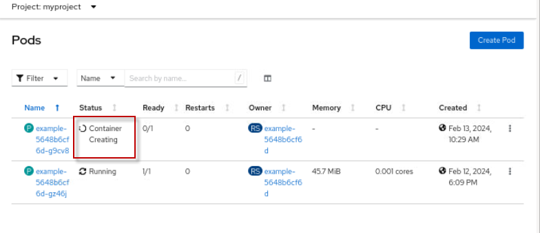

     <br>
    

6. Para cambiar la cantidad de instancias, deberá cambiar la especificación de su implementación. Haga clic en la pestaña **`Deployments`** en **`Workloads`** en el panel de navegación izquierdo y, luego, haga clic en la implementación `example` :

    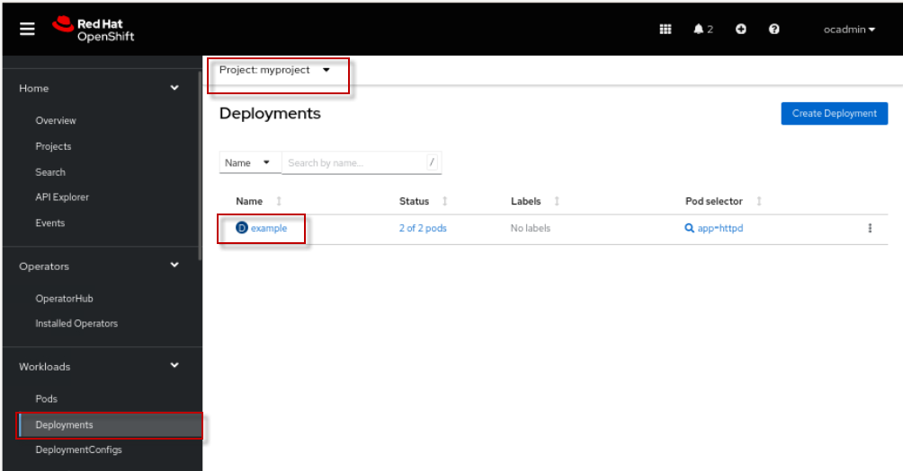

     <br>
    

7. Haga clic en la **`down arrow`** para reducir el tamaño de la réplica a 1:

    

     <br>
    

8. Una vez completada la operación, haga clic en la pestaña **`YAML`** :

    

    Tenga en cuenta que la consola cambió la especificación REST en su nombre, por lo que el recuento de réplicas ahora es 1:

    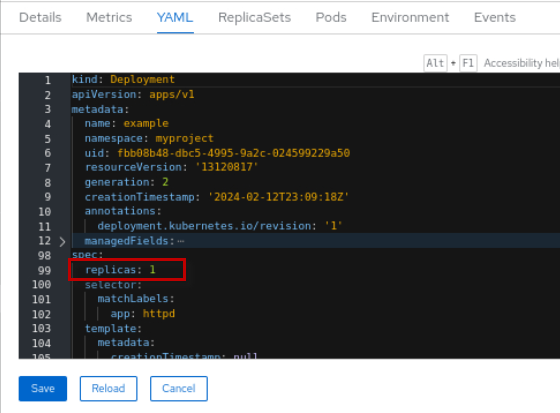

## Implemente la imagen de ejemplo 'httd' a través de la línea de comandos

Puede utilizar tanto `oc` , la herramienta de línea de comandos de openshift, como `kubectl` , la herramienta de línea de comandos de Kubernetes, para interactuar con Openshift.

Los recursos en Openshift se configuran mediante una estructura de datos REST. En el caso de las herramientas de línea de comandos, la estructura de datos REST se puede almacenar en un archivo YAML o en un archivo JSON.

Las herramientas de línea de comandos se pueden utilizar para:

- Lista de recursos disponibles
- Crear recursos
- Actualizar los recursos existentes
- Eliminar recursos

### Terminal de línea de comandos

El comando `oc` ya está instalado en la terminal de su VM.

1. Abra una nueva ventana `Terminal` en la máquina virtual de escritorio:

    

     <br>
    

2. Si aún no ha clonado el repositorio de GitHub con los artefactos del laboratorio, en un laboratorio anterior, ejecute el siguiente comando en su terminal:

```
  cd /home/techzone
		
  git clone https://github.com/IBMTechSales/appmod-pot-labfiles.git
```

1. Cambiar directorio a: `appmod-pot-labfiles/labs/IntroOpenshift`

    ```
     cd /home/techzone/appmod-pot-labfiles/labs/IntroOpenshift
    ```

### Iniciar sesión en OpenShift

1. Inicie sesión en la CLI de OpenShift con el comando `oc login` desde la terminal.

    Cuando se le solicite el nombre de usuario y la contraseña, ingrese las siguientes credenciales de inicio de sesión:

    Nombre de usuario: `ocadmin`

    Contraseña: `ibmrhocp`

    ```
     oc login -u ocadmin -p ibmrhocp
    ```

     <br>


    Después de iniciar sesión, se muestra el último proyecto al que se accedió, que puede o no ser el proyecto `default` que se muestra a continuación:

    

### Listado de recursos

1. Utilice `oc api-resources` para enumerar todos los tipos de recursos disponibles.

    Tenga en cuenta que los recursos en Openshift tienen un `group` , `version` y `kind` . Algunos recursos son globales (no están en un namespace), mientras que otros están limitados a un `namespace` .

    Muchos recursos también tienen nombres cortos para ahorrar tiempo escribiendo al utilizar la herramienta de línea de comandos.

    Por ejemplo, puede utilizar `cm` en lugar de `ConfigMap` como parámetro de línea de comando cuando el parámetro es para un `KIND` .

    **Ejemplo de salida:**

    ```
    NAME                                  SHORTNAMES       APIGROUP                              NAMESPACED   KIND
    bindings                                                                                     true         Binding
    componentstatuses                     cs                                                     false        ComponentStatus
    configmaps                            cm                                                     true         ConfigMap
    endpoints                             ep                                                     true         Endpoints
    events                                ev                                                     true         Event
    limitranges                           limits                                                 true         LimitRange
    namespaces                            ns                                                     false        Namespace
    nodes                                 no                                                     false        Node
    ...
    ```

### Listado de instancias de un tipo de recurso

1. Listar todos los proyectos: `oc get projects`

    ```
    NAME          DISPLAY NAME   STATUS
    default                      Active
    ibm-cert-store               Active
    ibm-system                   Active
    kube-node-lease              Active
    kube-public                  Active
    kube-system                  Active
    myproject                    Active
    ...
    ```

2. Enumere todos los pods en todos los espacios de nombres: `oc get pods --all-namespaces`

    ```
    NAMESPACE                                          NAME                                                              READY   STATUS      RESTARTS       AGE
    clusteroverride                                    clusterresourceoverride-operator-8447f78c94-9ww57                 1/1     Running     1              3d22h
    db2                                                db2-6b759748bf-spkgr                                              1/1     Running     2              5d23h
    ibm-common-services                                iam-onboarding-4knm6                                              0/1     Completed   0              217d
    ibm-common-services                                ibm-common-service-webhook-f74fd799d-vrlr4                        1/1     Running     11             217d
    ibm-common-services                                ibm-namespace-scope-operator-948fd44bb-5wb97                      1/1     Running     11             217d
    ibm-common-services                                meta-api-deploy-594f4f9bf4-mvq2k                                  1/1     Running     11             217d
    ibm-common-services                                pre-zen-operand-config-job-hld85                                  0/1     Completed   0
    ...
    ```

3. Enumere todos los pods dentro de un namespace: `oc get pods -n myproject`

    ```
    NAME                       READY   STATUS    RESTARTS   AGE
    example-5648b6cf6d-gz46j   1/1     Running   0          19h
    ```

### Proyectos

1. Listar todos los proyectos: `oc get projects`

    ```
    NAME          DISPLAY NAME   STATUS
    default                      Active
    ibm-cert-store               Active
    ibm-system                   Active
    kube-node-lease              Active
    kube-public                  Active
    kube-system                  Active
    myproject                    Active
    ...
    ```

2. Obtener el proyecto actual: `oc project` (Nota: el proyecto actual puede no ser `default` como se muestra a continuación):

    ```
    Using project "default" on server "https://api.ocp.ibm.edu:6443".
    ```

3. Cambiar a un proyecto específico

    ```
    oc project myproject
    ```

    ```
    Now using project "myproject" on server "https://api.ocp.ibm.edu:6443".
    ```

4. Crea un nuevo proyecto y conviértelo en el proyecto actual:

    ```
    oc new-project  project1
    ```

    El resultado de crear un nuevo proyecto:

    ```
    Now using project "project1" on server "https://api.ocp.ibm.edu:6443".

    You can add applications to this project with the 'new-app' command. For example, try:

    oc new-app rails-postgresql-example

    to build a new example application in Ruby. Or use kubectl to deploy a simple Kubernetes application:

    kubectl create deployment hello-node --image=k8s.gcr.io/e2e-test-images/agnhost:2.33 -- /agnhost serve-hostname
    ```

5. Cambiar al proyecto `default` :

    ```
    oc project default
    ```

6. Volver al `project1` :

    ```
    oc project project1
    ```

    Producción:

    ```
     Now using project "project1" on server "https://api.ocp.ibm.edu:6443".
    ```

7. Ver la especificación REST del proyecto:

    ```
    oc get project project1 -o yaml
    ```

    La salida de la especificación de recursos en **yaml**

    ```yaml
    apiVersion: project.openshift.io/v1
    kind: Project
    metadata:
      annotations:
        openshift.io/description: ""
        openshift.io/display-name: ""
        openshift.io/requester: ocadmin
        openshift.io/sa.scc.mcs: s0:c28,c7
        openshift.io/sa.scc.supplemental-groups: 1000770000/10000
        openshift.io/sa.scc.uid-range: 1000770000/10000
      creationTimestamp: "2024-02-13T18:51:45Z"
      labels:
        kubernetes.io/metadata.name: project1
        pod-security.kubernetes.io/audit: restricted
        pod-security.kubernetes.io/audit-version: v1.24
        pod-security.kubernetes.io/warn: restricted
        pod-security.kubernetes.io/warn-version: v1.24
      name: project1
      resourceVersion: "13199098"
      uid: 34c89410-a09a-419e-82dd-d2788379ad01
    spec:
      finalizers:
      - kubernetes
    status:
      phase: Active
    ```

### Primera aplicación

#### Primer despliegue

1. En la ventana de la terminal, debajo del directorio donde clonó el repositorio de laboratorios `(/home/techzone/appmod-pot-labfiles/labs/IntroOpenshift)` , encontrará `Deployment.yaml` , que usará para implementar la aplicación `httpd` usando la CLI de OpenShift.

    ```
     cd /home/techzone/appmod-pot-labfiles/labs/IntroOpenshift

     ls -l
    ```

    Producción:

    ```
    -rw-rw-r-- 1 techzone techzone 669 Feb 13 11:48 Deployment.yaml
    -rw-rw-r-- 1 techzone techzone 171 Feb 13 11:48 Route.yaml
    -rw-rw-r-- 1 techzone techzone 197 Feb 13 11:48 Service.yaml
    ```

2. Revisar el contenido de `Deployment.yaml`

    ```
    clear

    cat Deployment.yaml
    ```

    Esto nos permite implementar la misma imagen en un proyecto diferente. El uso de la misma imagen personalizada para diferentes entornos es un concepto importante que se tratará más a fondo en futuros laboratorios.

    ```yaml
    apiVersion: apps/v1
    kind: Deployment
    metadata:
     name: example
     namespace: project1
    spec:
     selector:
       matchLabels:
         app: httpd
     replicas: 2
     template:
       metadata:
         labels:
           app: httpd
       spec:
         containers:
           - name: httpd
             image: image-registry.openshift-image-registry.svc:5000/openshift/httpd:latest
             ports:
               - containerPort: 8080
             imagePullPolicy: Always
             securityContext:
               allowPrivilegeEscalation: false
               runAsNonRoot: true
               capabilities:
                 drop:
                 - ALL
               seccompProfile:
                 type: "RuntimeDefault"
    ```

3. Aplicar la implementación a través de la línea de comando:

    ```
    oc apply -f Deployment.yaml
    ```

    Después de aplicar el yaml, verá un mensaje que indica que se creó el recurso de implementación.

    ```
    deployment.apps/example created
    ```

4. Compruebe el estado de la implementación:

    ```
    oc get deployment example -o wide
    ```

    Debe haber 2 de 2 pods en el estado LISTO:

    ```
    NAME      READY   UP-TO-DATE   AVAILABLE   AGE    CONTAINERS IMAGES                                                                    SELECTOR
    example   2/2     2            2           103s   httpd        image-registry.openshift-image-registry.svc:5000/openshift/httpd:latest   app=httpd

    ```

    Si el estado no muestra disponible **`READY 2/2`** , espere unos segundos y luego vuelva a ejecutar el comando.

5. Enumere los pods en ejecución creados por el controlador para la implementación:

    ```
    oc get pods
    ```

    Los pods deben estar en estado **`Running`**

    ```
    NAME                      READY   STATUS    RESTARTS   AGE
    example-764854fb5-lhdm7   1/1     Running   0          5m53s
    example-764854fb5-s5f68   1/1     Running   0          5m53s

    ```

6. Mostrar los registros de uno de los pods: `oc logs <pod name>`

    **Nota:** `\<pod name\>` es el nombre de los pods del comando `oc get pods` en el paso anterior.

7. Eche un vistazo a `Service.yaml` y observe que es para el namespace `project1` :

    ```
    clear

    cat Service.yaml
    ```

    Ejemplo de salida:

    ```yaml
    apiVersion: v1
    kind: Service
    metadata:
      name: example
      namespace: project1
    spec:
      ports:
        - protocol: TCP
          port: 8080
          targetPort: 8080
      selector:
        app: httpd
      type: ClusterIP
    ```

    Tenga en cuenta que el **selector** está configurado en **app: httd** , lo que significa que el servicio cargará los pods de equilibrio con la etiqueta `app: httpd` dentro del namespace `project1` :

8. Crear el servicio.

    ```
    oc apply -f Service.yaml
    ```

    El servicio se ha creado

    ```
    service/example created
    ```

9. Examinar Route.yaml:

    ```
    clear

    cat Route.yaml
    ```

    Tenga en cuenta que la ruta apunta al **ejemplo** Servicio Producción:

    ```yaml
    apiVersion: route.openshift.io/v1
    kind: Route
    metadata:
      name: example
      namespace: project1
    spec:
      port:
        targetPort: 8080
      to:
        kind: Service
        name: example
    ```

10. Aplicar la ruta para que el servicio sea accesible desde fuera del clúster:

    ```
    oc apply -f Route.yaml
    ```

    La ruta está creada

    ```
    route.route.openshift.io/example created
    ```

11. Utilice el siguiente comando para obtener la URL de la ruta. A continuación, abra la URL en el navegador de la máquina virtual:

    ```
    echo http://$(oc get route example --template='{{ .spec.host }}')
    ```

    Producción:

    ```
    http://example-project1.apps.ocp.ibm.edu
    ```

12. Abra nuevamente su navegador Firefox y visite la URL que generó el comando anterior. Debería ver una página web que muestra el siguiente mensaje:

    

### Cambiar la instancia de réplica

1. Lista de pods: `oc get pods`

    ```
    NAME                      READY   STATUS    RESTARTS   AGE
    example-75778c488-7k7q2   1/1     Running   0          60m
    example-75778c488-c9jhd   1/1     Running   0          60m
    ```

2. Eliminar uno de los pods: `oc delete pod <pod name>`

    ```
    pod "example-764854fb5-lhdm7" deleted
    ```

3. Enumere los pods nuevamente y observe que se creó una nueva instancia como se esperaba. La implementación especificó 2 instancias, por lo que el controlador intenta mantener 2 instancias: `oc get pods`

**Nota:** El nuevo pod se inicia automáticamente

```
```
NAME                      READY   STATUS    RESTARTS   AGE
example-764854fb5-pjdgg   1/1     Running   0          42s
example-764854fb5-s5f68   1/1     Running   0          44m
```
```

1. Para cambiar la cantidad de pods, puedes parchear el recurso de una de dos maneras:

    - Parche con script que utiliza la opción `patch` de la línea de comando: este comando reduce la cantidad de pods a 1.

        ```
        oc patch deployment example -p '{ "spec": { "replicas": 1 } }'

        oc get pods
        ```

        ```
        NAME                      READY   STATUS    RESTARTS   AGE
        example-764854fb5-s5f68   1/1     Running   0          47m
        ```

    - Parche interactivo usando la opción `edit` de la línea de comandos a través del editor `vi` :

        ```
        oc edit deployment example
        ```

    En la sección `spec` (no en la sección `status` ), cambie `replicas: 1` a `replicas: 2` y **guarde** el cambio en el editor vi (con `:wq` ).

    La salida:

    ```
    deployment.extensions/example edited
    ```

2. Enumere los pods para mostrar 2 pods en ejecución después de emitir los comandos anteriores:

    ```
    oc get pods
    ```

    Si editó y guardó el recurso en el paso anterior, habrá dos pods en ejecución.

    ```
    NAME                      READY   STATUS    RESTARTS   AGE
    example-764854fb5-s5f68   1/1     Running   0          50m
    example-764854fb5-w6w8j   1/1     Running   0          75s
    ```

    **Nota:** lo anterior edita la copia que está almacenada en Openshift. También puede editar su copia local de `Deployment.yaml` y volver a aplicarla.

       <br>
    

3. Edite el `Deployment.yaml` en la máquina virtual y vuelva a aplicar las actualizaciones

    a. Desde una ventana `Terminal` , cambie a la carpeta del directorio del laboratorio donde se encuentra el archivo `Deployment.yaml`

    ```
     cd  /home/techzone/appmod-pot-labfiles/labs/IntroOpenshift
    ```

    b. Utilice gedit para editar el archivo `Deployment.yaml`

    ```
     gedit ./Deployment.yaml
    ```

    

    c. `Save` el archivo Deployment.yaml

    d. Vuelva a aplicar la implementación

    ```
     oc apply -f ./Deployment.yaml
    ```

    Se ha vuelto a aplicar la implementación de ejemplo.

    ```
     deployment.apps/example configured
    ```

4. Enumere los pods nuevamente para ver que ahora hay `3` pods en ejecución

    ```
    oc get pods
    ```

    Tres vainas en funcionamiento

    ```
    NAME                      READY   STATUS    RESTARTS   AGE
    example-764854fb5-s5f68   1/1     Running   0          63m
    example-764854fb5-t4w24   1/1     Running   0          111s
    example-764854fb5-w6w8j   1/1     Running   0          13m
    ```

5. Limpieza:

    ```
    oc delete route example
    oc delete service example
    oc delete deployment example

    oc get pods
    ```

    La salida debe indicar que no se encontraron recursos en el proyecto.

    ```
    No resources found in project1 namespace.
    ```

    **Nota:** Es posible que tengas que ejecutar el comando **oc get pods** varias veces para esperar a que se eliminen los pods.

<br>

Felicitaciones, ha implementado su primera aplicación en Openshift a través de la línea de comandos.

**===== FIN DEL LABORATORIO =====**

[Regresar a la página principal de laboratorios](../README.md)
